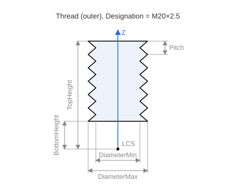

# IPMIGeomThread

Describes a thread object for PMI. An instance is returned by the `ISTGeomReceiver.BeginObject_PMIThread` method (see [PMI (Product Manufacturing Information)](pmi.md)); after being filled in, the object is written to the SGF via `EndObject`.

Each property is accessed through a pair of `Get<Name>` / `Set<Name>` methods (for example, `GetPitch` / `SetPitch`).



| Property | Type | Purpose |
|----------|-----|-----------|
| `Designation` | `string` | Thread designation. |
| `LCS` | `TST3DMatrix` | Local coordinate system of the thread. |
| `TopHeight` | `STFloat` | Upper bound (height). |
| `BottomHeight` | `STFloat` | Lower bound. |
| `Pitch` | `STFloat` | Thread pitch. |
| `StartCount` | `integer` | Number of starts. |
| `DiameterMin` | `STFloat` | Minimum diameter. |
| `DiameterMax` | `STFloat` | Maximum diameter. |
| `ConeAngle` | `STFloat` | Cone angle (for a tapered thread). |
| `DirectionIsLeft` | `boolean` | Left-hand thread. |
| `IsOuterThread` | `boolean` | External thread. |

**Associative references to geometry (optional).** A thread can reference the source model geometry it was built from, by lists of string CAD identifiers. These references are **optional**: the thread is saved correctly without them; they merely establish an associative link to the geometry.

| Method | Description |
|-------|----------|
| `AddBaseObjectCADID(Value: string)` | *(optional)* Associative reference to the base object — the supporting surface on which the thread was created. |
| `AddInitialBorderCADID(Value: string)` | *(optional)* Associative reference to the geometry of the thread's initial boundary. |
| `AddFinalBorderCADID(Value: string)` | *(optional)* Associative reference to the geometry of the thread's final boundary. |

**Filling order.** The thread object is created by a call to `BeginObject_PMIThread` (which returns the `IPMIGeomThread` interface), filled in with parameter setters, and written to the SGF by a call to `EndObject`. The thread's position is defined by its local coordinate system `LCS` (`TST3DMatrix`), and its extent along the axis by `TopHeight` / `BottomHeight`. The associative references to the source geometry (`AddBaseObjectCADID`, `AddInitialBorderCADID`, `AddFinalBorderCADID`) are **optional** — they can be left unset.

**Example of saving a thread (PMI).**

```csharp
// Save a thread (PMI) from CAD system data
bool SaveThread(CADThread thread)
{
    // open the thread object and get the interface for filling it in
    IPMIGeomThread pmi = sgr.BeginObject_PMIThread(thread.Id);
    if (pmi == null)
        return false;

    // thread parameters
    pmi.SetDesignation(thread.Designation);     // designation, e.g. "M12x1.5"
    pmi.SetPitch(thread.Pitch);                 // pitch
    pmi.SetStartCount(thread.StartCount);       // number of starts
    pmi.SetDiameterMax(thread.OuterDiameter);   // outer diameter
    pmi.SetDiameterMin(thread.InnerDiameter);   // inner diameter
    pmi.SetConeAngle(thread.ConeAngle);         // cone angle (0 for a cylindrical thread)
    pmi.SetDirectionIsLeft(thread.IsLeft);      // left-hand thread
    pmi.SetIsOuterThread(thread.IsOuter);       // external thread

    // position and extent
    pmi.SetLCS(ToMatrix(thread.Placement));     // local coordinate system → TST3DMatrix
    pmi.SetTopHeight(thread.TopHeight);
    pmi.SetBottomHeight(thread.BottomHeight);

    // optional associative references to the source geometry — only if they are set
    if (thread.BaseSurfaceId != null) pmi.AddBaseObjectCADID(thread.BaseSurfaceId);     // supporting surface
    if (thread.StartBorderId != null) pmi.AddInitialBorderCADID(thread.StartBorderId);  // initial boundary
    if (thread.EndBorderId   != null) pmi.AddFinalBorderCADID(thread.EndBorderId);      // final boundary

    // write the filled-in object to the SGF
    return sgr.EndObject(pmi);
}
```
