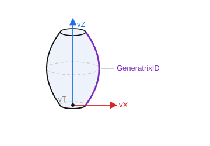

# Surface of revolution

`CreateRevSurface120(ID: string; Location, Axis: TST3DPoint; GeneratrixID: string; sa, ta: STFloat)` — a surface of revolution of a generatrix curve around an axis. It is built starting from the X axis, counterclockwise around `Axis`: from the start angle `sa` to the end angle `ta`.

- `ID` — identifier of the entity to create;
- `Location` — a point on the axis of revolution (`vT`);
- `Axis` — direction of the axis of revolution (`vZ`);
- `GeneratrixID` — identifier of the generatrix curve;
- `sa` — start angle (usually `0`);
- `ta` — end angle (full revolution — `2π`).



**Example of saving a surface of revolution.**

```csharp
// Surface of revolution parameters from the CAD system
class CADRevolutionParam
{
    public CADPoint Location;    // point on the axis of revolution (vT)
    public CADPoint Axis;        // direction of the axis of revolution (vZ)
    public CADCurve Curve;       // generatrix curve
    public double   StartAngle;  // start angle (sa)
    public double   EndAngle;    // end angle (ta); full revolution — 2π
}

bool SaveRevolution(string id, CADRevolutionParam param)
{
    if (!SaveCurve(param.Curve))
        return false;

    return sgr.CreateRevSurface120(id, ToPoint(param.Location), ToPoint(param.Axis),
                                   param.Curve.Id, param.StartAngle, param.EndAngle);
}
```
