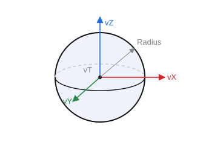

# Sphere

`CreateSphereP(ID: string; Location, Axis, RefAxis: TST3DPoint; Radius: STFloat)` — create a spherical surface.

- `ID` — the entity identifier;
- `Location` — the center (`vT`);
- `Axis` — the Z axis (`vZ`);
- `RefAxis` — the X axis (`vX`);
- `Radius` — the radius.

