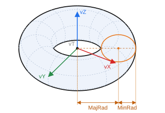

# Torus

`CreateTorusP(ID: string; Location, Axis, RefAxis: TST3DPoint; MajRad, MinRad: STFloat)` — create a toroidal surface.

- `ID` — identifier of the entity;
- `Location` — center (`vT`);
- `Axis` — Z axis (`vZ`), the axis of the torus;
- `RefAxis` — X axis (`vX`);
- `MajRad` — major radius (from the axis to the center of the tube);
- `MinRad` — minor radius (radius of the tube).

