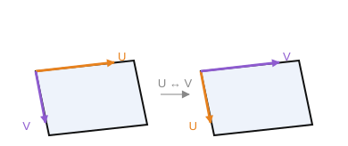

# Transposed UV surface

`CreateTransposedUVSurface(ID: string; SourceSurface: string)` — a surface with the U and V parameters swapped.

- `ID` — the identifier of the entity being created;
- `SourceSurface` — the identifier of the source surface.

