---
title: "Cell Mode"
---

<link rel="stylesheet" href="assets/manual.css">

<h1 id="src-150697487"> Cell Mode</h1>

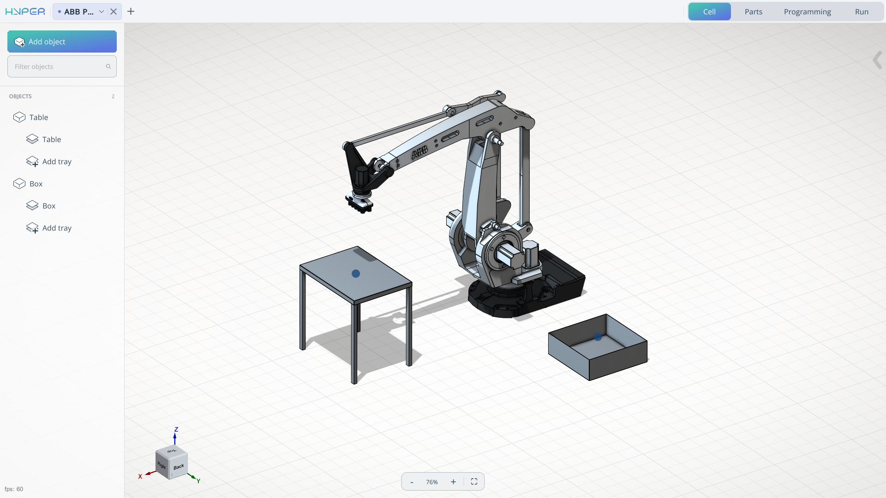

<h1 class="heading">Application Area:</h1>

This module enables editing of the digital twin of the robotic cell, including the addition and spatial arrangement of mechanisms in a 3D environment.

<h2 class="heading">Add object. </h2>

At the top‑left position of the interface, you will locate the <strong class="">Add Object</strong> button. This functionality serves as the primary creation tool, enabling the user to incorporate various mechanisms into the workspace. These may include, but are not limited to: tables, boxes, machines, or any other entities with which the robot is designed to interact.

Click here to expand..

<strong class="">Work with mechanisms:</strong>

Click here to expand..

<strong class="">Name. </strong>Mechanism name.

<strong class="">Width. </strong>Allows you to change the width of the mechanism.

<strong class="">Depth. </strong>Allows you to change the depth of the mechanism.

<strong class="">Height. </strong>Allows you to change the height of the mechanism.

<strong class="">The component creation window will change depending on what you are trying to create.</strong>

<strong class="">Type of mechanism. </strong>Types of mechanisms for product placement.

<strong class="">Box. </strong>The mechanism is presented in the form of a box/tray.

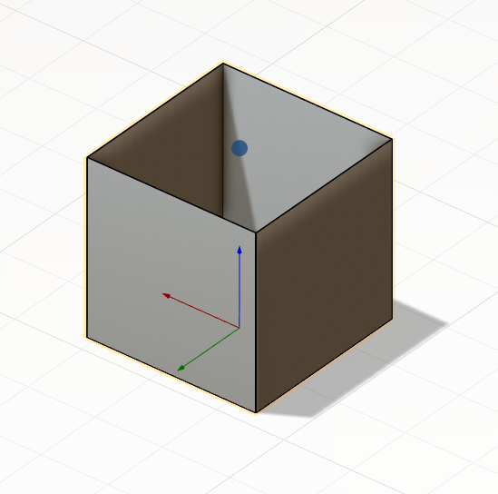

<strong class="">Table. </strong>The mechanism is presented in the form of a table for placing products.

<strong class="">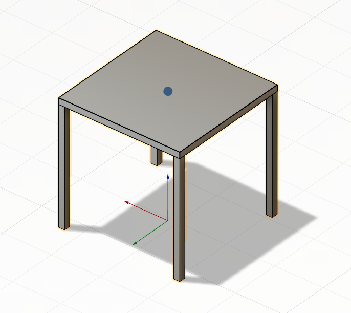
</strong>

<strong class="">Mill. </strong>The mechanism is presented in the form of a simplified model of a machine for placing products.

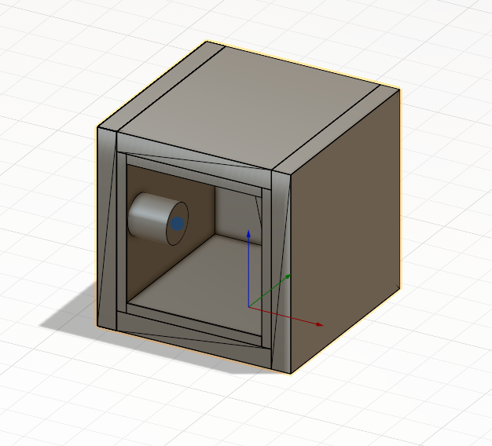

<strong class="">Back wall. </strong>Rear structural panel.

<strong class="">Wall thikness. </strong>Thickness of enclosure walls.

<strong class="">Door parameters. </strong>Specifications of access door.

<strong class="">Chuck height. </strong>Vertical dimension of the chuck.

<strong class="">Chuck diameter. </strong>Outer diameter of the chuck.<strong class=""></strong>

<strong class="">Chuck positions. </strong>Available mounting/operating positions of the chuck.

<strong class="">Empty. </strong>The mechanism does not have a 3D component

When the <strong class="">Apply</strong> button is clicked, the mechanism is added to the component tree, and a second menu opens to edit its position in space. In the component tree, placement positions (<strong class="">tray</strong>) also appear.

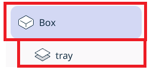

<strong class=""><strong class="">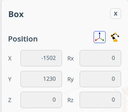
</strong></strong>

The menu includes the following items:

<strong class="">Name</strong>. Mechanism name.

<strong class="">Position. </strong>Modify the component’s position with respect to either the <strong class="">world coordinate system</strong> or the <strong class="">robot’s BaseCS</strong>.

<strong class="">X,Y,Z,Rx,Ry,Rz,A,B,C</strong> - Fields for spatial orientation of the mechanism.

In the lower‑right part of the screen, the component navigation mechanism appears. Allows interactive spatial manipulation of the mechanism.

In this window, you can also <strong class="">delete</strong> the mechanism or <strong class="">close</strong> the window to continue working on the project.

<strong class="">Work with Tray.</strong>

Click here to expand..

Item location. Each mechanism has at least one drawer.<strong class=""> </strong>

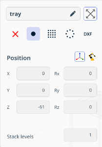

<strong class="">Name.</strong> Tray name.

<strong class="">Zoom extents. </strong>It scales the view so that all objects (<strong class="">Tray</strong>) fit entirely within the viewing window.

<strong class="">Pick or Place point.</strong> Allows setting attachment points for the product.

<strong class="">None. </strong>In No‑Point mode, no point needs to be set. Useful for creating collision‑control mechanisms (e.g., fences, barriers).

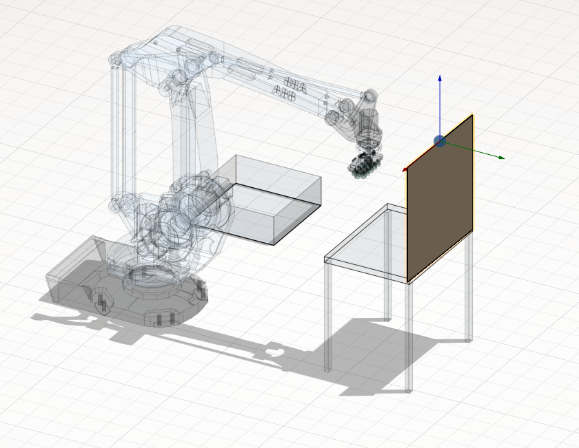

<strong class="">Single Point. </strong>It allows you to specify one mounting point.

<strong class="">Position. </strong>Modify the component’s position with respect to either the world coordinate system or the robot’s BaseCS. <strong class="">This position is typically calibrated on a physical robot</strong>, and the point(s) are then transferred via coordinates into the system while the <strong class="">Position</strong> - <strong class="">Robot’s BaseCS</strong> is enabled.

<strong class="">Transform parent. </strong>This function works only in <strong class="">Position</strong> — <strong class="">Robot’s BaseCS</strong> mode. When enabled, changing the <strong class="">Tray</strong> position also adjusts the mechanism’s position. When disabled, only the <strong class="">Tray</strong> position changes.

<strong class="">X,Y,Z,Rx,Ry,Rz,A,B,C</strong> - Fields for spatial orientation of the tray.

<strong class="">Stack levels.</strong> It allows you to create an array of points along the height axis.

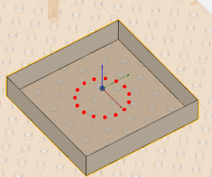
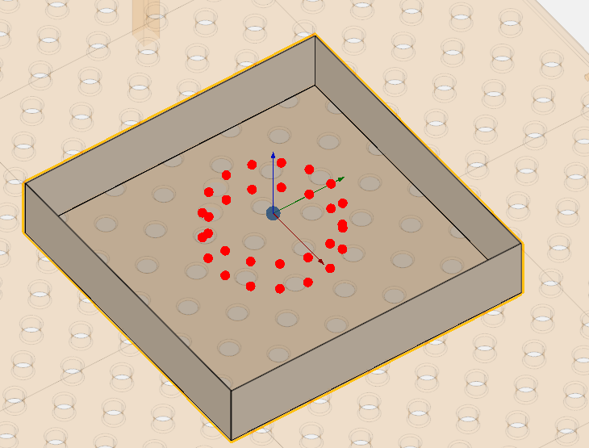

In the lower‑right part of the screen, the component navigation mechanism appears. Allows interactive spatial manipulation of the mechanism.

<strong class="">Two dimensional array. </strong>It allows you to create a two‑dimensional array. In this template, some parameters are identical to those in <strong class="">Single Point</strong>.

<strong class="">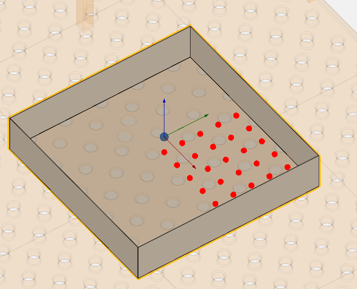
</strong>

<strong class="">Rows. </strong>Number of horizontal rows in the array

<strong class="">Columns. </strong>Number of vertical columns in the array

<strong class="">Step X. </strong>Horizontal spacing (distance between column centers).

<strong class="">Step Y. </strong>Vertical spacing (distance between row centers).

<strong class="">Round array. </strong>It allows you to create a circular array. In this template, some parameters are identical to those in <strong class="">Single Point</strong>.

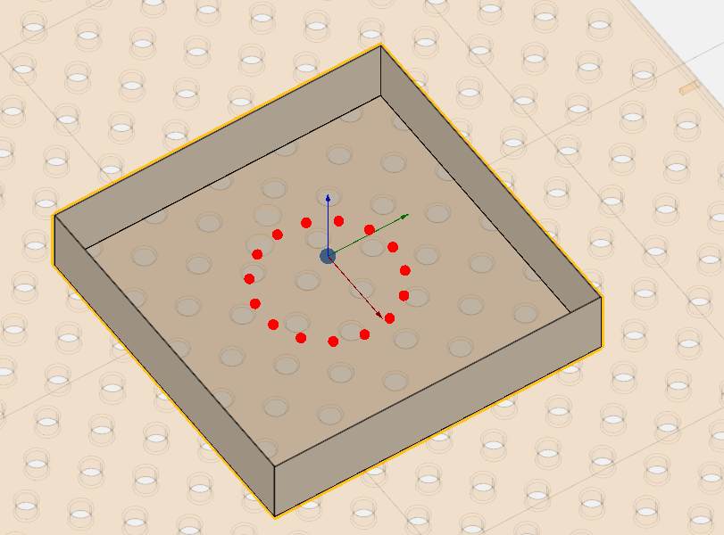

<strong class="">Points. </strong>Number of points around the circle.

<strong class="">Radius. </strong>Distance from center to each point.

<strong class="">DXF. </strong>It allows you to import DXF‑format drawings. The point can be placed within a <strong class="">closed contour</strong>, which will serve as a workpiece holder.

In this template, some parameters are identical to those in <strong class="">Single Point</strong>.

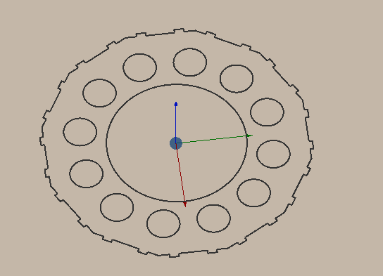
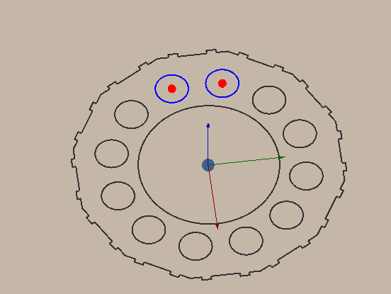

<strong class="">Custom file</strong>. It allows you to reselect the model.

<h2 class="heading">Tree of Mechanisms. </h2>

Structured list of all elements in your cell.

<ol class=""><li class="">
Each mechanism is assigned a unique name, which may be renamed unless the mechanism is locked.

</li><li class="">
All mechanisms include tray by default; these may be disregarded if not required for the current task.

</li><li class="">
Mechanisms and tray originate from one of two sources:

</li></ol><ul class=""><li class="">
predefined entries in the <tt class="Markdown-Word">.mma</tt> cell file (supplied by the vendor);

</li><li class="">
user‑generated entries created manually.

</li></ul>

