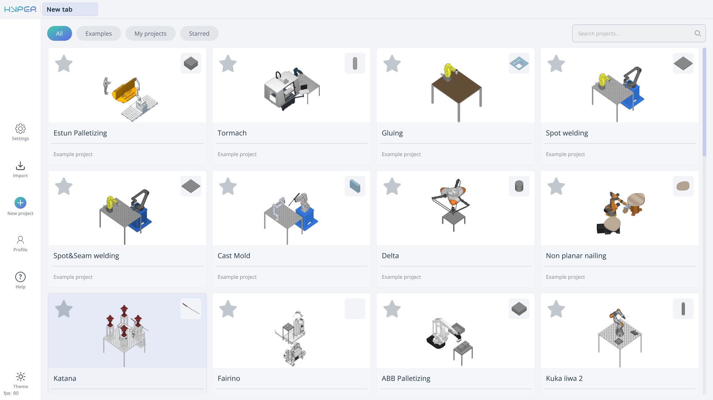
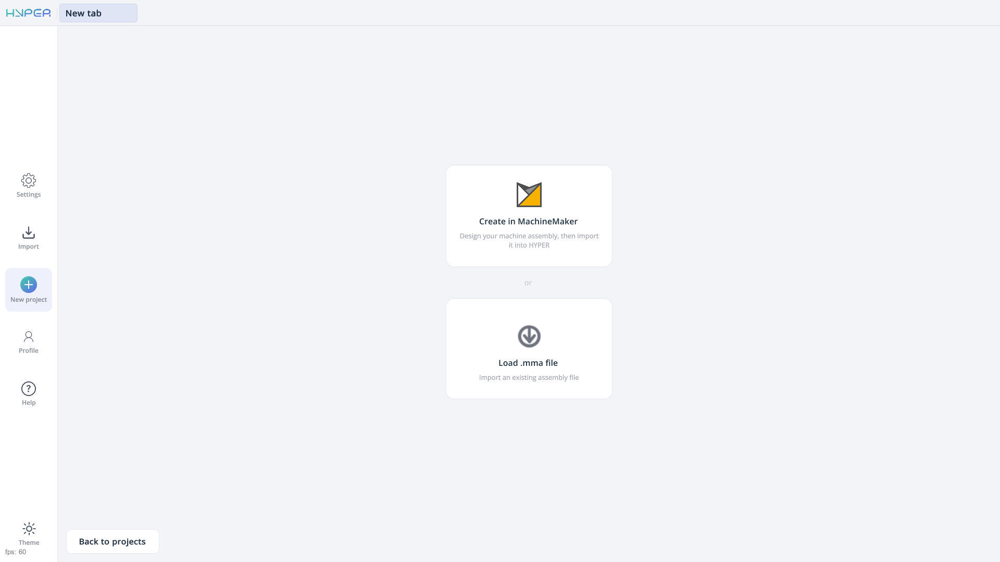
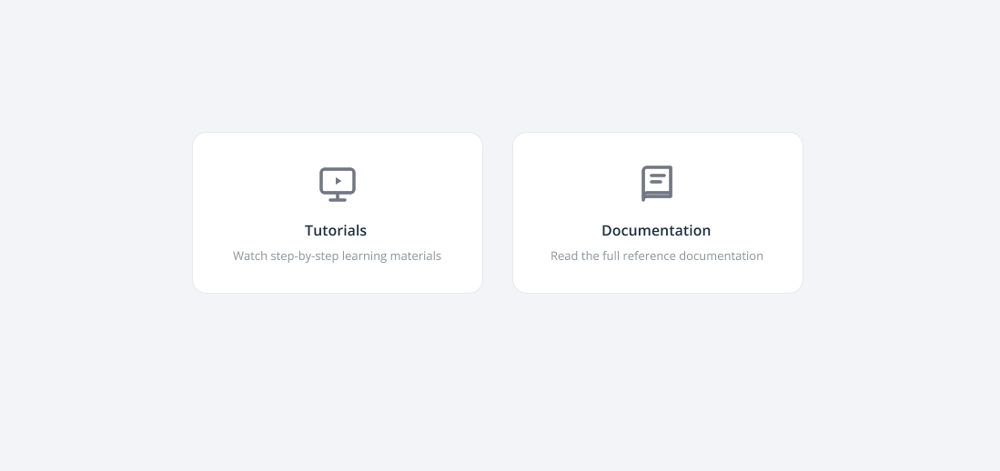
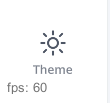

---
title: "Home page"
---

<link rel="stylesheet" href="assets/manual.css">

<h1 id="src-150697466"> Home page</h1>

<h1 class="heading">Application Area:</h1>

The home page provides the following functionalities:

<ul class="">
<li>
project library management;
</li>
<li>
access to standard example projects;
</li>
<li>
creation of new projects;
</li>
<li>
import of existing projects;
</li>
<li>
access to the system’s basic settings and user profile;
</li>
<li>
access to tutorials and documentation;
</li>
<li>
switching between light and dark themes.
</li>
</ul>

The project library occupies the main area of the home page. The <strong>All</strong>, <strong>Examples</strong>, <strong>My projects</strong>, and <strong>Starred</strong> filters are located above the project cards. The <strong>Search projects...</strong> field is in the upper-right corner. For details about the library, see <a href="project-library.md">Project library</a>.

<strong>Buttons on the left navigation panel.</strong>

The main buttons are arranged vertically on the left side of the screen, from top to bottom:

<strong>Settings.</strong> Allows you to access the system’s basic settings.

<strong>Import.</strong> Allows you to open an existing project.

<strong>New project.</strong> Opens a page with two options for creating a project:

<ul>
<li>
<strong>Create in MachineMaker.</strong> Launches MachineMaker, where you can prepare the machine assembly and then import it into ENCY Hyper.
</li>
<li>
<strong>Load .mma file.</strong> Allows you to select an existing assembly file in <strong>.mma</strong> format. The file can be prepared by the supplier or created in MachineMaker. <a class="external-link" href="https://docs.encycam.com/MachineMaker/1/robots/en/1.html">See more</a>
</li>
</ul>

<strong>In MachineMaker, use «Save assembly to file» to save the assembly.</strong>

The <strong>Back to projects</strong> button in the lower-left corner of the main area returns you to the project library.

<strong>Profile.</strong> Opens the user profile. Depending on the system configuration, some features may be unavailable to certain user roles. If a feature is grayed out or missing, your user role may not have the required permissions.

<strong>Help.</strong> Opens a page with two options:

<ul>
<li>
<strong>Tutorials.</strong> Opens the page with ENCY Hyper training videos.
</li>
<li>
<strong>Documentation.</strong> Opens the reference documentation.
</li>
</ul>

<strong>Button at the bottom of the left navigation panel.</strong>

<strong>Theme.</strong> Switches the interface between light and dark themes.

<strong>License and version information.</strong>

<strong>License information.</strong> Displays the remaining number of days on your license.

<strong>Version info.</strong> This information may be useful when demonstrating the app’s capabilities to others or when contacting technical support.

