---
title: "Application area:"
---

<link rel="stylesheet" href="assets/manual.css">

<h1 id="src-150697437"> Application area:</h1>

<section id="introduction-application-area">
<h2 class="heading">Application Area</h2>

<strong>ENCY Hyper</strong> is a hybrid platform for programming industrial robots. It combines offline program development and testing in a digital twin with online robot control.

<strong>Offline mode</strong> lets you verify programs before running them on the physical robot, reducing on-site trial and error. <strong>Online mode</strong> provides real-time feedback for debugging and adjustment, monitors execution, and supports stopping the robot when an anomaly is detected.

Optimized for <strong>Pick and Place</strong>, ENCY Hyper helps reduce idle time and manual intervention while improving production efficiency and consistency. Other applications include assembly, palletizing, sorting, quality inspection, milling, grinding, polishing, painting, and welding.

This manual introduces the platform's functions and workflow. Before deployment, review the supported hardware, available functions, and programming concepts.

</section>

<h2 class="heading">Workflow</h2>
<ol>
<li>
<strong>Prepare the cell.</strong> Create a <strong>.mma</strong> cell file in MachineMaker or obtain one from your dealer, then load it from the <a href="home-page.md">Home page</a>.
</li>
<li>
<strong>Open the project.</strong> Double-click its card on the Home page.
</li>
<li>
<strong>Configure the cell.</strong> Define trays and part attachment points in <a href="cell-mode.md">Cell mode</a>.
</li>
<li>
<strong>Define parts.</strong> Import models or create primitives and specify their pick points in <a href="parts-mode.md">Parts mode</a>.
</li>
<li>
<strong>Build the program.</strong> Add command blocks and calculate the trajectory in <a href="programming-mode.md">Programming Mode</a>.
</li>
<li>
<strong>Run and monitor.</strong> Simulate the program in <a href="run-mode.md">Run Mode</a> and monitor actual operation when a robot is connected.
</li>
</ol>

<h1 class="heading"> Pick and place (transfer from table to table).</h1>

 
The example shows simple transfer of a part from one table to another.    

Click here to expand..

<h2 id="pick-place-create-project">1. Create a project and assemble the cell</h2>

On the <strong>ENCY Hyper</strong> home page, select <strong>New project &gt; Create in MachineMaker</strong> to create your own robotic cell.

<a href="images/download/attachments/150697437/pick-tutorial-new-project-2026-09-17.png" rel="noopener" target="_blank">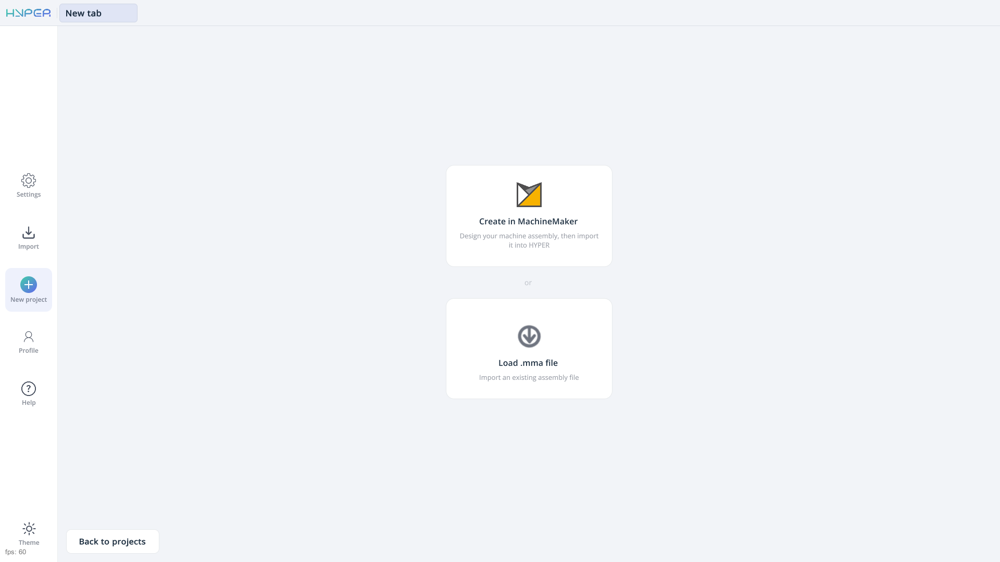</a>

In <strong>MachineMaker</strong>, assemble the cell using the mechanisms required for your task. This example uses a robot, a gripper, and a table. Export the completed cell to <strong>ENCY Hyper</strong>.

<a href="images/download/attachments/150697437/pick-tutorial-machinemaker-2026-09-17.png" rel="noopener" target="_blank">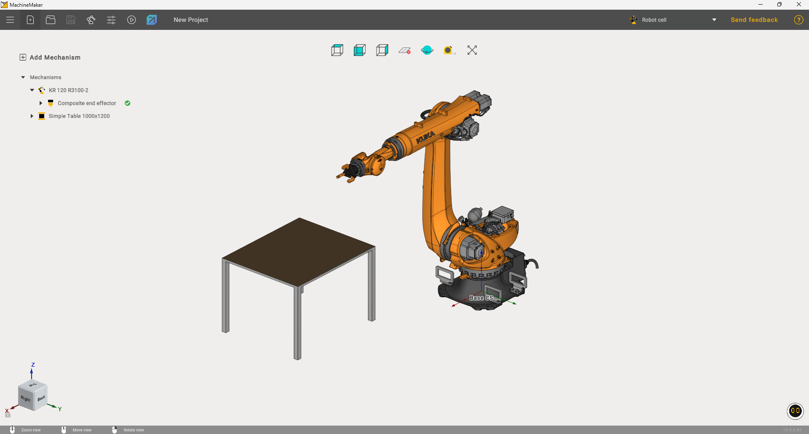</a>

<h2>2. Add objects and trays in Cell mode</h2>

The project opens on the <strong>Cell</strong> tab. Here you can add objects and define trays with points for locating parts on tables or at other positions in the cell. Add a tray with <strong>3 rows and 3 columns</strong> to the table imported from MachineMaker. Then add a second table directly in <strong>ENCY Hyper</strong> and give it another nine-point tray. One tray will hold the parts to be picked; the other will receive them. See <a href="cell-mode.md">Cell Mode</a> for details.

<a href="images/download/attachments/150697437/pick-tutorial-trays-2026-09-17.png" rel="noopener" target="_blank">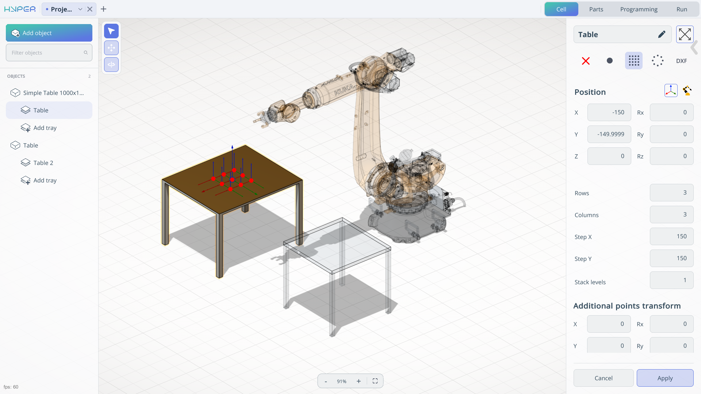</a>

<h2>3. Define and place the parts</h2>

On the <strong>Parts</strong> tab, use <strong>Add part</strong> to create a box or cylinder, or use <strong>Import</strong> to load your own 3D model. Configure the gripping settings for each part: <strong>Pick point</strong> defines how the tool grips it, while <strong>Base point</strong> defines the reference point used to position it on a tray. This example uses a cylinder.

<a href="images/download/attachments/150697437/pick-tutorial-part-2026-09-17.png" rel="noopener" target="_blank">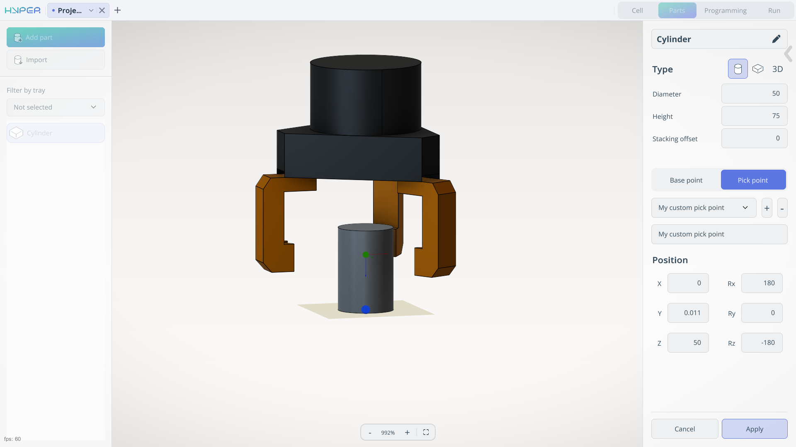</a>

After creating the part, place it at a tray point with the <strong>left mouse button</strong>. To fill the entire tray, press and hold the left mouse button on a point in that tray, then select <strong>Yes</strong> in the confirmation dialog. Fill the source tray and leave the destination tray empty.

<a href="images/download/attachments/150697437/pick-tutorial-filled-tray-2026-09-17.png" rel="noopener" target="_blank">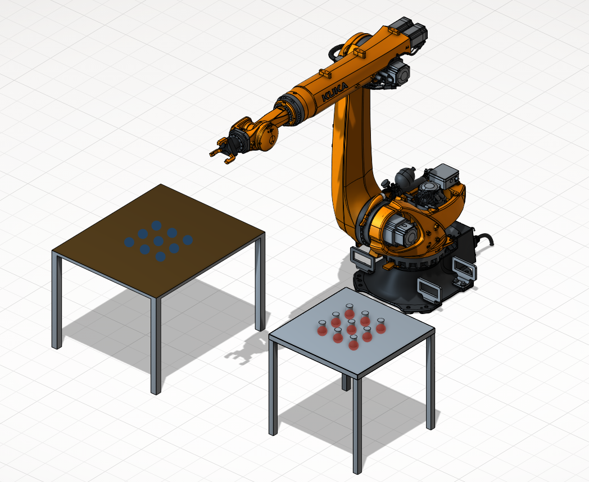</a>

<h2>4. Build the program</h2>

Switch to <strong>Programming</strong>, the main workspace for defining and checking the robot program. Click the <strong>+</strong> button to open the command list.

<a href="images/download/attachments/150697437/pick-tutorial-commands-2026-09-17.png" rel="noopener" target="_blank">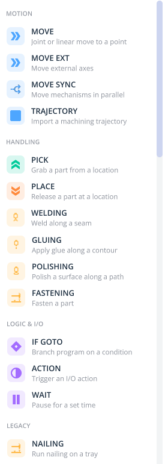</a>

<ul>
<li><strong>MOVE</strong> — moves the robot to a point using joint or linear motion.</li>
<li><strong>MOVE EXT</strong> — moves external axes.</li>
<li><strong>MOVE SYNC</strong> — moves mechanisms in parallel.</li>
<li><strong>TRAJECTORY</strong> — imports a machining trajectory from a CAM system.</li>
<li><strong>PICK</strong> — picks up a part from a selected location.</li>
<li><strong>PLACE</strong> — releases a part at a selected location.</li>
<li><strong>WELDING</strong> — performs a welding operation.</li>
<li><strong>GLUING</strong> — applies adhesive along the specified path.</li>
<li><strong>POLISHING</strong> — polishes a surface along a path.</li>
<li><strong>FASTENING</strong> — fastens a part.</li>
<li><strong>IF GOTO</strong> — branches to another program step when a condition is met.</li>
<li><strong>ACTION</strong> — triggers an input/output action.</li>
<li><strong>WAIT</strong> — pauses execution for a specified time.</li>
<li><strong>NAILING</strong> — performs a nailing operation; listed under Legacy.</li>
</ul>
<h3>Set the initial and final robot positions</h3>

Begin with <strong>MOVE</strong>, which can also be configured within the <strong>START</strong> and <strong>END</strong> steps to define the robot's initial and final positions. Select the corresponding step and use the robot movement controls on the right to set the required position. The screenshot highlights <strong>START</strong>, <strong>END</strong>, and the robot movement controls.

<a href="images/download/attachments/150697437/pick-tutorial-start-end-2026-09-17.png" rel="noopener" target="_blank">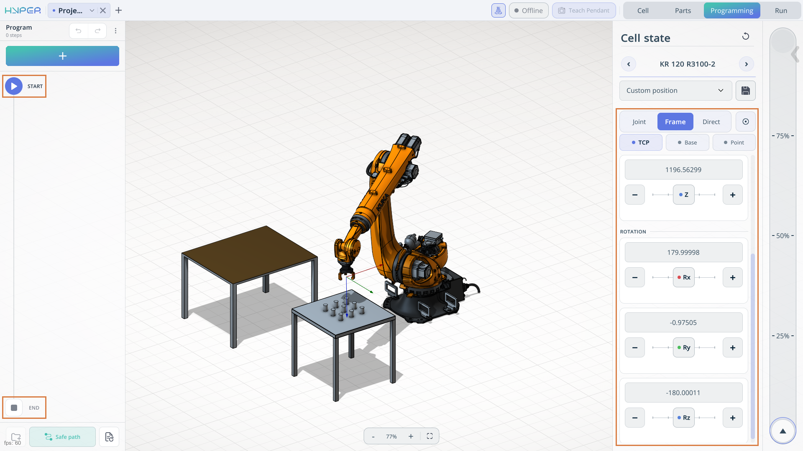</a>

<h2>5. Configure the Pick operation</h2>

Add a <strong>PICK</strong> operation and select the source tray. Use <strong>Single element</strong> to choose whether the operation handles one part or the whole tray. Turn it <strong>off</strong> to work with all parts in the selected tray; turn it on to pick a single part. For this example, leave it off.

<a href="images/download/attachments/150697437/pick-tutorial-pick-options-2026-09-17.png" rel="noopener" target="_blank">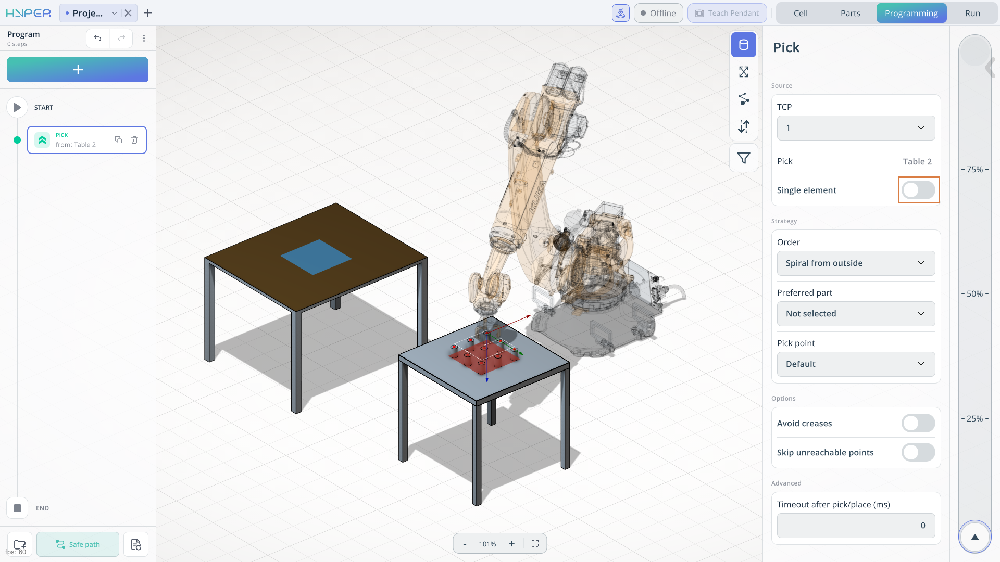</a>

The Pick operation provides settings for part selection, gripping, robot configuration, and approach and retract movements:

<ul>
<li><strong>Main Pick settings.</strong> Select the tool's <strong>TCP</strong> and the source tray. Set <strong>Order</strong> to choose the picking sequence, <strong>Preferred part</strong> to select a part type when needed, and <strong>Pick point</strong> to choose the gripping point defined for the part.</li>
<li><strong>Pick position adjustment.</strong> Use the Pick position controls to adjust the robot pose manually and refine how the tool approaches the part.</li>
<li><strong>Fix.</strong> Use this option in the robot configuration settings to correct an unsuitable joint configuration when the robot's axes fold into an undesirable pose.</li>
<li><strong>Avoid collisions.</strong> Enable this option for the relevant movement segments so that trajectory calculation plans a path around obstacles. Use <strong>Safe Path</strong> to calculate movements with collision avoidance enabled.</li>
<li><strong>Safe move distance.</strong> Set the clearance distance for the robot's approach to and withdrawal from the pick point. Adjust the safe move direction and speed as needed for the part and surrounding objects.</li>
</ul>

For detailed command settings, see <a href="programming-mode.md">Programming Mode</a>.

For the<strong class=""> Place</strong> command, simply select the target cell using the left mouse button where the parts will be placed.

<a href="images/download/attachments/150697437/pick-tutorial-place-2026-09-17.png" rel="noopener" target="_blank">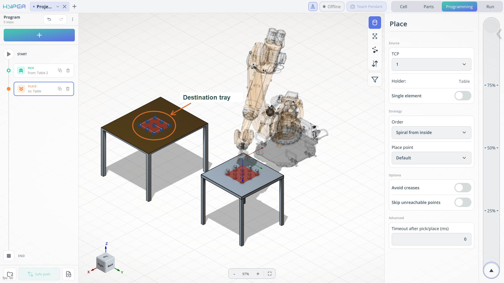</a>

The <strong class="">IF</strong> command allows the program to loop the preceding commands and properly terminate them. In this case, we specify that if all parts have been removed from the table, the robot returns to its Home position.

<a href="images/download/attachments/150697437/pick-tutorial-condition-2026-09-17.png" rel="noopener" target="_blank">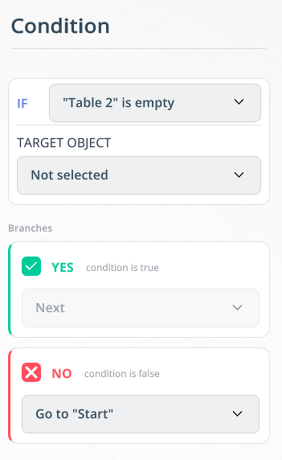</a>

When your program is ready, you need to calculate it before starting the simulation. Use the Recalculate button for this. You will visually see the trajectory along which your robot will move the parts.

<a href="images/download/attachments/150697437/pick-tutorial-calculated-2026-09-17.png" rel="noopener" target="_blank">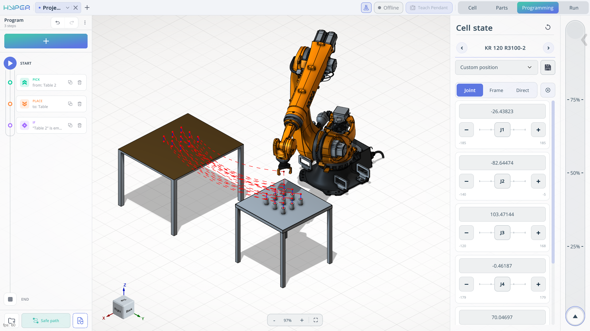</a>

<h2 id="pick-place-simulation">6. Simulate the program and check the gripper</h2>

Use the <strong>simulation slider on the right side of the screen</strong> to start the simulation and adjust its speed. The percentage markings indicate the simulation speed.

<a href="images/download/attachments/150697437/pick-tutorial-simulation-2026-09-17.png" rel="noopener" target="_blank">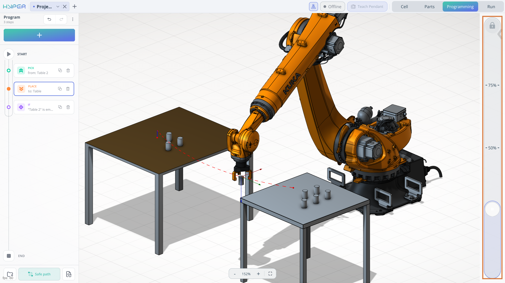</a>

During simulation, you can see that the gripper jaws do not close around the part. To correct this, configure the gripper's opening and closing actions in <strong>Project settings</strong>.

<h3>Assign the opening and closing actions</h3>

Open <strong>Project settings &gt; End effector parameters</strong>, select your tool, and open its gripper settings. In this example, the path is <strong>Composite end effector &gt; Grippers &gt; My TCP</strong>. Assign <strong>TCP - Open</strong> to <strong>Open IO</strong> and <strong>TCP - Close</strong> to <strong>Close IO</strong>.

<a href="images/download/attachments/150697437/pick-tutorial-gripper-2026-09-17.png" rel="noopener" target="_blank">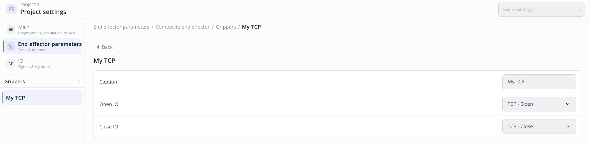</a>

<h3>Configure the IO signals and linked gripper axis</h3>

Go to <strong>Project settings &gt; IO</strong> and select <strong>TCP - Open</strong>. Open its <strong>Input</strong> and <strong>Output</strong> sections and use <strong>Add</strong> to create an item in each. Configure the signal and the associated gripper axis:

<ul>
<li><strong>Input number / Output number</strong> — the input or output signal number used by the action.</li>
<li><strong>Value</strong> — the expected input value or the value sent to the output.</li>
<li><strong>Linked axis</strong> — the tool axis associated with the signal.</li>
<li><strong>Linked axis value</strong> — the axis value corresponding to the required gripper position.</li>
</ul>

The combined illustration shows the <strong>Input</strong> settings above and the <strong>Output</strong> settings below. In this example, both use signal number <strong>0</strong>, signal value <strong>1</strong>, and linked axis value <strong>50</strong> for the open position. <strong>The IO signal and linked axis values shown here are illustrative only.</strong> Actual production equipment may require different values. Configure them to match the signals and gripper positions used by your robot and tool.

<a href="images/download/attachments/150697437/pick-tutorial-io-combined-2026-09-17.png" rel="noopener" target="_blank">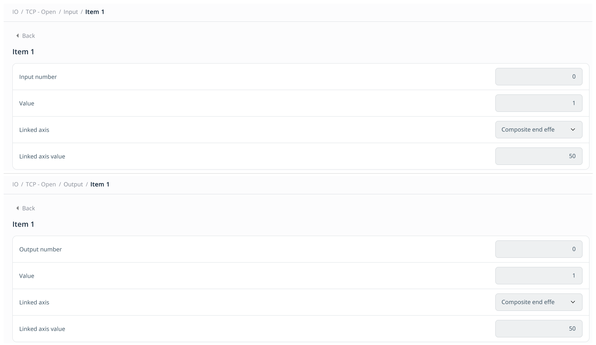</a>

Repeat the same procedure for <strong>TCP - Close</strong>: add and configure its Input and Output items, specifying the signal parameters and the linked axis value for the closed gripping position. Click <strong>Apply</strong> to save the settings.

Run the simulation again. The gripper now responds to the opening and closing signals, moving its fingers to grip and release the parts during the Pick and Place sequence.

<a href="images/download/attachments/150697437/pick-tutorial-gripper-result-2026-09-17.png" rel="noopener" target="_blank">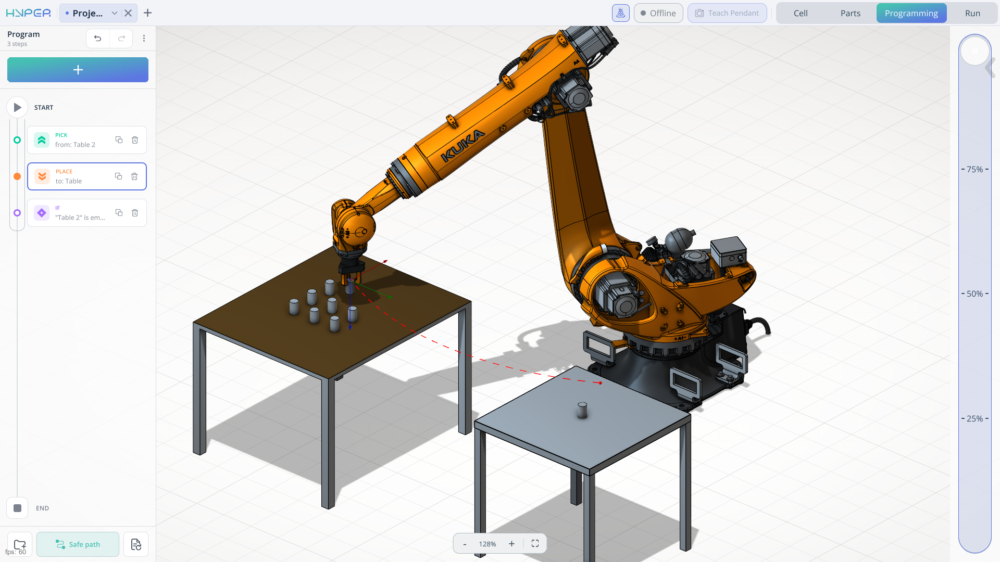</a>

<h2 id="pick-place-run">7. Connect to the robot in Run mode</h2>

Switch to the <strong>Run</strong> tab to connect to the physical robot. Before connecting, open <strong>Project settings &gt; Main &gt; Robot driver settings</strong> and set the robot's <strong>IP address</strong> to match your robot controller.

Return to <strong>Run</strong> and click <strong>Offline</strong> at the top of the screen to establish the connection. Once the robot is connected, the button changes to <strong>Online</strong>.

<a href="images/download/attachments/150697437/pick-tutorial-run-2026-09-17.png" rel="noopener" target="_blank">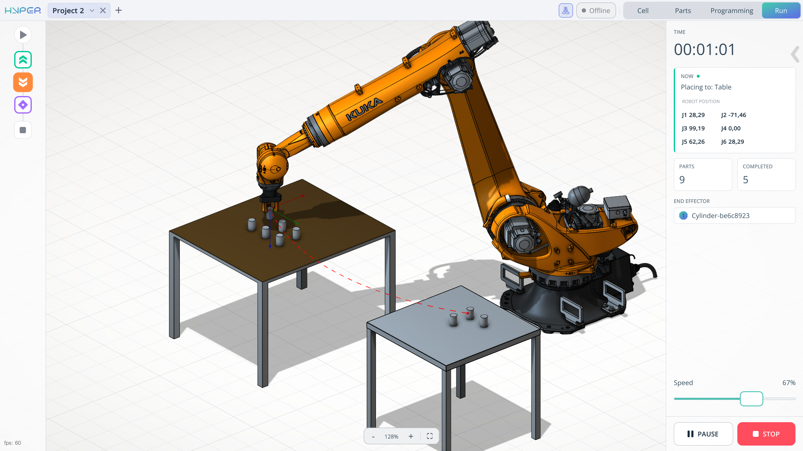</a>

<h1 class="heading">Pick and place (transfer of the part from the workbench to the machine and back.).</h1>

Example of part loading/unloading onto machine.

Click here to expand..

 
First, import the <a href="attachments/150698029/3/Test_Project.zip">project</a> on the Start Page. <a href="home-page.md">See more</a> 

 
After loading the project, open it and add an object representing a CNC machine.  

 
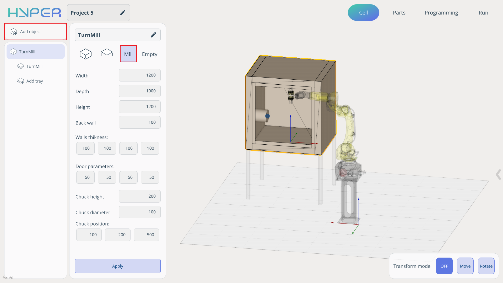
  

Add a cell for part processing on the machine surface.

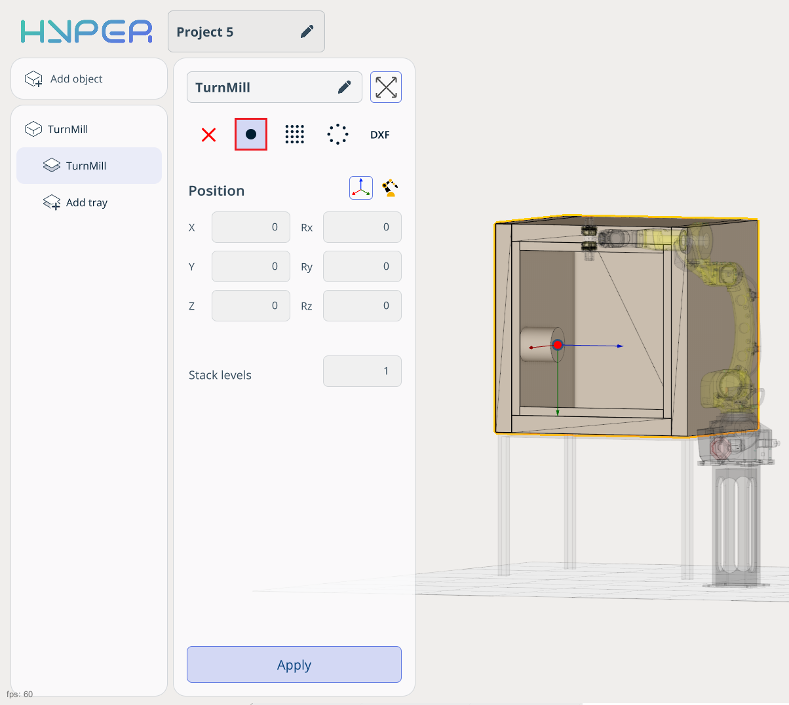

Add a table where the parts will be stored. Add and configure the cell parameters for the table.

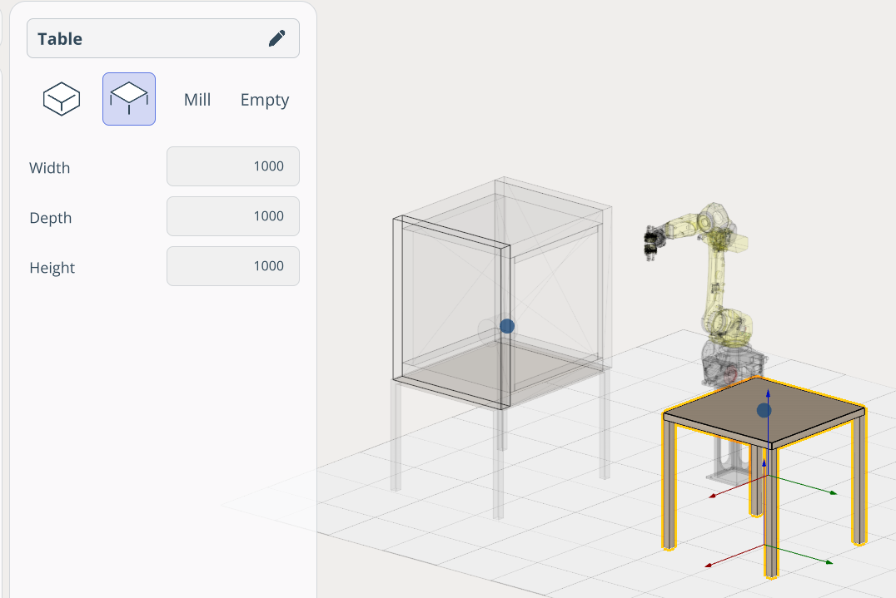

Add a table where the parts will be stored. Add and configure the cell parameters for the table.

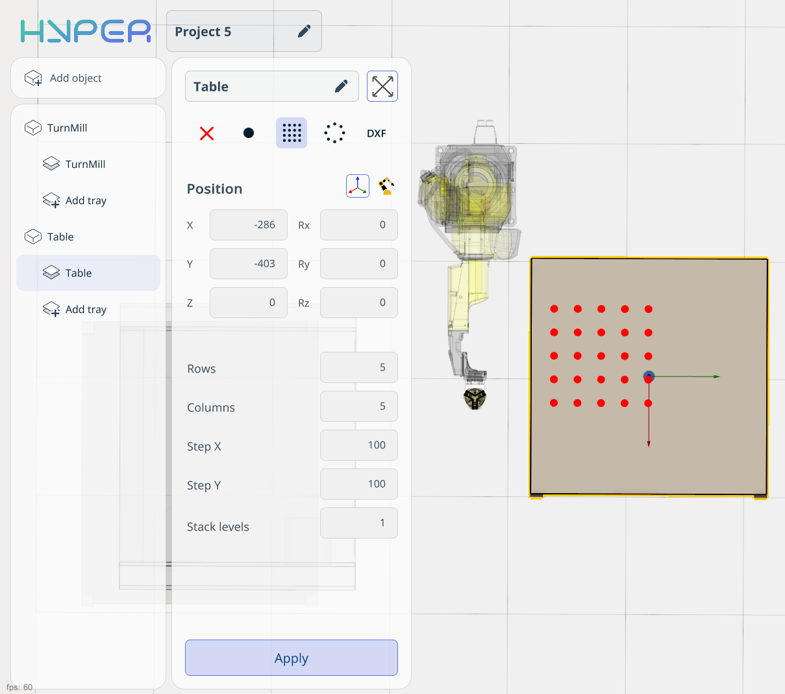

On the Parts tab, create a cylinder and define its <strong class="">Pick Point</strong>. Leave the <strong class="">Base Point</strong> set to default.

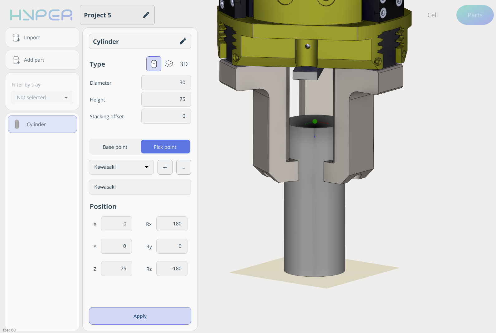

Place the cylinders across the entire cell by holding the left mouse button.

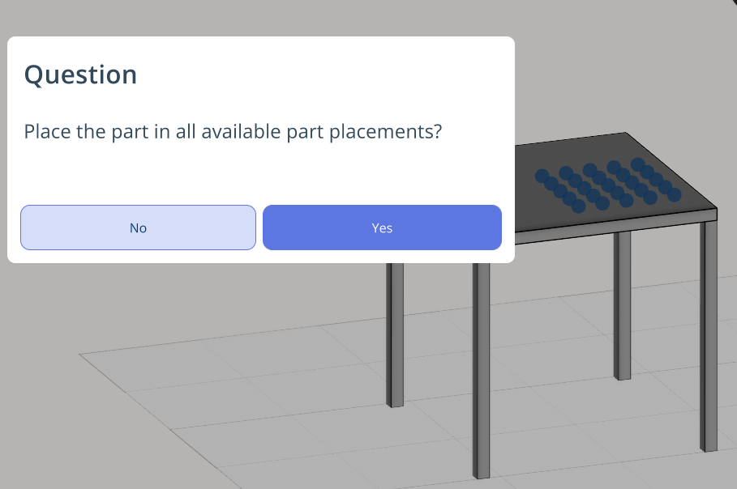

The next step is to build the correct program that enables the robot to transfer parts to the machine for processing.

This robot is equipped with a tool that has two grippers. The logic of our program is to pick up a part and load it into the machine for processing, then place the processed part back onto the table. To ensure that all parts from the table are used, disable the <strong class="">Single element</strong> slider. Also place one part into the machine cell.

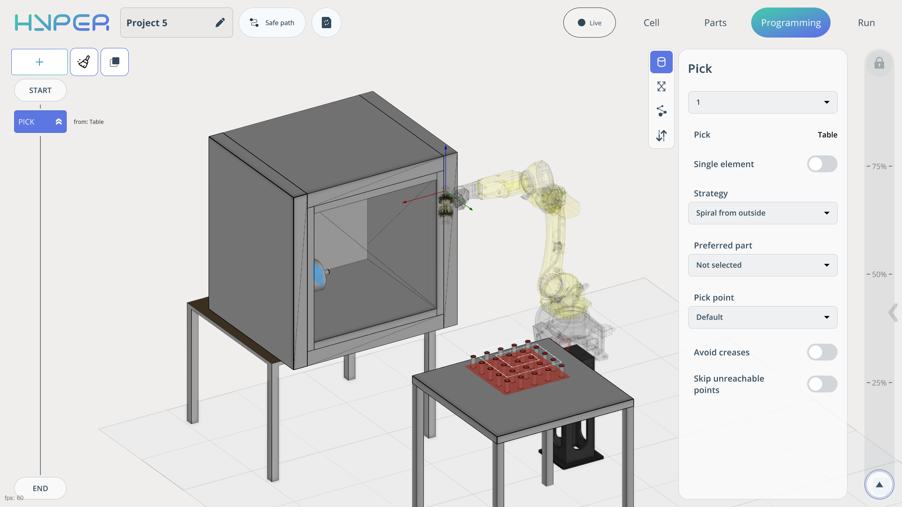

As a result, the robot picks up an unprocessed part from the table, then removes the processed part from the machine and replaces it.

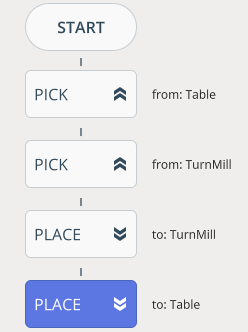

Since we are using multiple parts from the table, the program needs to be looped. To do this, add an <strong class="">IF</strong> command and set the parameters required to loop the part transfer and processing workflow.

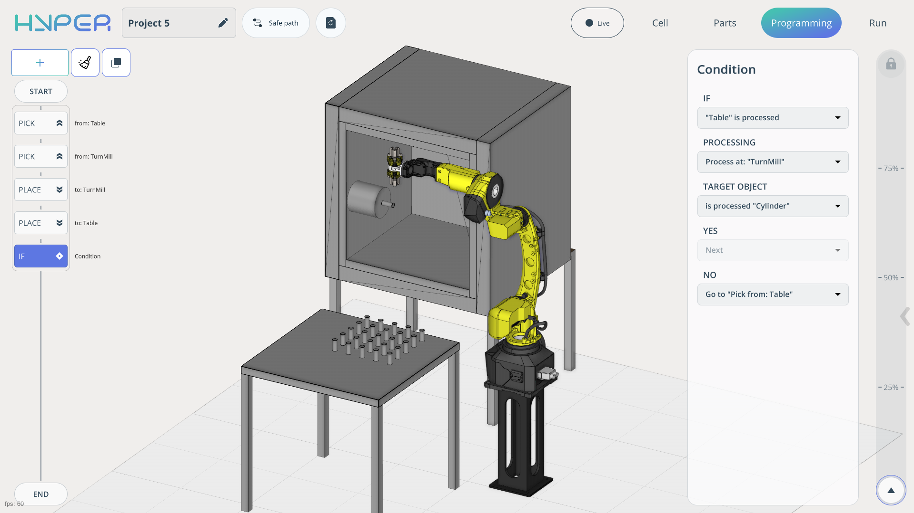

After recalculating all commands, the trajectory will appear. You can use the speed slider on the right to observe the program execution. The robot should transfer all parts to the machine and return them to the table.

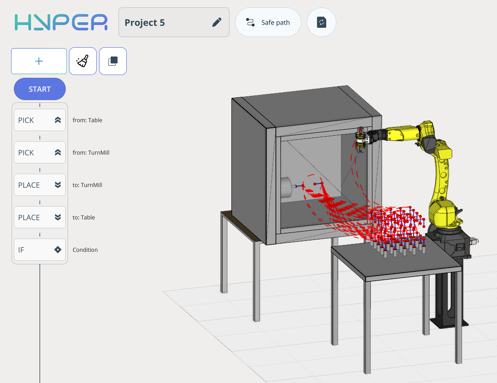

