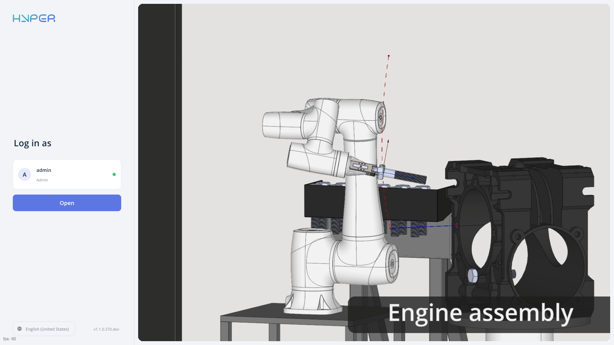
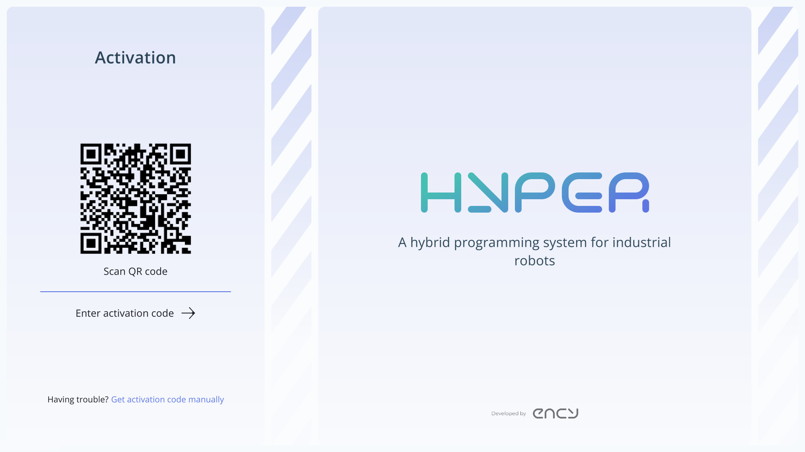
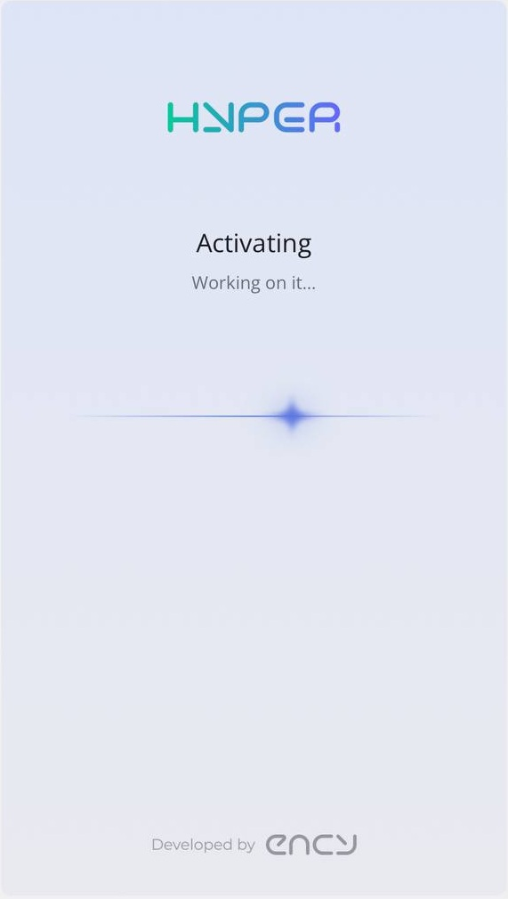
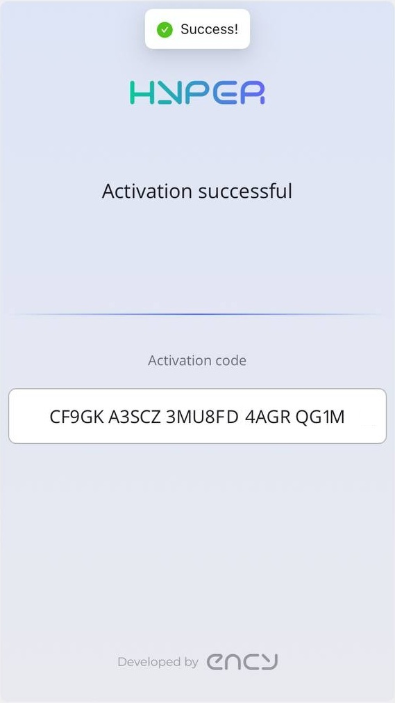
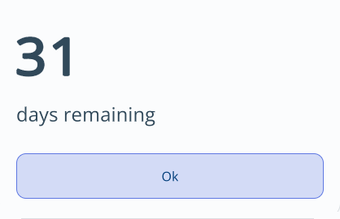

---
title: "License activation"
---

<link rel="stylesheet" href="assets/manual.css">

<h1 id="src-150697452"> License activation</h1>

On the login screen, check the user profile shown under <strong class="">Log in as</strong> (<strong class="">admin</strong> in this example), then click <strong class="">Open</strong> to log in. ENCY Hyper will detect that you don’t have a license and redirect you to the license activation page. You will need a phone with a camera for this process.

Once you scan the QR code, you will be redirected to the login page. If you don’t have an account, you can create one there.

After logging in, the license activation will start automatically. If your computer is not connected to the internet, you will need to manually enter the received CM code using the <strong class="">Get activation code manually </strong>button.

The license should activate successfully. After clicking the <strong class="">OK</strong> button, the main ENCY Hyper window will launch.

