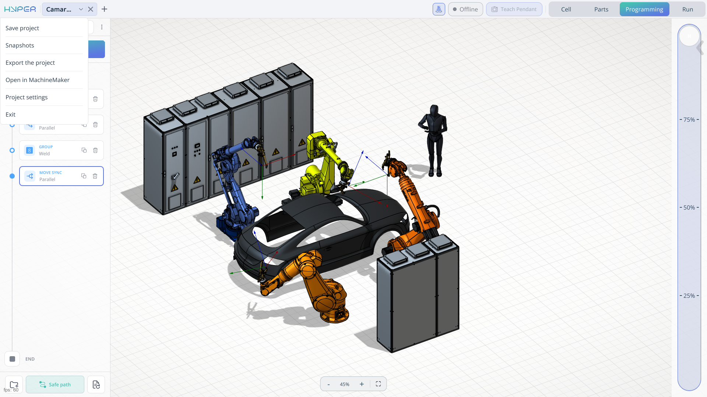

---
title: "Main menu"
---

<link rel="stylesheet" href="assets/manual.css">

<h1 id="src-150697606"> Main menu</h1>

<section id="src-150697606_safe-id-aWQtLk1haW5tZW51djEtQXBwbGljYXRpb25BcmVhOg"><h2>Application Area</h2>

The main menu provides commands for saving and restoring the current project, transferring it to another computer, editing the robotic cell in MachineMaker, and configuring project settings.

<strong class="">Save project.</strong> Saves the changes made to the current project so that you can retain your work and continue from the saved state later.

<strong class="">Snapshots.</strong> Allows you to restore the project to a previously captured state. Use a snapshot to recover an earlier project state after a failure.

<strong class="">Export the project.</strong> Exports the current project as a <strong class="">.zip</strong> archive. You can transfer the archive to another computer and import the project into ENCY Hyper to continue working on it.

<strong class="">Open in MachineMaker.</strong> Opens the current project in MachineMaker, where you can extend the robotic cell by adding objects, robots, and other mechanisms.

<strong class="">Project settings.</strong> Opens the settings associated with the current project, allowing you to configure its parameters.

<strong class="">Exit.</strong> Closes the application.

</section>
<section id="src-150697606_safe-id-aWQtLk1haW5tZW51djEtUHJvamVjdHNldHRpbmdzOg"><h2>Project settings</h2>
<section id="src-150697606_id-.Mainmenuv1-Main."><h3>Main</h3>
These settings configure programming, robot connections, motion, simulation, part handling, and integration services for the current project.

<section id="src-150697606_id-.Mainmenuv1-Programming."><h4>Programming</h4>

Open <strong>Project settings &gt; Main &gt; Programming</strong> to configure collision avoidance, tray processing, calculation time limits, and inverse kinematics for the current project.

Click here to expand..

<strong>Avoid collisions calculation request timeout (ms).</strong> Sets the time limit for waiting for a response to a collision-avoidance calculation request. Increase this limit if a valid request requires more time to complete. This setting controls the request timeout; the calculation itself has a separate timeout below.

<strong>Stack trays strategy.</strong> Selects the strategy used to process trays containing stacked parts. The selected strategy determines the processing order for the stacks and their levels. Use this setting to match the handling sequence to the arrangement of parts in the tray. Available options:

<ul><li><strong>Stacks.</strong> Processes one stack completely before moving to the next stack.</li><li><strong>Levels.</strong> Processes one level across all stacks before moving to the next level.</li></ul>

<strong>Place the part in the same location in the process tray mode.</strong> Controls where a part is returned when processing a tray. When enabled, the part is returned to the location from which it was picked. When disabled, the part may be returned to a different location in the tray.

<strong>Avoid collisions calculation timeout (ms).</strong> Sets the time limit for calculating a path with collision avoidance. A longer timeout allows more time to solve complex movements around obstacles. Increasing the timeout does not guarantee that a collision-free path exists or can be found.

<strong>Avoid collisions safe distance.</strong> Specifies the clearance used when calculating a collision-avoidance path. A larger value requests more separation between the moving robot or tool and surrounding geometry, but can restrict the available paths in confined areas. This parameter affects path calculation, not the robot’s programmed movement speed.

<strong>Program interpretation timeout (ms).</strong> Sets the time limit for interpreting the program commands as part of program preparation. Increase this value if a valid, complex program requires more time for interpretation. This setting applies to interpretation, rather than to the duration of physical robot execution.

<strong>Program calculation timeout (ms).</strong> Sets the time limit for program calculation, including the calculation of the robot movements defined by the commands. Increase it when a valid program cannot finish calculating within the current limit. This setting does not specify how long the robot is allowed to run the program.

<strong>Additional verification of the inverse kinematics solution.</strong> Enables additional checks of calculated inverse kinematics (IK) solutions. An IK solution defines the joint positions required to achieve a requested tool position and orientation. Additional verification checks the calculated solution and may increase calculation time.

<strong>Robot joints flip mode (A1, A3, A5).</strong> Selects how the inverse kinematics calculation handles alternative robot configurations associated with joints A1, A3, and A5. Different joint configurations can achieve the same tool position and orientation. This setting governs configuration selection during calculation. Available options: <strong>Explicit</strong>, <strong>geometrichint</strong>, and <strong>proximitysearch</strong>.

<strong>Cache calculated IK solutions to reduce computation time.</strong> Stores calculated inverse kinematics solutions for reuse when the same calculation is needed again. This can reduce calculation time for repeated positions or movements by avoiding redundant IK calculations.

</section>
<section id="src-150697606_id-.Mainmenuv1-Robotdriversettings."><h4>Robot driver settings</h4>

Configures communication between ENCY Hyper and the robot controller. Select a robot in the project to configure its connection, control driver, network address, and driver-specific parameters.

</section>
<section id="src-150697606_id-.Mainmenuv1-Extensionsettings."><h4>Extension settings</h4>

Configures the dedicated scanner used to inspect the working area and detect parts. These settings support scanner-based functions such as determining how many parts are present in the working area.

</section>
<section id="src-150697606_id-.Mainmenuv1-Motionpathconfiguration."><h4>Motion path configuration</h4>

Configures robot motion speed for simulation and the representation of linear and circular movements.

<strong>Robot general speed multiplier.</strong> Scales the robot motion speed used in the application. Use it to adjust how quickly the robot moves during simulation.

<strong>Linear robot motion accuracy (mm).</strong> Sets the accuracy used to represent linear robot movements.

<strong>Arc robot motion accuracy (degree).</strong> Sets the angular accuracy used to represent circular robot movements.

<strong>Speed settings during runtime.</strong> Groups the motion speed settings used across the application's operating workflows.

</section>
<section id="src-150697606_id-.Mainmenuv1-Simulation."><h4>Simulation</h4>

Controls playback behavior and the visualization of the simulated cell.

Click here to expand..

<strong>Robot motion simulation speed multiplier.</strong> Scales the playback speed of simulated robot movements. A value of 1 uses the nominal simulation speed; larger values speed up playback, and smaller positive values slow it down.

<strong>Collision detection.</strong> Enables collision checking during simulation using the collision geometry available in the project. Use it to identify interference between components while reviewing the simulated motion.

<strong>Welding simulation.</strong> Enables the simulation of the welding process when welding operations are played back.

<strong>Welding contact tolerance (mm).</strong> Sets the distance tolerance used to determine contact between the welding tool and the workpiece during welding simulation. A larger value allows a greater separation to be treated as contact.

<strong>Gluing simulation.</strong> Enables the simulation of adhesive application when gluing operations are played back.

<strong>Polishing simulation.</strong> Enables the simulation of the polishing process when polishing operations are played back.

<strong>Fastening simulation.</strong> Enables the simulation of the fastening process when fastening operations are played back.

<strong>Fastening contact tolerance (mm).</strong> Sets the distance tolerance used to determine contact during fastening simulation. A larger value allows a greater separation between the tool and the workpiece to be treated as contact.

<strong>Trajectory visualization.</strong> Selects the level of detail used to display the robot trajectory. Use this setting to balance visual detail and rendering performance.

<strong>Maximum number of rendered path elements.</strong> Limits the number of trajectory elements drawn in the graphics window. A lower limit reduces the amount of path geometry displayed; a higher limit allows more elements to be shown.

<strong>Step for drawing the robots work area.</strong> Sets the spacing used to draw the robot's work area. A smaller step produces a denser representation; a larger step produces a coarser representation.

<strong>Speeds and accelerations by mechanism.</strong> Opens a subpage containing simulation speed and acceleration settings organized by mechanism.

</section>
<section id="src-150697606_id-.Mainmenuv1-Optimalrobotpositionwhenpickingupapart."><h4>Optimal robot position when picking up a part</h4>

Configures the selection of the robot pose used to pick up a part.

<strong>TCP CS maximum rotation along the Z-axis.</strong> Limits the rotation of the Tool Center Point coordinate system about its Z-axis when determining the picking pose. This controls how much the tool orientation may be adjusted around that axis.

<strong>Avoiding joint creases.</strong> Opens a subpage with settings for avoiding excessive joint twisting when selecting the picking pose.

</section>
<section id="src-150697606_id-.Mainmenuv1-Optimalrobotpositionduringpartrelease."><h4>Optimal robot position during part release</h4>

Configures the selection of the robot pose used to place and release a part.

<strong>TCP CS maximum rotation along the Z-axis.</strong> Limits the rotation of the Tool Center Point coordinate system about its Z-axis when determining the placement pose. This controls how much the tool orientation may be adjusted around that axis.

<strong>Avoiding joint creases.</strong> Opens a subpage with settings for avoiding excessive joint twisting when selecting the placement pose.

</section>
<section id="src-150697606_id-.Mainmenuv1-AI."><h4>AI</h4>

Configures part detection and recognition using a webcam or manually selected images.

Click here to expand..

<strong>Part detector enabled.</strong> Enables part recognition and makes the <strong>Placed Part Detection</strong> window available on the <strong>Parts</strong> tab. Connect a webcam to recognize the parts in the working area.

<strong>WebCam device index number.</strong> Selects the webcam used for image capture by its device index. Use this parameter to choose the required camera when multiple webcams are connected.

<strong>Delay before capturing a photo from a webcam.</strong> Sets the waiting period before the webcam captures an image for recognition.

<strong>Manual selection of images for recognition.</strong> Allows you to select existing images manually for part recognition.

</section>
<section id="src-150697606_id-.Mainmenuv1-CAMIntegration."><h4>CAM Integration</h4>

Stores the file paths required for integration with the CAM system. These paths can be configured manually.

</section>
<section id="src-150697606_id-.Mainmenuv1-Server."><h4>Server</h4>

Contains the IP address and port settings required for communication between the robot driver and ENCY Hyper.

</section>
</section>
<section id="src-150697606_id-.Mainmenuv1-Grippersettings.">
<h3>End effector parameters</h3>

Configures the operating parameters of the tools mounted on the robots in the current project. A project can contain multiple robots, each equipped with a different tool. This section allows you to configure each tool individually.

For grippers, these parameters define how the jaws open and close. Use them to match the tool configuration to the installed end effector and the parts it handles. The available parameters depend on the tool.

</section>
<section id="src-150697606_id-.Mainmenuv1-IO.">
<h3>IO</h3>

Configures the input and output signals used to control end effectors and other equipment in the robotic cell. These settings support tool operation as well as communication with machines and peripheral devices.

Outputs can trigger actions such as opening or closing gripper jaws or machine doors. Inputs can provide feedback about equipment status, allowing the program to coordinate robot movements with external operations.

For example, configure an output signal to open or close a machine door automatically, then use the configured action in an <strong>IO</strong> command in the robot program. An input signal can be used to check the door status before the next operation. Signal assignments and values must match the connected equipment.

</section>
</section>

