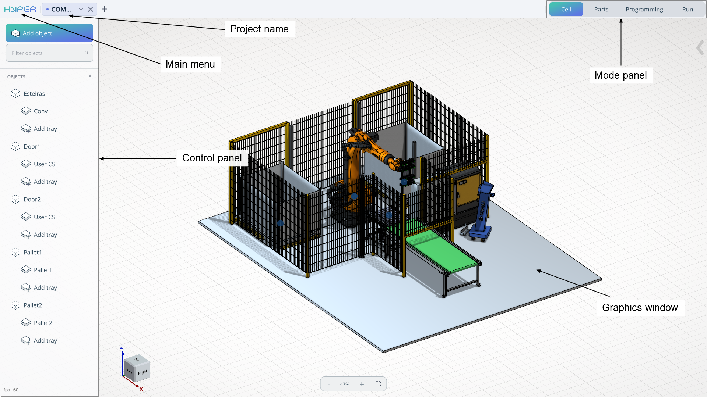

---
title: "System's main window"
---

<link rel="stylesheet" href="assets/manual.css">

<h1 id="src-150697477"> System's main window</h1>

<h1 class="heading">The system's main window has the following view:</h1>

<strong class="">Mode panel. </strong>The mode panel is necessary for step‑by‑step switching between various solutions, from loading the equipment scheme to executing the task on the robotic cell. Mode: <strong class="">Cell, Parts, Programming, Run. </strong><a href="mode-panel.md">See more</a>

<strong class="">Control panel. </strong>The control panel will change depending on the operating mode. It can be presented as a tree of mechanisms, a list of models, or a list of robot movements.

<strong class="">Main menu. </strong>The main menu allows you to open a list that includes project opening, project submission, license menu, and other options. <a href="main-menu.md">See more</a>

<strong class="">Project name. </strong>The project name field allows you to enter the project name using the provided keyboard.

<strong class="">Graphics windows. </strong>The graphics window shows the main components, including the cell, parts, trajectory, etc.

