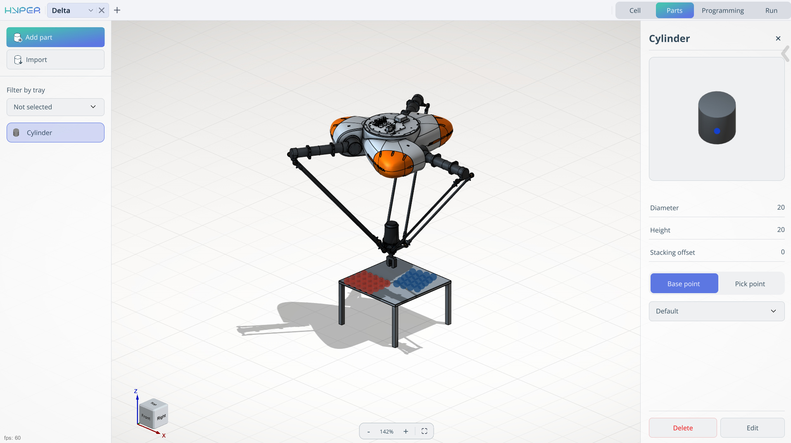
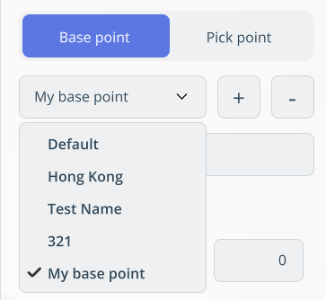
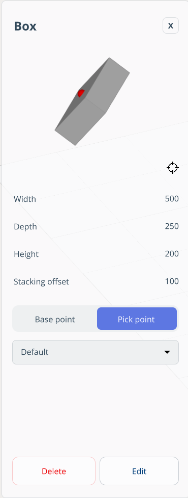
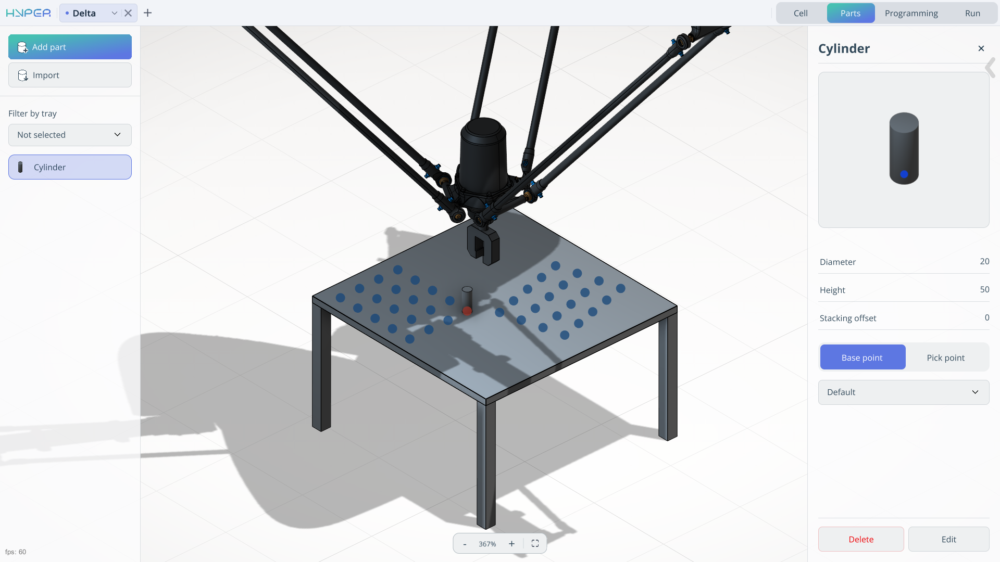
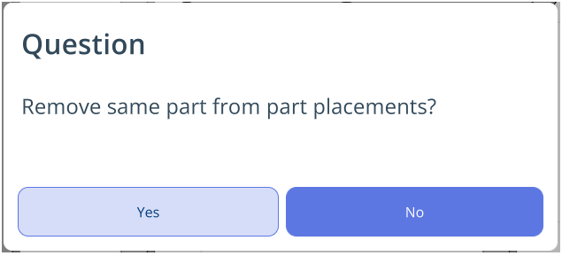
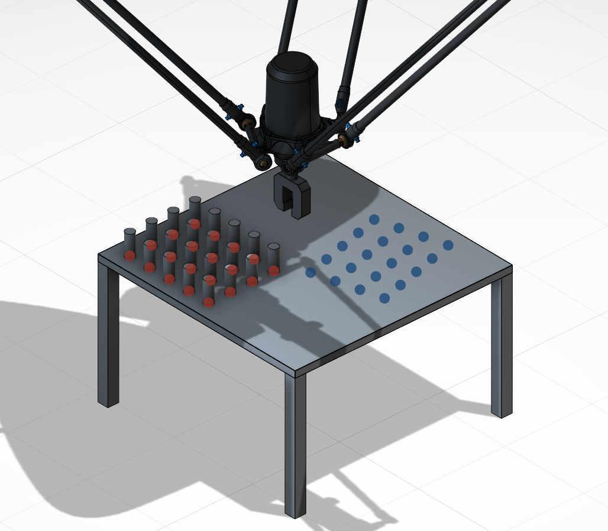

---
title: "Parts Mode"
---

<link rel="stylesheet" href="assets/manual.css">

<h1 id="src-150697513"> Parts Mode</h1>

<h1 class="heading">Application Area:</h1>

The Part mode allows you to add a model or create it from primitives, as well as place them in the <strong class="">tray</strong>.

<h2 class="heading">Import.</h2>

Click here to expand..

It allows you to load a 3D model of the product.

<strong class="">Type. </strong>Сylinder, Box, or 3D model.

<strong class="">ustom file. </strong>It allows you to reselect the model.

<strong class="">Stacking offset. </strong>The parameter determines the vertical alignment relationship between stacked components.

Value = 0: parts are positioned directly atop one another without overlap.

Value &gt; 0: defines the insertion depth for mating parts (e.g., in LEGO‑like interlocking mechanisms, this would equal the height of the connecting cylinder).

<strong class="">Base point/ Pick point. </strong>The reference point for placement /<strong class=""> </strong>The gripping point on the part.

<ul class=""><li class="">
Unlimited pick and base points can be created.

</li><li class="">
Each point supports editing, deletion, and renaming.

</li><li class="">
Coordinates can be input manually or selected via model interaction.

</li><li class="">
A gripper visualization aids pick point definition, showing the robot’s actual gripping posture.

</li></ul>
<strong class="">Name pont. </strong>Assigns a name to an existing point

<strong class=""> 
Add/Delete a point.     
</strong> 
Allows you to create/delete a point that is added to the <strong class="">list of points.</strong> 

 
<strong class="">List of points. </strong>View point names    

 
<strong class=""><strong class="">
</strong> </strong> 

 
<strong class="">X,Y,Z,Rx,Ry,Rz,A,B,C</strong> - Fields for spatial orientation of the point.    

<h2 class="heading">Add part.</h2>

Click here to expand..

It allows you to create a model from primitives. In this template, some parameters are identical to those in <strong class="">Import - 3D model.</strong>

<strong class="">Сylinder.</strong>

<strong class="">Diameter. </strong>Distance across the circular base, through the center

<strong class="">Height. </strong>Distance between the two bases along the axis

<strong class="">Box.</strong>

<strong class="">Width.</strong> 
Defines the width    

<strong class="">Depth. </strong> 
Defines the depth    

<strong class="">Height. </strong> 
Defines the height    

<h2 class="heading">Filter by tray.</h2>

It allows you to select a specific tray for work.

<h2 class="heading">List of parts</h2>

It displays a list of parts for moving and allows you to edit them.

Click here to expand..

Clicking the part opens a window where you can:

<ol class=""><li class="">
View model name

</li><li class="">
Edit model

</li><li class="">
Delete model

</li><li class="">
Show base and pick points

</li><li class="">
Rotate model (preview)

</li></ol> 

<h2 class="heading">Work specifics</h2>

In this mode, place the parts in their initial positions.

Click here to expand..

To position the parts in the tray:

<ul class=""><li class="">
Select the required part in the parts tree.

</li><li class="">
In the graphics window, choose the attachment point.

</li><li class="">
The selected part will appear in this position.

</li></ul>

The position where a part is already installed (attachment point) changes its color to indicate that the slot is occupied.

To <strong class="">remove</strong> a part from its position, simply click on the attachment point where the part is located.

To add <strong class="">multiple parts</strong> at once, <strong class="">press and hold the left mouse button</strong>. A dialog box will then appear, prompting you to add this part to the entire tray.

 The same mechanism applies to removing parts from the tray.

