---
title: "Programming Mode"
---

<link rel="stylesheet" href="assets/manual.css">

<h1 id="src-150697525"> Programming Mode</h1>

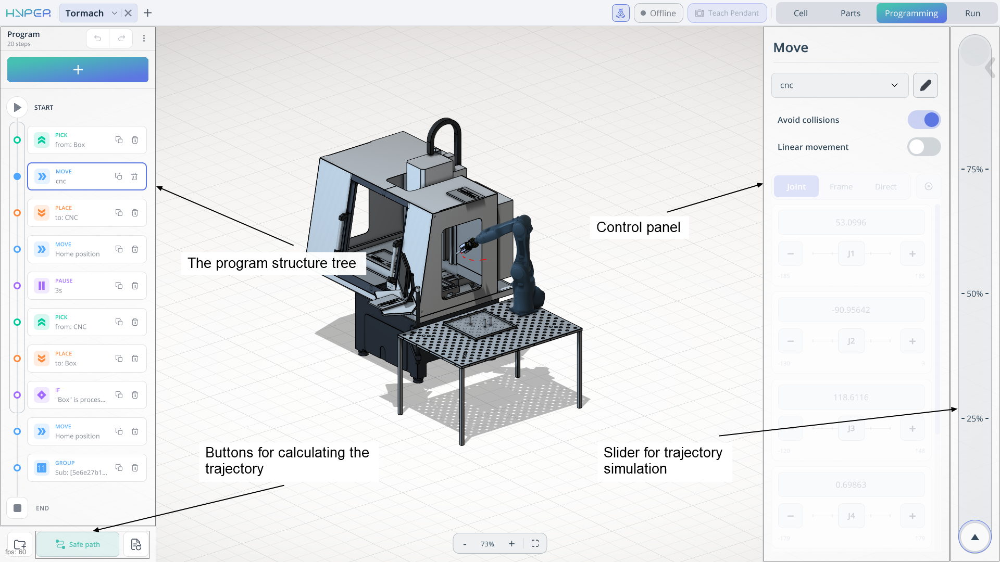

<h1 class="heading">Application Area:</h1>

 
Programming Mode represents the pivotal operational environment in which theoretical plans are executed and robotic systems become operational. It functions as a multifaceted control center—a dedicated workspace for automation management and system configuration.    

 
In Programming Mode, the <strong class="">Control Panel</strong> shifts to the right side of the screen and the <strong class="">Program Structure Tree</strong> is added.    

<h2 class="heading">Buttons for calculate the trajectory.</h2>

 

<strong class="">Quick</strong> 
<strong class=""> calculation</strong> 
<strong class=""> button. </strong>Calculates the trajectory without considering the checkboxes in <strong class="">collision avoidance</strong> commands.    

 

<strong class="">Safe</strong> 
<strong class=""> Path</strong> 
<strong class="">button. </strong>Computes trajectory with collision avoidance — only for commands where the flag is enabled.    
  

<h2 class="heading">Slider for simulation.</h2>

 
Simulate trajectory (speed controlled by slider).  

<h2 class="heading">Collision detection</h2>

<strong>Collision detection</strong> helps identify collisions between mechanisms and objects in your project. To enable it, open <strong>Project settings &gt; Main &gt; Simulation</strong> and turn on the <strong>Collision detection</strong> toggle.

<a href="images/download/attachments/150697525/collision-detection-settings-2026-09-17.png" rel="noopener" target="_blank">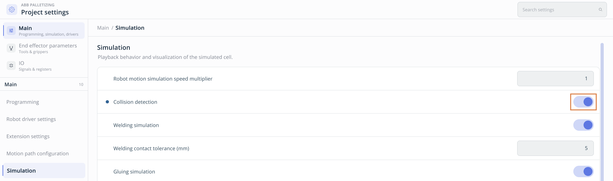</a>

After you enable this option, ENCY Hyper builds a collision model for your project. A progress indicator appears at the top of the screen. Wait for the model to finish building before checking for collisions.

Once the model is ready, simulate the robot movements to check where collisions may occur between mechanisms and objects. Colliding components are highlighted in red in the graphics window, as shown below.

<a href="images/download/attachments/150697525/collision-detection-example-2026-09-17.png" rel="noopener" target="_blank">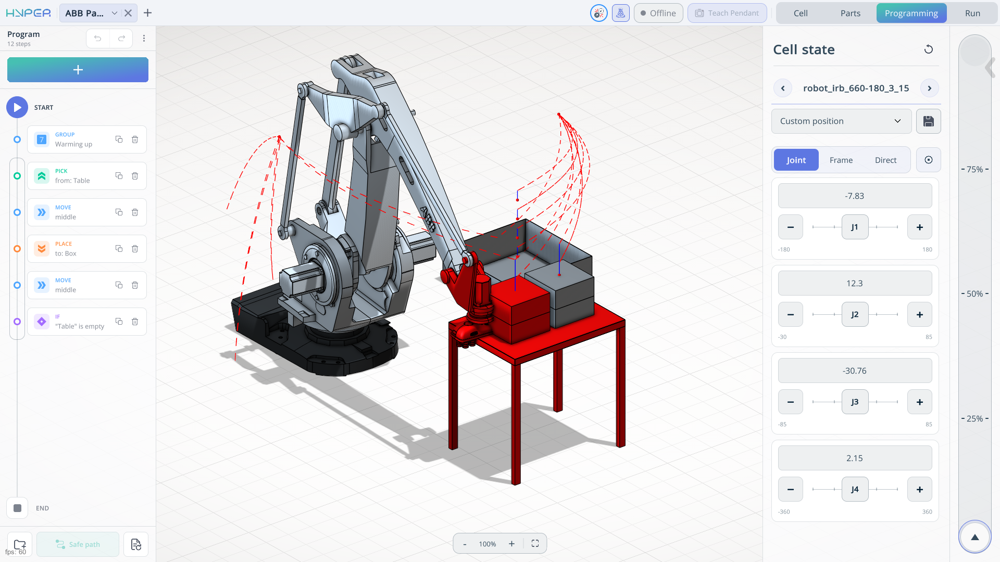</a>

<h2 class="heading">The Program Structure Tree consists of:</h2>

 
<strong class=""><i class=""> 
Buttons:    
</i></strong> 

<strong class=""> 
<strong class="">Add a command. </strong> 
</strong> 
Allows you to add basic commands.     
<strong class=""> 
<strong class="">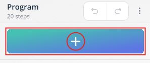
</strong> 
</strong>

<strong class=""> 
<strong class="">Clear. </strong> 
</strong> 
To clear all commands and restart from the initial state.     
<strong class=""> 

</strong>

<strong class=""><strong class=""> 
Creates a Group.    
</strong></strong> 
Commands can be organized into groups. Once created, a group can be copied, and the tray assignments for all commands in the group can be modified collectively. Efficient handling of repetitive tasks across multiple trays. 

<strong class=""> 
<strong class=""><i class="">Commands:</i></strong> 
</strong>

<strong class=""> 
Start    

.     
</strong> 
Set robot initial position. The Control Panel features navigation for robot movement in space.     

<a href="robot-navigation.md">See more</a> 

<strong class=""> 
End    

.     
</strong> 
Set    

 robot final position. The Control Panel features navigation for robot movement in space. <a href="robot-navigation.md">See more</a> 

<strong class=""> 
MOVE    

<strong class="">. </strong> 
</strong> 
Place robot at target position.    

Click here to expand..

 
<i class=""><strong class="">Consists of:</strong></i> 

 
<strong class="">List of Robot Positions</strong><strong class=""><strong class="">.</strong></strong><i class=""><strong class=""><strong class=""> </strong></strong></i>Remembers the robot’s position. You can assign a name to this position to use it again. The assigned name will be displayed in the robot’s programming tree structure.    

 
To add a new position, select <strong class="">Custom</strong><strong class=""> Positions</strong> and move the robot, then save the setting.  

 

 
<strong class="">Avoid collisions. </strong>Allows calculating a safe trajectory for this movement.    

 
If you run the project using the <strong class="">quick</strong><strong class=""> calculation</strong><strong class=""> button</strong>, this checkbox will be ignored.    

 

 
When using the <strong class="">Safe</strong><strong class=""> Path</strong> button, it automatically calculates a collision‑avoidant trajectory if this option is enabled for the specific movement. <strong class="">The trajectory calculation will take longer.</strong>  

 
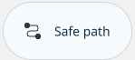
  

 
<strong class="">Linear movement. </strong>Allows linear movement of the robot.    

 
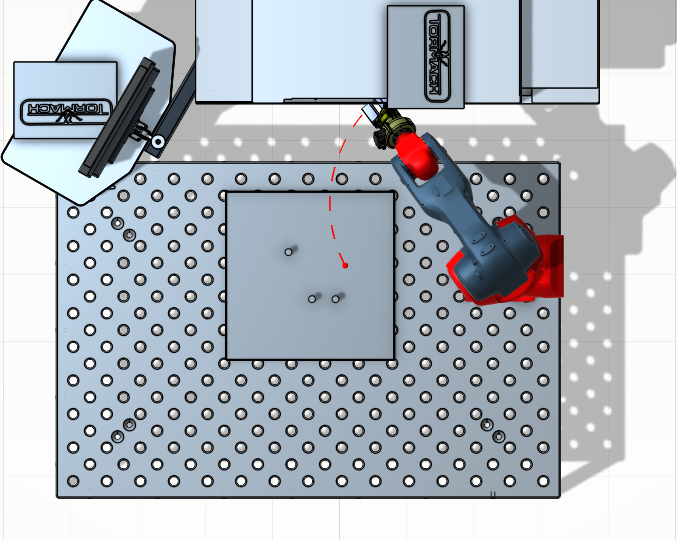
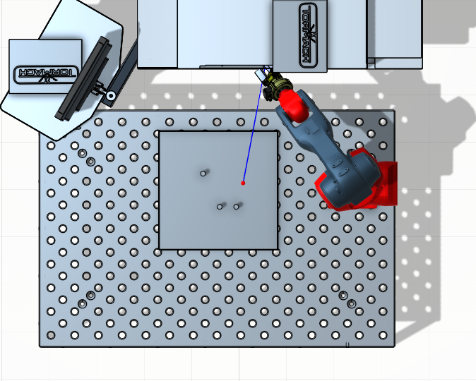
  

 
<strong class="">Navigation for robot movement in space<i class="">. </i></strong>Allows moving the robot in space in various ways.<strong class=""><i class=""> </i></strong><a href="robot-navigation.md">See more</a> 

 
<strong class="">PICK/PLACE. </strong>Enables the robot to pick up/place a part.    

Click here to expand..

 
<i class=""><strong class="">Working principles:</strong></i>  

 
To <strong class="">pick</strong> a part, you need to perform a press action on it. The gripper moves to the part’s pickup point. This point was previously defined in the     
<strong class="">Part mode</strong> 
.    

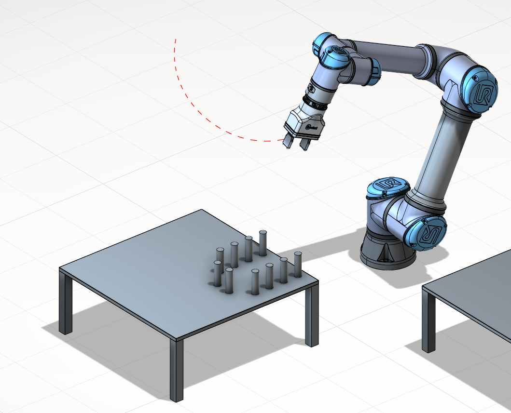
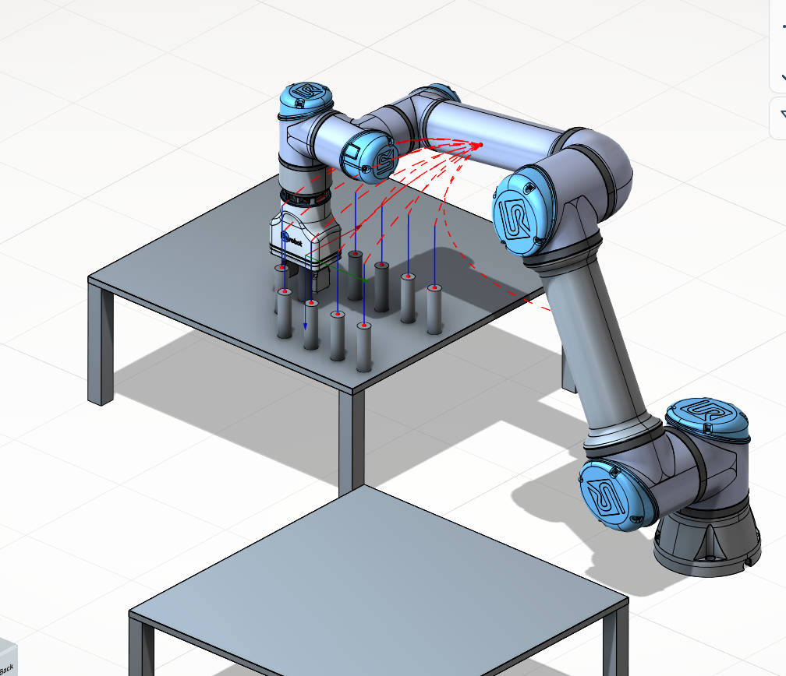

To <strong class="">place</strong> a part, you need to click on the attachment point in the tray.

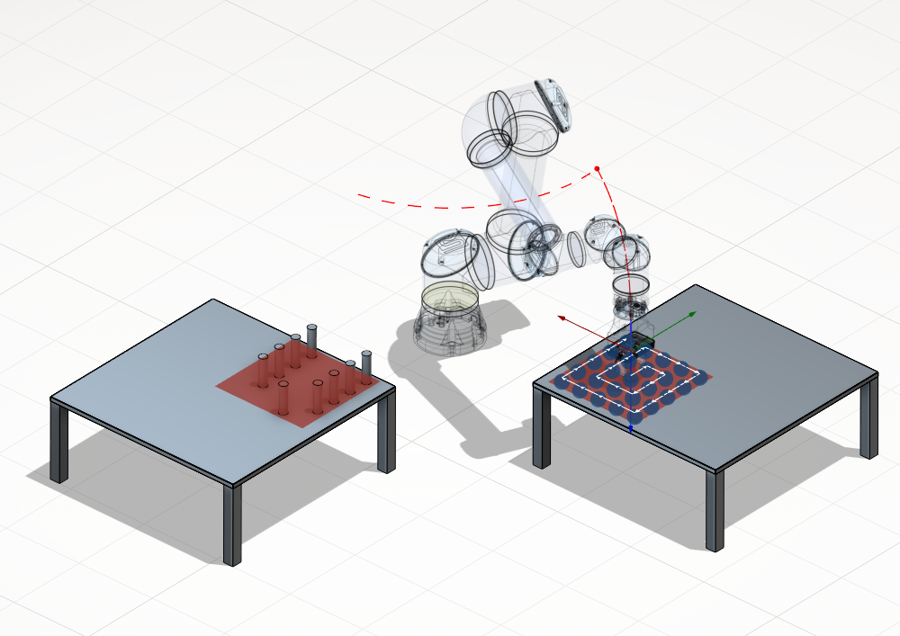

 
<i class=""><strong class="">Consists of:</strong></i> 

<strong class="">The control panel will change depending on the selected mode.</strong>

<strong class="">
1. Pick options.</strong> This tab contains the main settings for gripping.

Click here to expand..

<strong class="">List of points for end effectors. </strong>Allows selecting a grip point on the end effector.

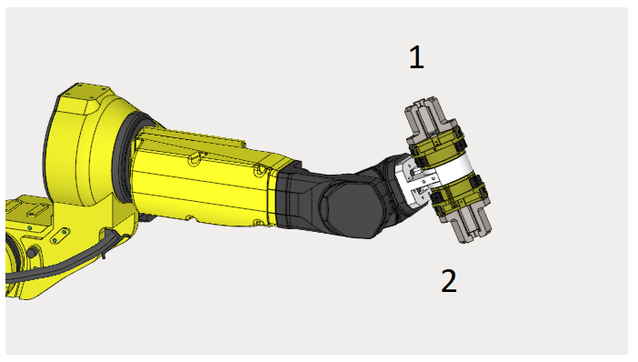

<strong class="">Pick/Holder. </strong>Robot’s position during gripping / Robot position during part placement.

<strong class="">Single element. </strong>Allows to take either one part or all parts from the <strong class="">tray.</strong>

If you select the entire tray, you will see a template of the sequence for transferring parts from this tray in advance.<strong class=""> </strong>

<strong class="">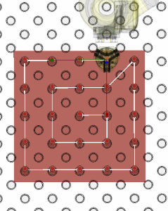
</strong>

<strong class="">Strategy. </strong>Allows selecting a template for the sequence of part transfer from the tray.

<strong class="">Spiral from outside.</strong>

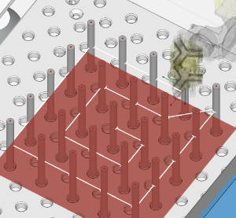

<strong class="">Spiral from inside.</strong>

<strong class="">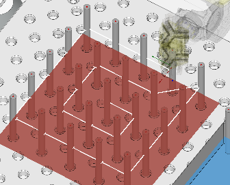
</strong>

<strong class="">Row.</strong>

<strong class="">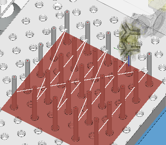
</strong>

<strong class="">Column.</strong>

<strong class="">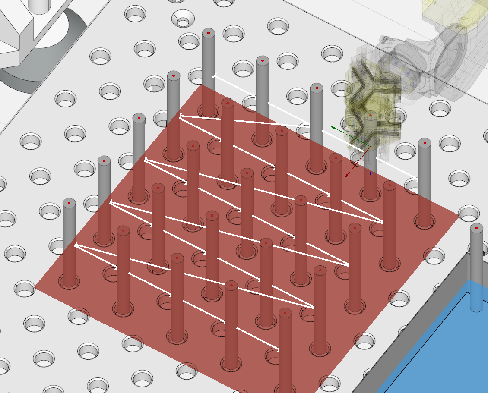
</strong>

<strong class="">Optimal.</strong>

<strong class="">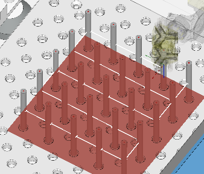
</strong>

<strong class="">Custom. </strong>Set pickup/drop‑off order for parts.

<strong class="">Preferred part. </strong>If the tray contains different types of parts (which we have defined in <strong class="">Part mode</strong>), this option allows you to specify exactly which ones to take.

<strong class="">Pick point /Place point. </strong>List of hold points. Pick points are defined in <strong class="">Parts mode</strong> when specifying a part. You can edit them at any time either in this mode or in <strong class="">Parts mode</strong>.

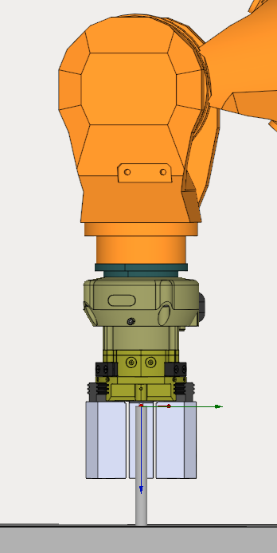
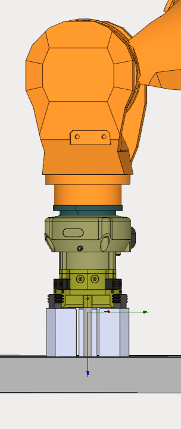

<strong class="">Avoid creases. </strong>Prevents axis twisting (robot joint overrotation).

<strong class="">Skip unreachable points. </strong>When this option is activated, the robot will only pick up parts that it can reach. If this option is not activated and the robot cannot reach a part, the program will display an error and wait for the operator.

<strong class=""><strong class="">
</strong>2. Reference Point Editor. </strong>Allows editing the part’s grip point (if gripping with a gap is required).

 
The Control Panel features navigation for robot movement in space.     
<a href="robot-navigation.md">See more</a>

<strong class=""><strong class="">
</strong>3. Additional points for collision avoidance. </strong>Allows defining additional points or collision‑avoidance strategies between the pick, place, and clearance points.

Click here to expand..

<strong class="">Pick.</strong>

<strong class="">Avoid collisions. </strong> 
Handles collision avoidance up to the <strong class="">clearance point</strong>.    

<strong class="">Checks. </strong> 
A check is required to verify the sensor. For example, to confirm that the tray has extended. In this case, the program will wait until the sensor sends a signal.    

<strong class="">Reference point</strong>

<strong class="">Before. </strong> 
Allows moving to a specific point prior to part pick/place.    

<strong class="">Avoid collisions. </strong>Handles movement from the <strong class="">clearance point</strong> to the <strong class="">pick/place point</strong>.

<strong class="">After. </strong>Allows moving to a specific point after part <strong class="">pick/place</strong>.

<strong class="">Avoid collisions. </strong>Handles movement from the <strong class="">pick/place point</strong> to the <strong class="">clearance point.</strong>

<strong class="">Edit. </strong>Allows setting a new robot position or editing the existing one.

<strong class="">
4. Clearance. </strong>The position the robot moves to prior to gripping the part.

Click here to expand..

<strong class="">Simple. </strong>Allows creating a simple approach to the grip point.

<strong class="">Save move distance. </strong>The position the robot moves to prior to gripping the part.

<strong class="">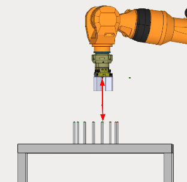
</strong>

<strong class="">Safe move direction. </strong>Allows specifying the axis along which to approach the grip point. (X+,X- and etc)

<strong class="">Safe move speed. </strong>Allows slowing down the feed rate when approaching the grip point.

<strong class="">Sub program. </strong> 
Allows creating a complex approach to the grip point (e.g., when the robot needs to retrieve a part from a machine, move to a chip‑blow‑off station, and then place the part).    

 
In this mode, you can create subroutines consisting of multiple steps (similar to a program tree). To do this, create a command using the «Add a command» button and drag the command not into the main tree, but into the subroutine.    

 
<strong class="">You can add commands such as MOVE or IO.</strong> 

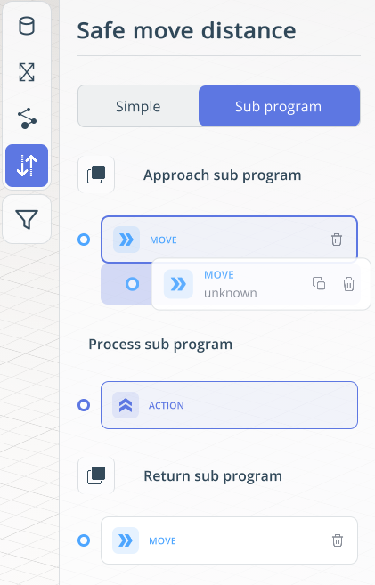

 For MOVE commands, an option to move the robot in space is available. <a href="robot-navigation.md">See more</a>

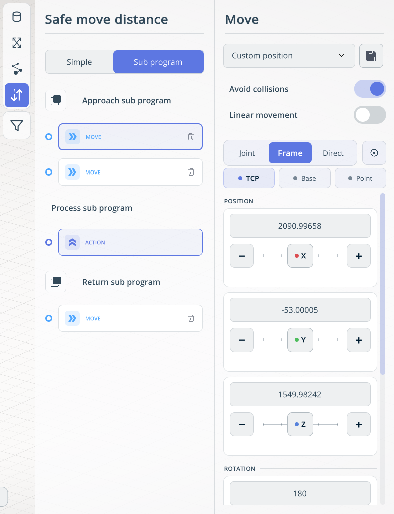

<strong class="">IF. </strong>Allows looping the program.

Click here to expand..

 
<i class=""><strong class="">Working principles:</strong></i>  

 
If the program doesn’t have an <strong class="">IF</strong> statement, pick/place is performed for only one part.    

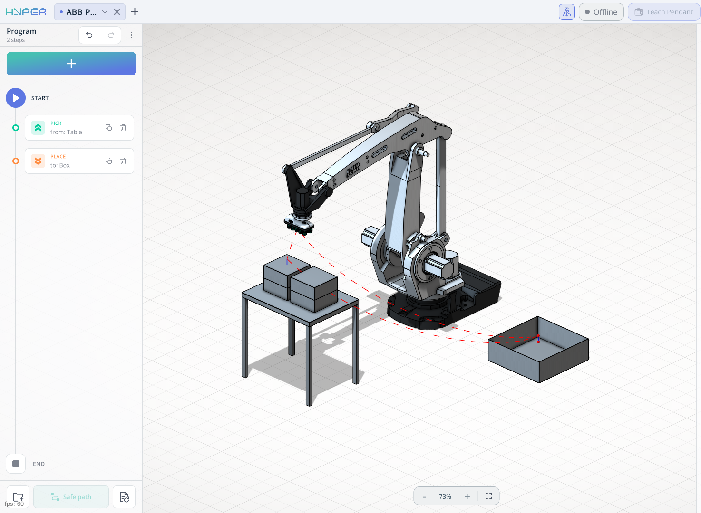

 
If you use an <strong class="">IF</strong> statement, it will loop the program. Meanwhile, the program tree shows which blocks the <strong class="">IF</strong> command works with (all commands fit into a single block).    

 
The program works in blocks.    
 In this example, there are 3 blocks.

 
<strong class="">Block 1 - PICK:</strong> In this case, it looks at the tray and checks whether there is a part inside. Then it picks up the part.    

 
<strong class="">Block 2 - PLACE:</strong> It looks at the second tray and searches for a place to put the part.    

 
<strong class="">Block 3: - IF:</strong> It checks whether the table is empty, and depending on the answer, performs an action for YES or NO.    

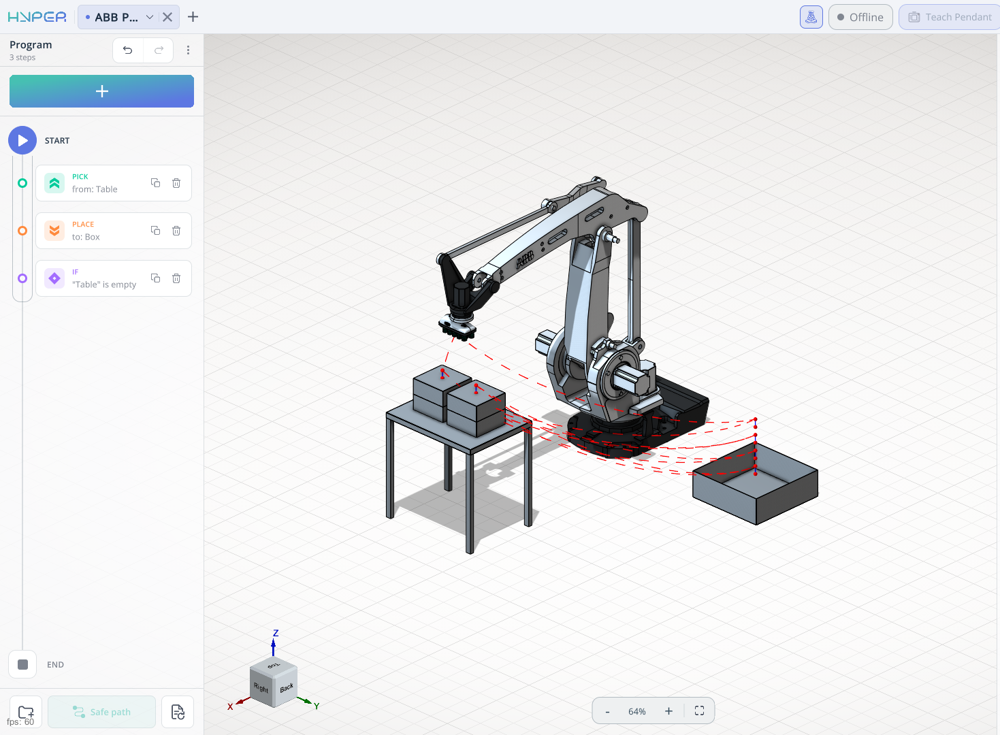
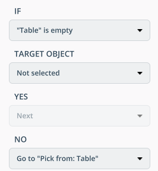

 
<i class=""><strong class="">Consists of:</strong></i> 

<strong class="">IF.</strong> The main condition under which the loop executes.     
This could be a condition such as <strong class="">Table</strong><strong class=""> empty</strong> or <strong class="">Table</strong><strong class=""> is</strong><strong class=""> processed</strong>.    

<strong class=""> 
TARGET OBJECT.     
</strong> 
The condition applies only to a specific part.    

<strong class=""> 
YES.     
</strong> 
What    

 should be done if the condition is true?    

<strong class=""> 
NO.     
</strong> 
What should be done if the condition is false?    

<strong class="">IO. </strong>This is required for managing inputs/outputs (external axes of machines and robots — machine doors, rails, etc.). <strong class="">IO</strong> is configured in <strong class="">Project Settings</strong>. <a href="main-menu.md">See more</a>

Click here to expand..

 
<i class=""><strong class="">Working principles:</strong></i> 

Open <strong>Project settings</strong> and select <strong>IO</strong> in the left panel. The settings already contain predefined IO entries. Select an entry, such as <strong>Open door</strong>, and edit its settings to match your equipment.

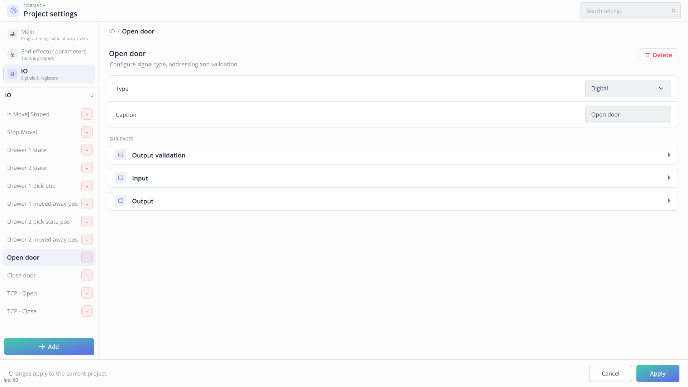

You can also create your own IO entry. Click <strong>Add</strong> at the bottom of the IO list on the left, then configure the new entry.

For example, let’s create an <strong>Open door cnc</strong> command in the settings.

You can configure any input and output signals. For example, let’s set output 250 to value 60. You also need to select the linked axis from the list and assign a value to it.

<a href="images/download/attachments/150697525/io-output-settings-2026-09-16.png" rel="noopener" target="_blank">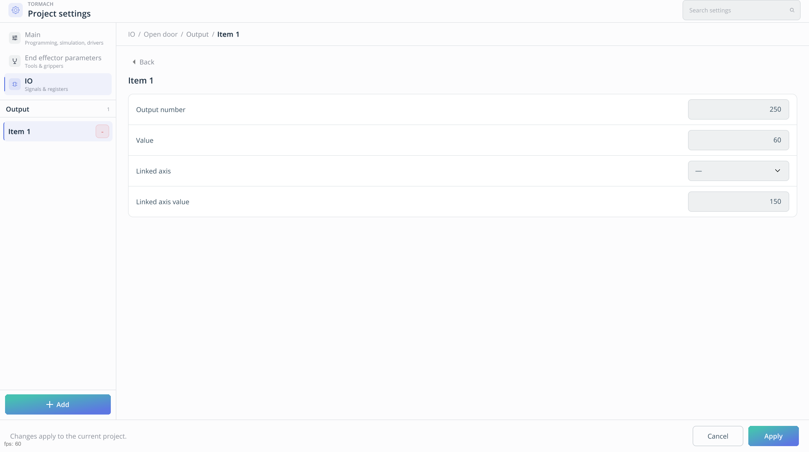</a>

In the IO window, you can select this action.

<a href="images/download/attachments/150697525/io-control-2026-09-16.png" rel="noopener" target="_blank">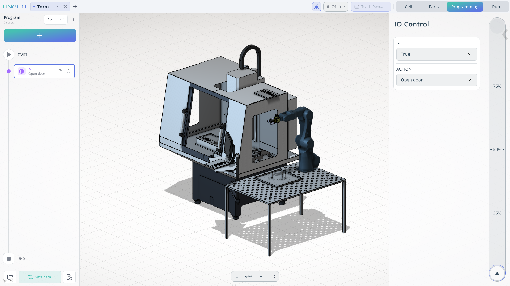</a>

 
<i class=""><strong class="">Consists of:</strong></i> 

<strong class=""> 
IF.     
</strong> 
It also allows checking a sensor before executing any IO action (e.g., open the machine door if the sensor indicates the machine is not in operation).    

 

<i class="">By default, you can trigger IO actions without conditions (True).</i> 
  

<strong class=""> 
ACTION.    
</strong> 

It allows you to run the macro event that was configured in the project settings.    

<strong class="">PAUSE. </strong>It allows you to set a delay between actions.

Click here to expand..

<i class=""><strong class="">Consists of:</strong></i>

<strong class="">WAIT UNTIL. </strong>It allows you to set a delay that waits for a specific event. If a sensor is set to be waited for, the Time field changes its value to reflect the polling interval of that sensor.

<i class="">By default without conditions (True).</i> 

<strong class="">TIME(sec). </strong>It specifies how many seconds to wait.

<strong class="">NAILING. </strong>The functionality is designed for nail driving.

Click here to expand..

<i class=""><strong class="">Working principles:</strong></i> 

The robot approaches the point, sends a signal to the end effector, which pushes the nail and turns it off.

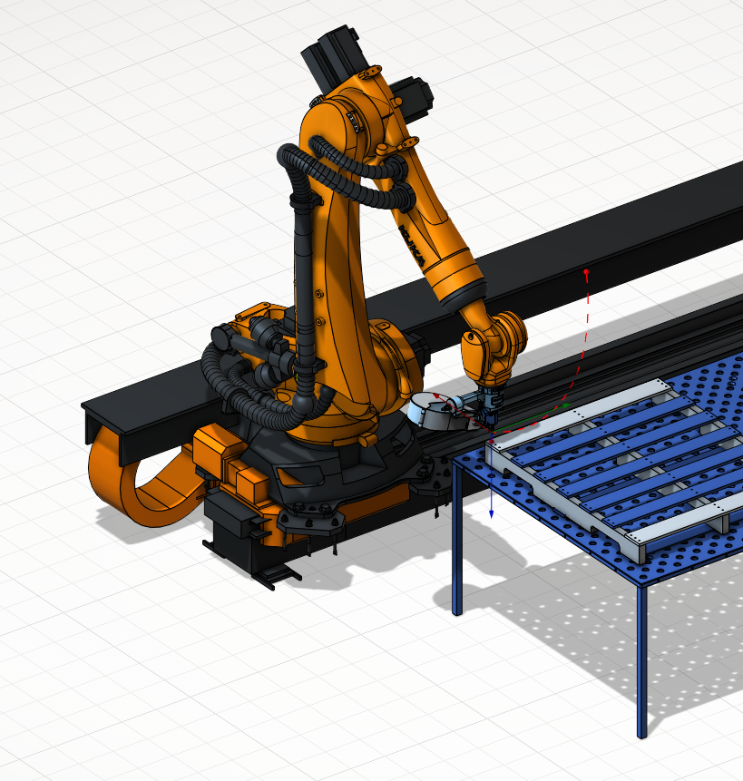

 
<i class=""><strong class="">Consists of:</strong></i> 

 
<strong class="">Processing action. </strong>It allows you to define an <strong class="">IO</strong> event (to send a signal to the end effector for driving nails).    

 
The parameters are the same as in the <strong class="">PICK</strong> operation.    

<strong class="">WELDING. </strong>Joins parts using spot welding or continuous seam welding.

Click here to expand..

<i><strong>Working principles:</strong></i>

For spot welding, the robot positions the welding tool at each specified point and performs a weld. For seam welding, the robot moves the tool continuously along the specified seam while welding.

<a href="images/download/attachments/150697525/welding-2026-09-16.png" rel="noopener" target="_blank">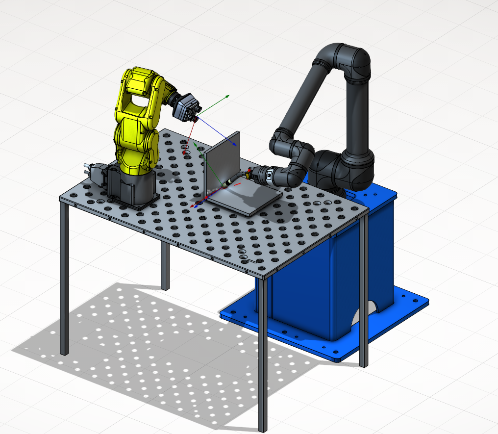</a>

<strong class="">GLUING. </strong>Applies adhesive to bond parts together.

Click here to expand..

<i><strong>Working principles:</strong></i>

The operation follows the same point-based or continuous-path approach as welding. The robot positions the dispensing tool at specified points or moves it along a specified path while dispensing adhesive. The adhesive is applied to the bonding surfaces to join the parts.

<a href="images/download/attachments/150697525/gluing-2026-09-16.png" rel="noopener" target="_blank">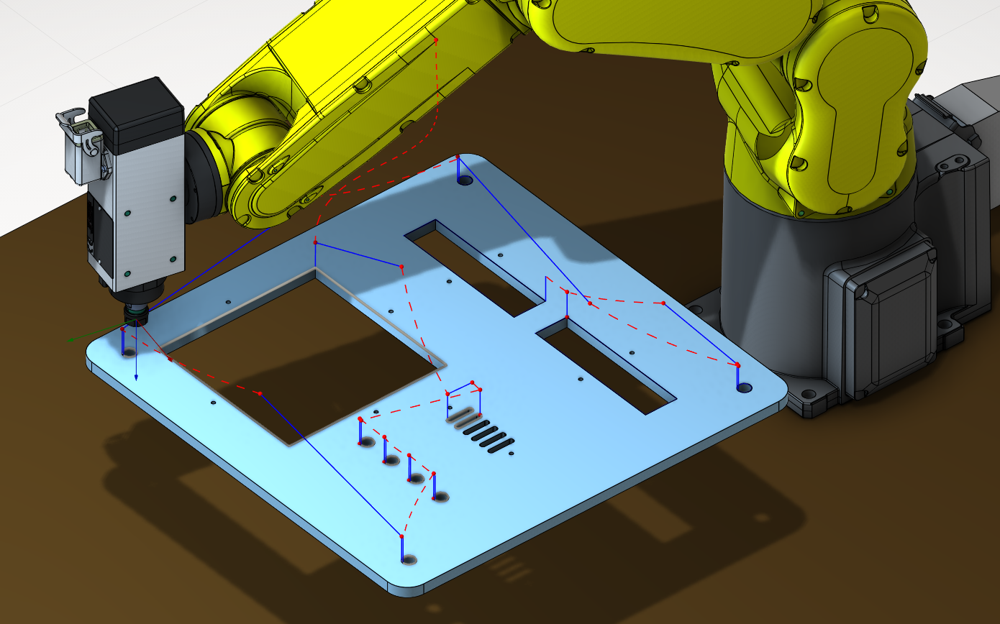</a>

<strong class="">POLISHING. </strong>Performs a continuous polishing pass along a specified seam. The robot guides the polishing tool along the seam to finish its surface.

<strong>TRAJECTORY. </strong>Imports a trajectory from a CAM system into <strong>ENCY Hyper</strong>. A simple way to do this is to import a saved CAM project, starting with a cell created in <strong>MachineMaker</strong>.

Click here to expand..

<strong>1. Prepare the cell and CAM operation.</strong> Create the cell in <strong>MachineMaker</strong>, save the project in <strong>.mma</strong> format, and click the button to export it to the CAM system. In the CAM system, create the machining operations. This example uses a simple <strong>2D contouring</strong> operation.

<a href="images/download/attachments/150697525/trajectory-cam-operation-2026-09-17.png" rel="noopener" target="_blank">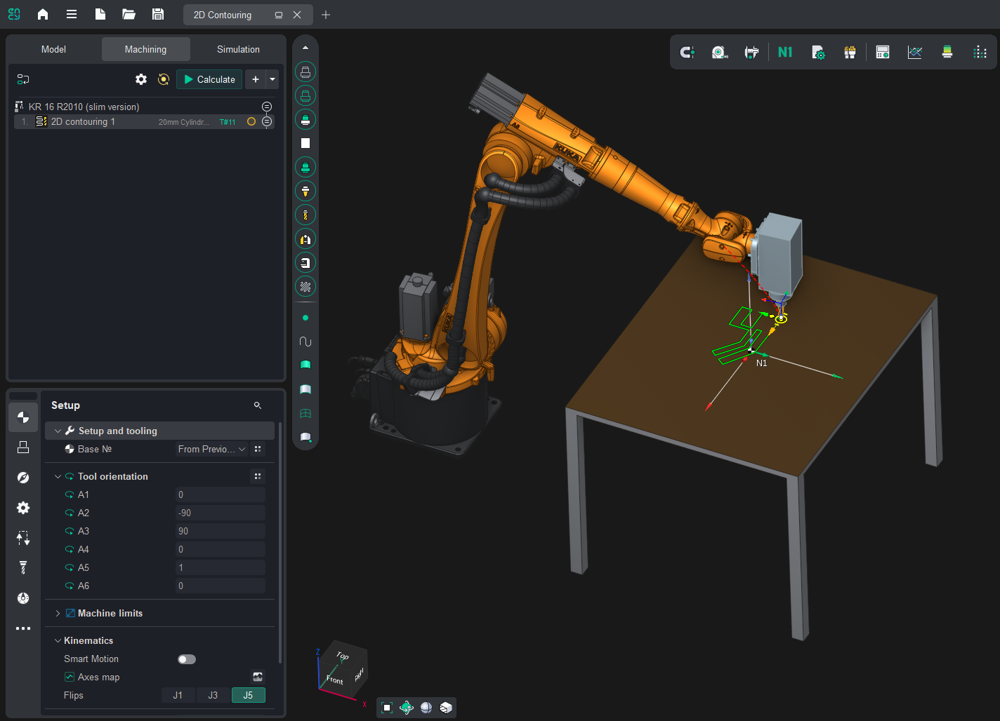</a>

<strong>2. Save the CAM project and configure the application path.</strong> Save the project in the CAM system. In <strong>ENCY Hyper</strong>, open <strong>Project settings &gt; Main &gt; CAM integration</strong>. In <strong>Path to the CAM application</strong>, specify the path to your CAM application shortcut and click <strong>Apply</strong>.

<a href="images/download/attachments/150697525/trajectory-cam-integration-2026-09-17.png" rel="noopener" target="_blank">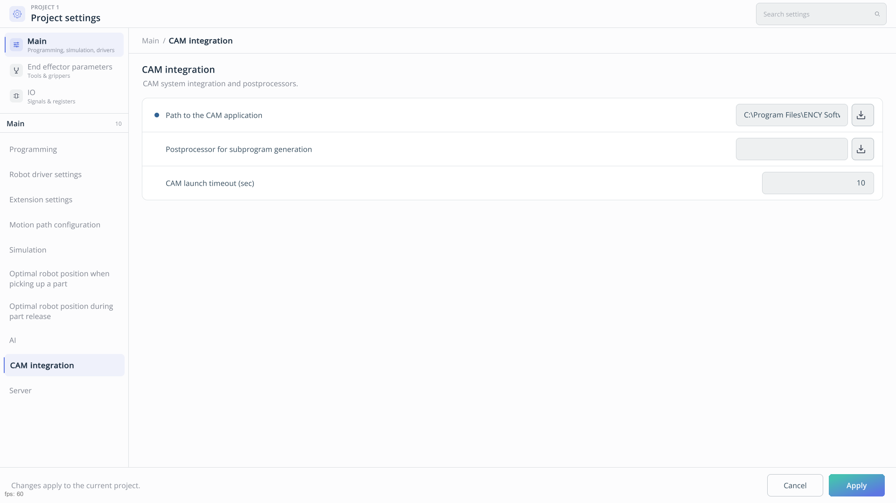</a>

<strong>3. Import the trajectory.</strong> In <strong>Programming Mode</strong>, create a <strong>Trajectory</strong> operation and select the saved CAM project in the file browser. <strong>ENCY Hyper</strong> launches the CAM system and retrieves the trajectory from the operation you created. The imported trajectory then appears in <strong>ENCY Hyper</strong>, as shown below.

<a href="images/download/attachments/150697525/trajectory-imported-2026-09-17.png" rel="noopener" target="_blank">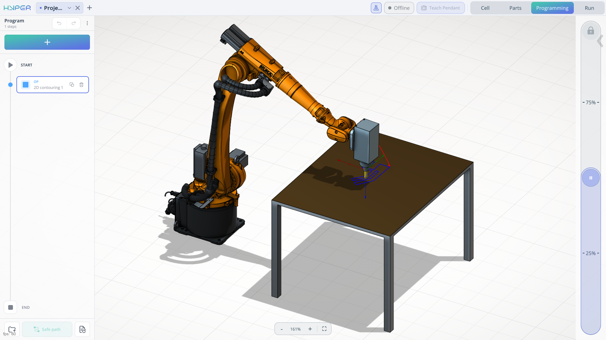</a>

