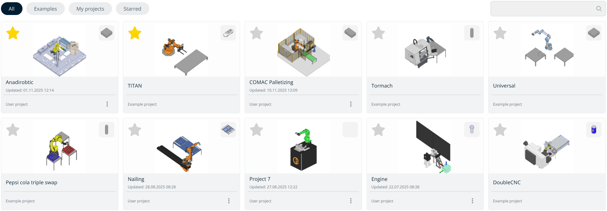
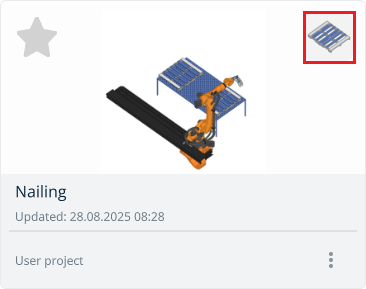
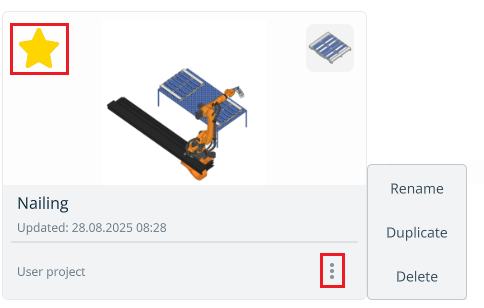

---
title: "Project library"
---

<link rel="stylesheet" href="assets/manual.css">

<h1 id="src-150697469"> Project library</h1>

<h1 class="heading">Application Area:</h1>

Project library for storing and accessing projects.

<strong class="">Buttons located at the top of the screen:</strong>

<strong class="">All.</strong> Displays all projects combined. <strong class="">Examples.</strong> Contains all default projects preinstalled with the application. <strong class="">My Projects.</strong> Includes all user-created or imported projects. <strong class="">Starred.</strong> Shows favorite projects marked with a star.

<strong class="">Navigating the Project Library. </strong>

The image located at the top-right corner of the project window displays the workpiece being processed.

<strong class="">User projects have a three-dot menu for:</strong>

<ul class=""><li class="">
Edit the project name;

</li><li class="">
Duplicate the project;

</li><li class="">
Delete the project.

</li></ul>

