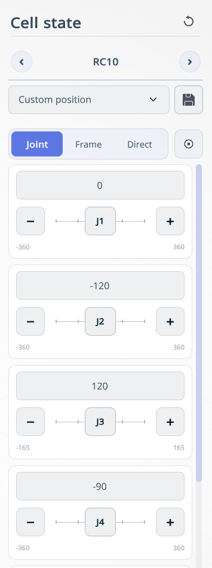
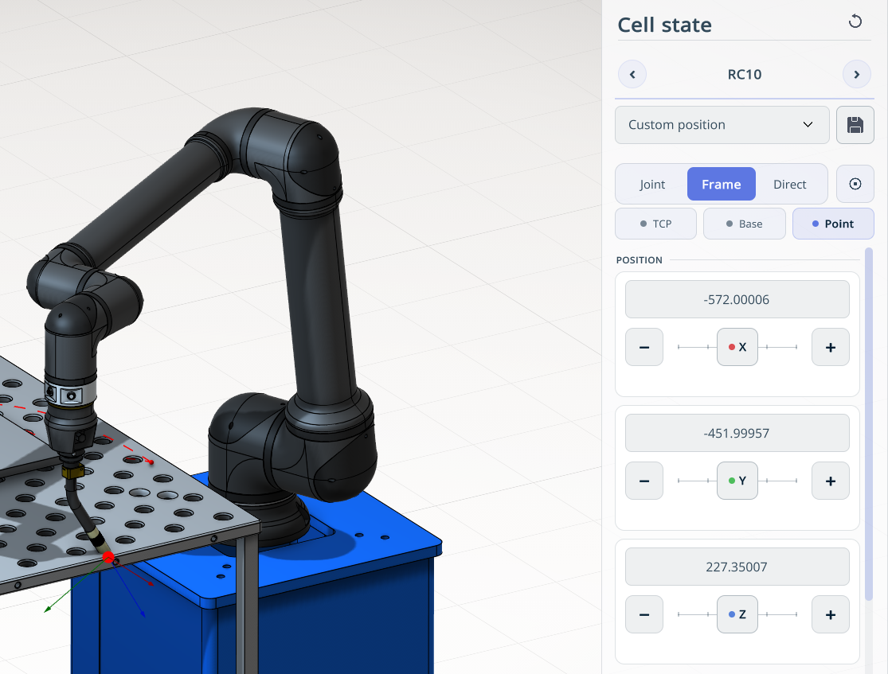

---
title: "The navigation for robot movement in space"
---

<link rel="stylesheet" href="assets/manual.css">

<h1 id="src-150697591"> The navigation for robot movement in space</h1>

<strong class="">Application Area:</strong>

Allows moving the robot in space in various ways.

<h1 class="heading">Joint Mode. </h1>

Allows moving the robot by controlling individual axes.

<h1 class="heading">Frame.</h1>

Frame mode provides three submodes for positioning the robot: <strong>TCP</strong>, <strong>Base</strong>, and <strong>Point</strong>.

<strong>TCP.</strong> Moves the robot relative to the Tool Center Point (TCP) coordinate system.

<strong>Base.</strong> Moves the robot relative to the robot base coordinate system.

<strong>Point.</strong> Moves the robot to a point selected in the graphics window. Click a point within the robot’s reachable workspace to move the robot to that point.

<h1 class="heading">Direct Mode.</h1>

Operates only when the robot is connected in real‑time mode. The robot can be moved either via remote control or manually.

<h1 class="heading">Precision mode </h1>

Сan be enabled for all operating modes. This reduces the movement step to prevent the robot from colliding with obstacles. 

<strong class="">The movement step is set at the bottom as a slider.</strong>

