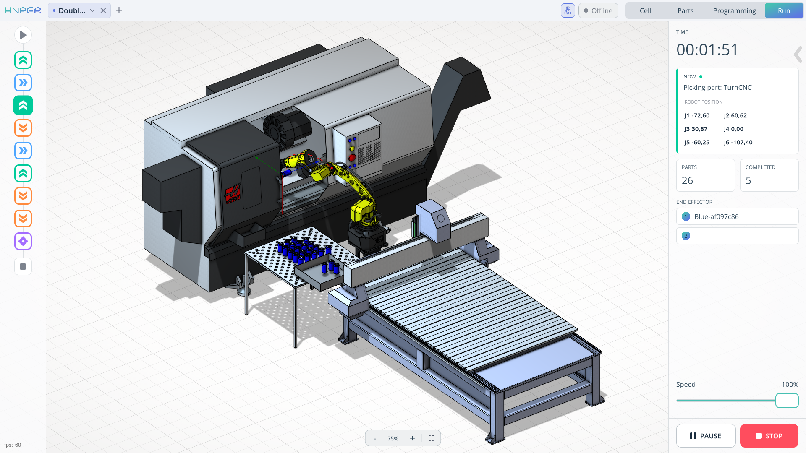
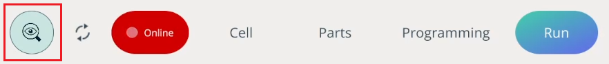

---
title: "Run Mode"
---

<link rel="stylesheet" href="assets/manual.css">

<h1 id="src-150697599"> Run Mode</h1>

<h1 class="heading">Application Area:</h1>

 
The <strong class="">Run</strong> tab is responsible for launching the already generated robot program.  

<strong class="">Time.</strong> Indicates the total execution time of the program.

<strong class="">Information window.</strong> Displays what is currently being executed in your program.

<strong class="">Parts information window</strong>. This window displays information about the number of parts and how many of them have been processed.

<strong class="">Speed slider.</strong> When starting the program using the large Start button, the speed must be adjusted using this slider. It affects the movement speed of the mechanisms.

The <strong class="">Start</strong>,<strong class=""> End</strong>, and other icons at the bottom indicate which command is currently being executed when the program is running.

<h2 class="heading">Program control buttons.</h2>

<strong class="">Start.</strong> Launches the program you created on the Programming tab.

<strong class="">Pause.</strong> Pauses the program.

<strong class="">Resume.</strong> Resumes the program.

<strong class="">Stop.</strong> Completely stops the program and resets it to the initial position.

Monitoring mode. This mode hides interface elements and allows you to manually adjust the robot and see the changes on your screen. It is enabled when you are already connected to your robot and online.

