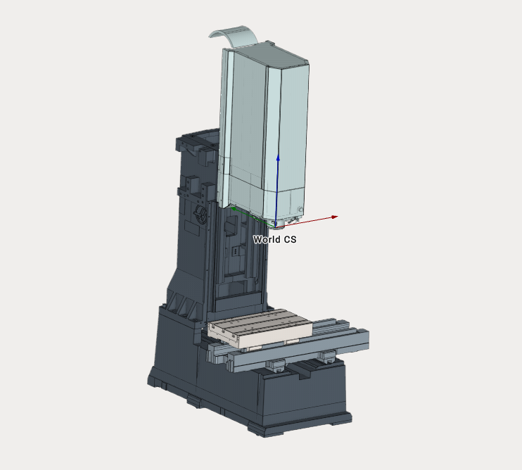

---
title: "3-Axes Milling Machine"
---

<link rel="stylesheet" href="assets/manual.css">

<h1 id="src-128546972">3-Axes Milling Machine</h1>

Download Project here:<strong class=""> <a href="https://github.com/EncySoftware/public-docs/releases/download/machinemaker-examples-2026-09-22/Milling_Machine-23e984538a.zip">Milling Machine.zip</a></strong>

<strong class="">
 </strong>

You can see the tutorial video at the <a class="external-link" href="https://www.youtube.com/watch?v=bWhaaIspP6A&amp;list=PLnaHZJpWJMKPN2hSDvR1DnxmAuFH4tP42&amp;index=11">link</a>

Download other examples here: <a class="external-link" href="https://download.sprutcam.com/download/sprutcam/MachineMaker/version_16/examples/3AxesMillingMachine/Milling_machine_3ax.zip">Milling_machine_3ax.zip</a> and here <a class="external-link" href="https://download.sprutcam.com/download/sprutcam/MachineMaker/version_16/examples/3AxesMillingMachine/Milling_machine.zip">Milling_machine</a>

