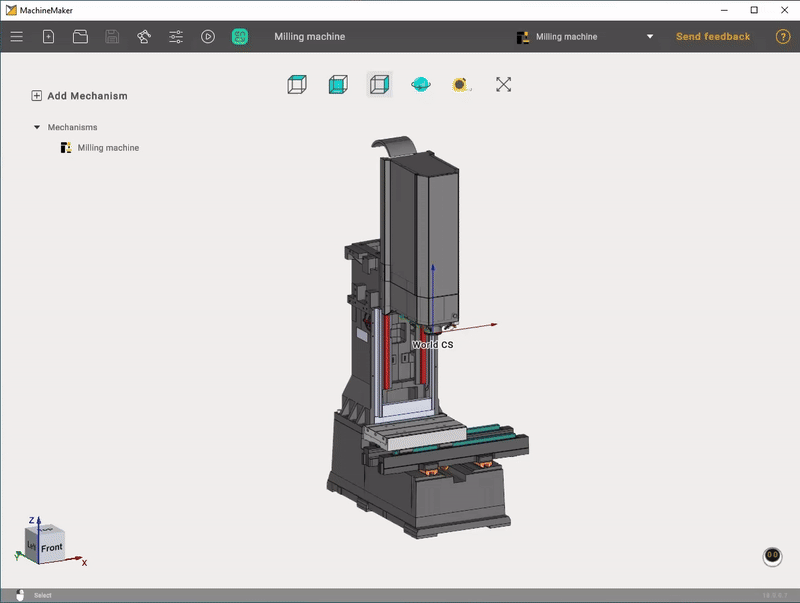
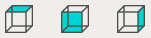
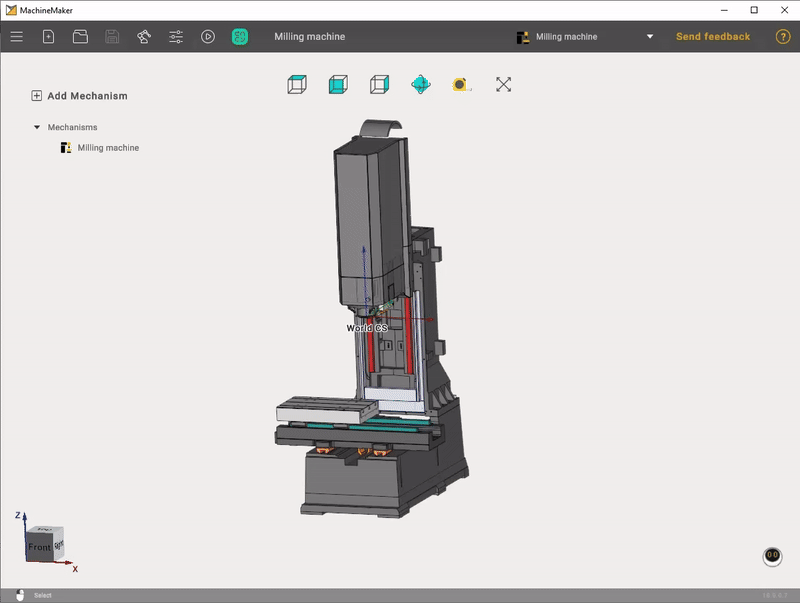
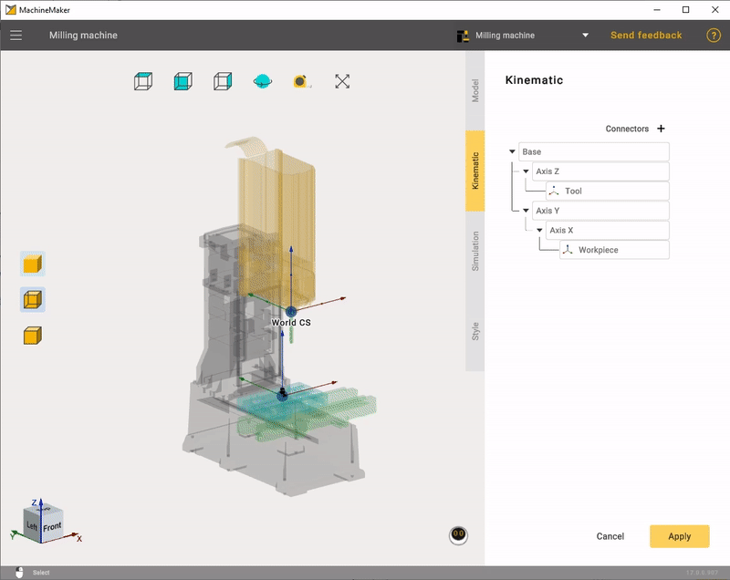

---
title: "3D navigation"
---

<link rel="stylesheet" href="assets/manual.css">

<h1 id="src-128546599">3D navigation</h1>

It is recommended to use a 3-buttons mouse with a scroll wheel for a full experience in MachineMaker and 3D navigation.

<h1 class="heading">Interactive rotate</h1>

Press and hold the right mouse button and drag the cursor around for the view rotation in the main visualization screen. Drag the cursor up and down to rotate around the horizontal screen axis. Drag it left and right to rotate around the vertical screen axis.

Use 
 button to switch between free and Z-Fixed rotation modes.

Use 
 the measure tool to measure the distance.

Changing the viewpoint can also be done by the <i class=""><strong class="">Standard views</strong></i> buttons.

You can also use interactive <strong class=""><i class="">Global CS</i></strong> located in the lower left corner of the main window.

Clicking on the <i class=""><strong class="">Middle Mouse Button (wheel)</strong></i> in the graphics window rotates the current view to the nearest standard plane.

<h1 class="heading">Interactive pan</h1>

Press and hold the <i class=""><strong class="">Middle Mouse Button (wheel)</strong></i> and drag the cursor in the main visualization screen to move the view vector.

<h1 class="heading">Interactive zoom in and out</h1>

Use <i class=""><strong class="">Mouse Wheel Scroll</strong></i> to zoom. The zoom area is where your mouse cursor is located.

<h1 class="heading">Visualization mode</h1>

It is possible to change visualization mode in the Mechanism edit mode.

