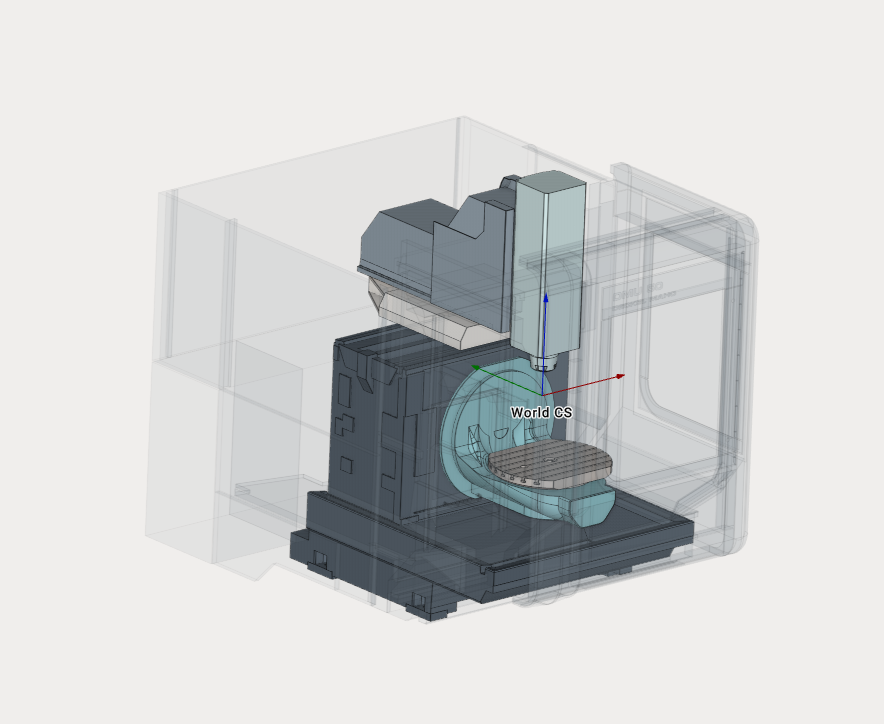

---
title: "5-Axes Milling Machine"
---

<link rel="stylesheet" href="assets/manual.css">

<h1 id="src-128546976">5-Axes Milling Machine</h1>

Download Project here: <strong class=""><a href="https://github.com/EncySoftware/public-docs/releases/download/machinemaker-examples-2026-09-22/5AxesMillingMachine-34140c2b09.zip">5AxesMillingMachine.zip</a></strong>

<strong class=""> 
 </strong>

You can see the tutorial video at the <a class="external-link" href="https://www.youtube.com/watch?v=0Q0UWthjqHA&amp;list=PLnaHZJpWJMKPN2hSDvR1DnxmAuFH4tP42&amp;index=9">link</a>

