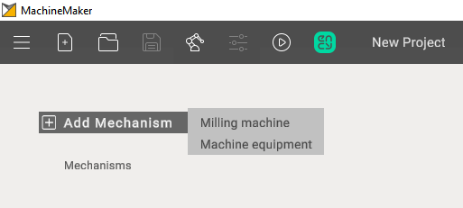

---
title: "Adding a mechanism"
---

<link rel="stylesheet" href="assets/manual.css">

<h1 id="src-129940195">Adding a mechanism</h1>

First of all it is necessary to add the desired mechanism to your project using <i class=""><strong class="">Add Mechanism </strong></i>button

