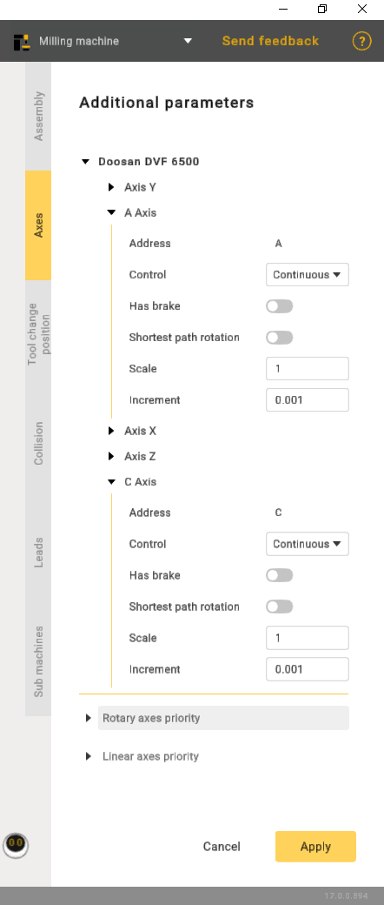

---
title: "Additional options"
---

<link rel="stylesheet" href="assets/manual.css">

<h1 id="src-150674530">Additional options</h1>

Click 
     button to open <i class=""><strong class="">Machine parameters panel</strong></i>. Then go to the <i class=""><strong class="">Axes</strong></i> tab. It is possible to specify

<ul class=""><li class="">
Address - axis designation.

</li><li class="">
Control:

</li></ul><ol class=""><li class="">
Countinuous.

</li><li class="">
Indexed - indicates that rotation will be carried out incrementally.

</li><li class="">
Manual - implies that the operation is entirely manual.

</li></ol><ul class=""><li class="">
Shortest path rotation - refers to the rotation around an axis or point using the most direct path between the initial and final positions in three-dimensional space.

</li><li class="">
Scale is a setting with four positions. Each position corresponds to a specific angular increment. Position 1 equals 90 degrees, Position 2 equals 180 degrees, and so on.

</li></ul>

