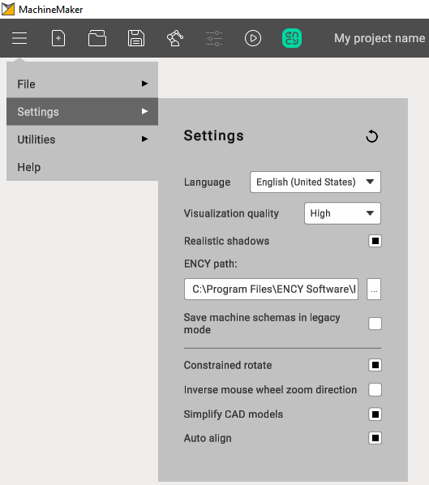

---
title: "Application Settings"
---

<link rel="stylesheet" href="assets/manual.css">

<h1 id="src-128546673">Application Settings</h1>

Settings panel can be opened from Main menu.

General    

<ul class=""><li class="">
<i class=""><strong class="">Language.</strong></i> MachineMaker uses CAM system language by default but it is possible to change it here.<i class=""><strong class=""> </strong></i>

</li><li class="">
<i class=""><strong class="">Visualization quality.</strong></i> Reduce quality if you have any problems with video memory or MachineMaker does not work smoothly enough. We recommend keeping High quality.

</li><li class="">
<i class=""><strong class="">CAM-system path.</strong></i><strong class=""> </strong>MachineMaker detects installed CAM system automatically. But it is also possible to specify CAM-system path here.<i class=""><strong class=""> </strong></i>

</li><li class="">
<i class=""><strong class="">Constrained rotate</strong></i><strong class=""> </strong>mode allows fixing Z axis during rotation. It is also possible to change this parameter from "Toolbar".

</li><li class="">
<i class=""><strong class="">Inverse mouse wheel zoom direction.</strong></i><strong class=""> </strong>Change this parameter to inverse zoom behavior on mouse scroll.

</li><li class="">
<i class=""><strong class="">Simplify CAD models</strong></i><strong class=""> </strong>allows you to reduce 3D model size. See "Prepare 3D models" page for details.

</li><li class="">
<i class=""><strong class="">Auto Align.</strong></i> MachineMaker will automatically go through the imported 3D models and try to find optimal position for each new mechanism in assembly.

</li></ul>

