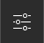
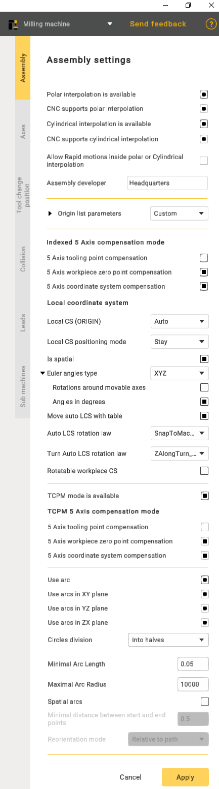

---
title: "Assembly options"
---

<link rel="stylesheet" href="assets/manual.css">

<h1 id="src-150674516">Assembly options</h1>

Click 
     button to open Assembly settings panel. Check CAM system documentation and SmartHints for parameters information.

<ul class=""><li class="">
 
<strong class="">Polar interpolation</strong> changes a linear axis to the rotary one in the simple 3-axes milling process. Usually it is necessary on the lathes that has the drive mill tool. Sometimes the polar interpolation is used with another king of machines.    

</li><li class="">
 
If the machine variable Machine –&gt; Control parameters –&gt; Rotary transformations –&gt; <strong class="">CNC support polar interpolation</strong> is set then CNC interpolation tick is available. If this parameter is on then the G-code generated with the commands to switch on/off the polar interpolation. Else the G-code is generated in the [X,C,Z] coordinates.  

</li><li class="">
 
<strong class="">The cylindrical interpolation</strong> gives the possibility to mill the side surface of cylinder by programming the unrolled curves. The unrolled curves are programmed in the [X,Y,Z] coordinates, but the cylinder milling is performed in [X,C,Z] coordinates. So the cylindrical interpolation makes the transformation [X,Y,Z] =&gt; [X,C,Z].  

</li><li class="">
 
If the machine variable Machine –&gt; Control parameters –&gt; Rotary transformations –&gt; <strong class="">CNC support cylindrical interpolation</strong> is set then CNC interpolation tick is available. If this parameter is on then the G-code generated with the commands to switch on/off the cylindrical interpolation. Else the G-code is generated in the [X,C,Z] coordinates.  

</li><li class="">
 
<strong class="">Allow rapid motions inside polar or Cylindrical interpolation</strong>. This capability is crucial for improving efficiency in machining operations, as rapid motions reduce the time required to traverse from one point to another, enhancing overall machining productivity.    

</li><li class="">
 
<strong class="">Assembly developer</strong>: Company name.    

</li><li class="">
<strong class="">Indexed 5-Axis compensation mode </strong> 
represents a configuration in which compensation is systematically applied to a machining process involving five axes.    

</li><li class="">
<strong class="">The 5-Axis tooling point compensation</strong> 
 feature implies the CNC controller's capability to dynamically adjust the tool's position or orientation throughout machining, accommodating variations in the tool itself. This ensures precise adherence of the machined part to the intended design.    

</li><li class="">
<strong class="">5-Axis workpiece zero point compensation</strong> 
 guarantees the correct alignment of machining operations with the workpiece's coordinate system, enhancing precision and accuracy in the manufacturing process.    

</li><li class="">
<strong class="">The 5-Axis coordinate system compensation</strong> 
 ensures that the CNC machine accurately interprets and executes toolpaths, considering the specific orientation and location of the workpiece in the machining space. This feature is pivotal for achieving precision and accuracy, especially when dealing with intricate geometries, and allows for versatile machining operations.    

  

</li><li class="">
<strong class="">TCPM mode availability</strong> 
 refers to the availability of a concept in CNC machining where the tool's center point is efficiently managed, ensuring precise and accurate machining.    

</li><li class="">
<strong class="">TCPM in the 5-Axis compensation mode</strong>, refers to a feature in CNC machining where adjustments are made to account for variations in the tool's center point. In a 5-axis setup, which allows movement in five different directions, this compensation mode ensures precise and accurate machining by dynamically managing the tool's center point.

</li><li class="">
<strong class="">The 5-Axis tooling point compensation</strong> within the context of TCPM refers to a feature in CNC machining where adjustments are made to the tool's position or orientation dynamically.

</li><li class="">
<strong class="">The 5-Axis workpiece zero point compensation</strong>, in conjunction with TCPM, is a feature in CNC machining that involves dynamic adjustments to align machining operations accurately with the zero point or origin of the workpiece coordinate system. In a 5-axis machining system, capable of movement along five directions, this compensation mechanism ensures precision and accuracy during the manufacturing process.

</li><li class="">
<strong class="">The 5-Axis coordinate system compensation</strong>, when integrated with TCPM in CNC machining, is a functionality designed to ensure precise toolpath execution by dynamically adjusting for the specific orientation and location of the workpiece within the machining space.

</li><li class="">
<strong class="">Use arc</strong> 
 function provides users with the capability to specify or enable the use of arc commands in the CNC program. It involves defining parameters such as the arc's start and end points, radius, and direction.    

</li><li class="">
<strong class="">Circles division</strong>: Used to divide arcs into halves or quarters.

</li><li class="">
<strong class="">Minimal Arc Length:</strong> Prevents the output of arcs shorter than a specified length; a segment will be displayed instead.

</li><li class="">
<strong class="">Maximal Arc Radius:</strong> Prevents the output of arcs with a radius larger than specified; segments will be displayed.

</li><li class="">
<strong class="">Spatial arcs:</strong> Arbitrary spatial arcs. A function necessary for robots to work.

</li><li class="">
<strong class="">Minimal distance between btart and end points:</strong> A restriction that allows the display of segments with a small distance between points.

</li><li class="">
<strong class="">Spatial arcs</strong>. A function necessary for robots to work.

</li><li class="">
<strong class="">Reorientation mode:</strong> The method of calculating the midpoint. The functionality may vary depending on the manufacturer.

</li></ul> 

<h1 class="heading">Local coordinate system(Local CS):</h1>
<ul class=""><li class="">
<strong class="">Auto</strong>. Function for indexed 5-axis machining. It is needed so the CAM system can automatically calculate the Local CS;

</li><li class="">
<strong class="">Off</strong>. Disables this function;

</li><li class="">
<strong class="">Unavailable</strong>. Makes this function unavailable for your machine.

</li></ul>
<strong class="">Local CS positioning mode</strong>. This function defines how the rotation of the local coordinate system is output to the NC-code.

<strong class="">Is spatial</strong>. A modifier that complements the Local CS positioning mode function. It defines how commands are output to the NC-code of your CAM system.

<strong class="">Euler angles type</strong>. A parameter that defines the type of Euler angles.

<ul class=""><li class="">
Rotations around movable axes;

</li><li class="">
Angles in degrees.

</li></ul>
These two parameters determine how the spatial angles will be output in the (ORIGIN) command in the NC code.

<strong class="">Move auto LCS with table</strong>. This function determines whether the origin point of the coordinate system should rotate together with the workpiece in the CAM system.

<strong class="">Auto LCS rotation law</strong>. Additional parameter for Local CS (ORIGIN).

<ul class=""><li class="">
<strong class="">Snap to Tool CS</strong>. Allows you to snap, for example, the X-axis of the rotated coordinate system to the coordinate system associated with the tool;

</li><li class="">
<strong class="">Snap to Machine CS</strong>. Attaches the <strong class="">CS</strong> to the machine’s Base Coordinate System that you specifie;

</li><li class="">
<strong class="">Snap to Workpiece CS</strong>. In this mode, the coordinate system will be linked to the geometric coordinate system of your workpiece.

</li><li class="">
<strong class="">Exclude spatial angle A,B,C</strong>. These values determine which axis the rotation should be performed around. If you select <strong class="">"Exclude spatial angle A",</strong> it means that rotation will occur around axes B and C, while rotation around axis A will always be 0.

</li></ul>
<strong class="">Rotatable workpiece CS. </strong>A parameter that applies specifically to the workpiece. This parameter indicates whether the coordinate system rotates when setting up the workpiece.

