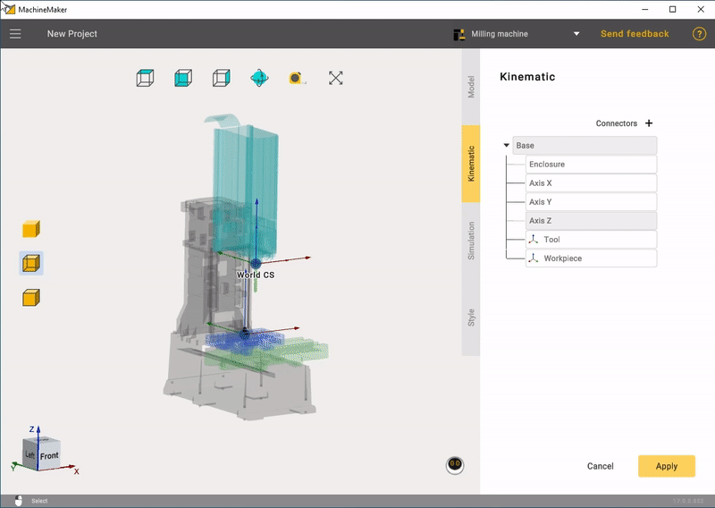
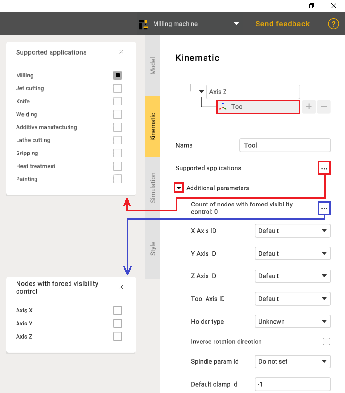
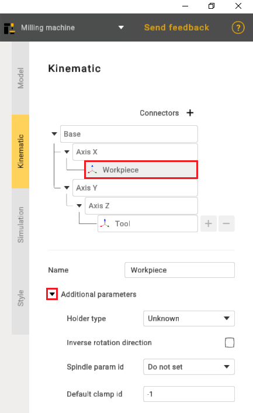
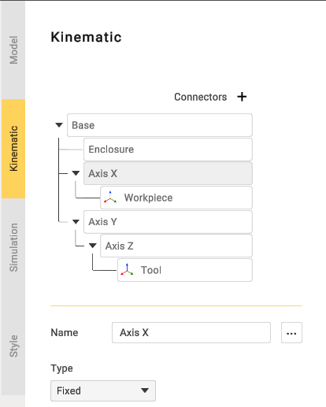
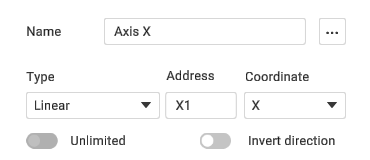
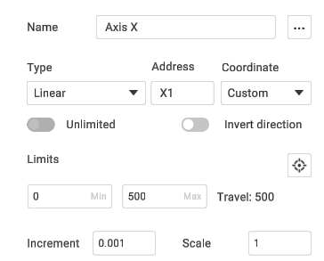
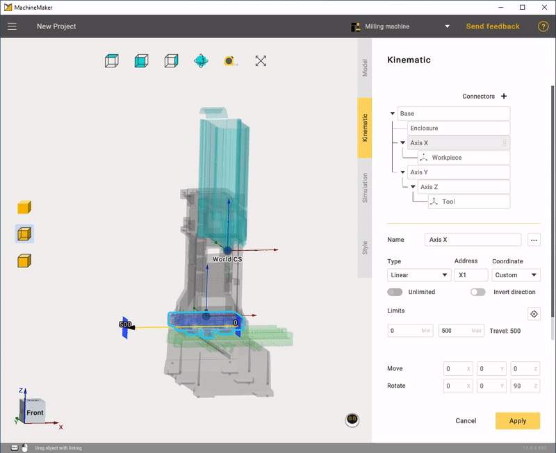
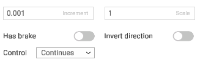
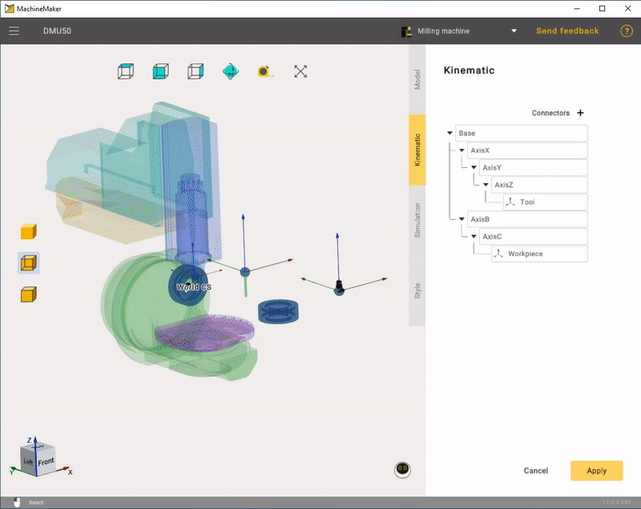
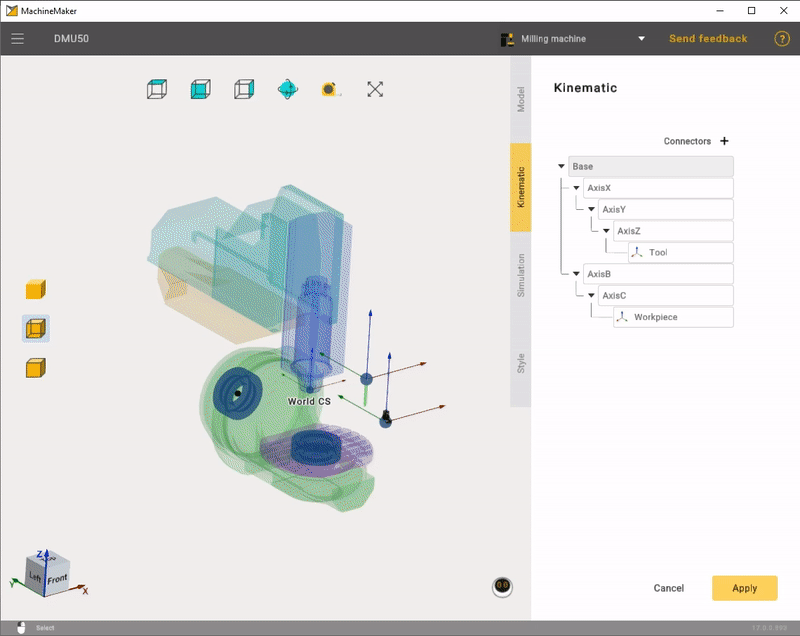

---
title: "Building a kinematic scheme"
---

<link rel="stylesheet" href="assets/manual.css">

<h1 id="src-129940297">Building a kinematic scheme</h1>

Click <i class=""><strong class="">Kinematic</strong></i><strong class=""> </strong>tab to open kinematic parameters panel.

First of all it is necessary to build correct mechanism's kinematic tree, using grag and drop. MachineMaker will show Tool node as a sample tool and Workpiece node as a sample part.

In the <strong class="">Tool</strong> settings there is a function to select <strong class="">Supported applications</strong> and also additional options.

<strong class="">Workpiece</strong> also has its own additional parameters.

Next it is necessary to specify parameters of each node.

Set node name and type.

Next it is necessary to specify node <i class=""><strong class="">Address</strong> </i>for Linear and Rotary nodes. It will be used in Postprocessors.

Select linear axis direction. You can select X Y Z or custom. Use <i class=""><strong class="">Orientation</strong></i><strong class=""> </strong>field to define <i class=""><strong class="">Custom</strong></i> direction vector.

Next define <i class=""><strong class="">Has Brake, Increment </strong></i>and<strong class=""> </strong><i class=""><strong class="">Scale</strong> </i>parameters. Change <i class=""><strong class="">Control</strong> <strong class=""></strong></i>parameter if axis is Indexed or Manual. It is possible to <i class=""><strong class="">Invert Direction</strong></i><strong class=""> </strong>of axis.

For rotary axes it is necessary to specify point of rotation. Hold the <i class=""><strong class="">Left Mouse Button,</strong></i><strong class=""> </strong>drag the bearing and drop it to the snap point. Use <i class=""><strong class="">Transformation Panel</strong></i><strong class=""> </strong>to set position and rotation manually.

Finally it is necessary to set <i class=""><strong class="">Tool Type</strong></i><strong class=""> </strong>and specify positions of Tool and Workpiece. Place Tool and Workpiece to the correct position at the <i class=""><strong class="">Kinematic tree.</strong></i><strong class=""> </strong>Then hold the <i class=""><strong class="">Left Mouse Button,</strong></i><strong class=""> </strong>drag the bearing and drop it to the snap point. Use <i class=""><strong class="">Transformation Panel</strong></i><strong class=""> </strong>to set position and rotation manually.

