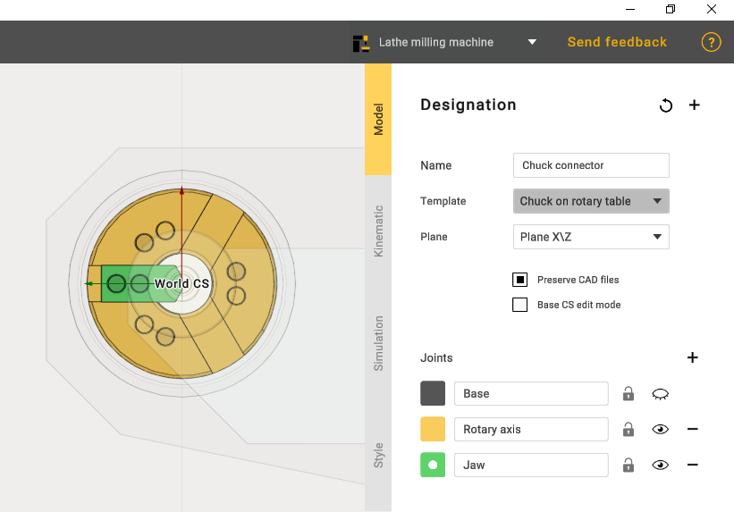
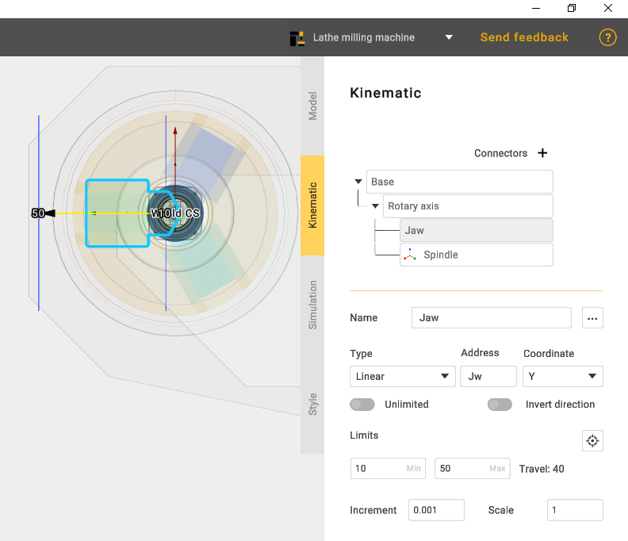
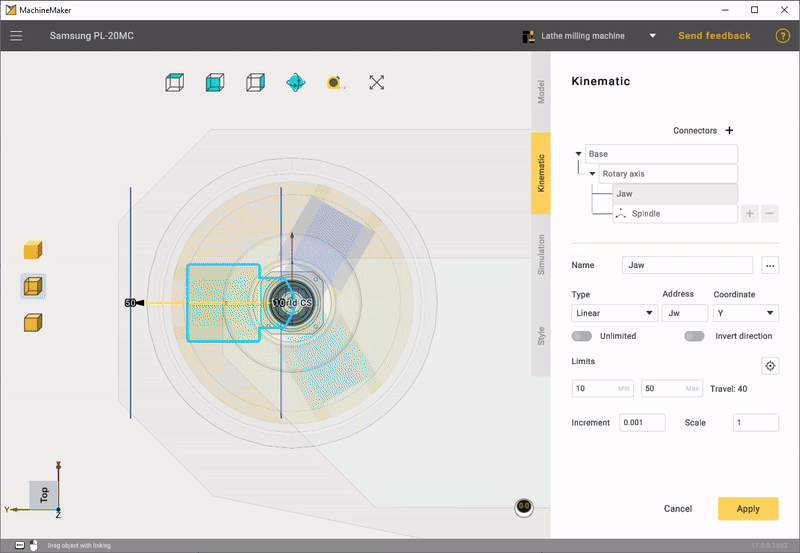

---
title: "Chuck connector"
---

<link rel="stylesheet" href="assets/manual.css">

<h1 id="src-129940379">Chuck connector</h1>

Once you have built the machine, the next step is to add the Chuck connector.

When editing the model, use only rotary axis and jaw joints.

Since the Rotary axis is initially already set correctly, only the cam limits and the coordinates at which they will move should be edited.

The next step is to set the home position of the jaws, test that the mechanism works correctly in the simulation and apply.

