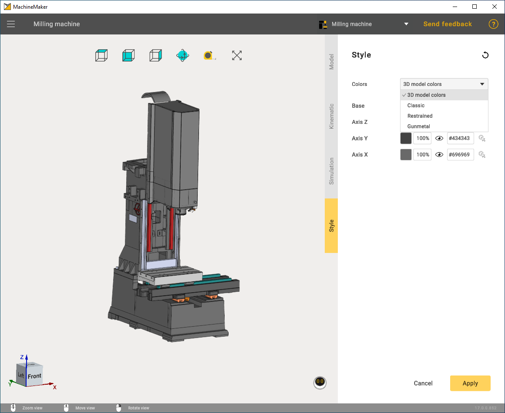

---
title: "Coloring"
---

<link rel="stylesheet" href="assets/manual.css">

<h1 id="src-129940403">Coloring</h1>

By default, MachineMaker uses the 3D model's color. Using the 3D model's colors gives a detailed representation. It is also possible to define the node's (machine element) color manually.

In addition to the default color, you can select 3 available sets of colors to paint the machines.

<ol class=""><li class="">
Classic

</li><li class="">
Restrained

</li><li class="">
Gunmetal

</li></ol>

 
Use     
<i class=""><strong class="">Mouse wheel scroll</strong></i> 
 with the mouse cursor on the combobox to switch between styles    

Click on the color hex code input field on the right to open the color selector. It is possible to copy and paste hex codes manually.

