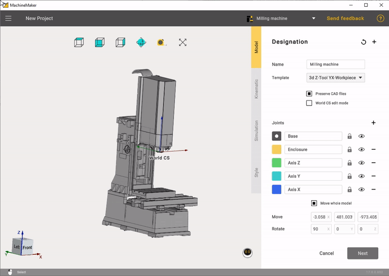
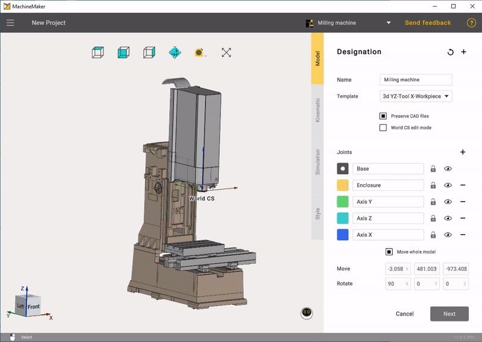
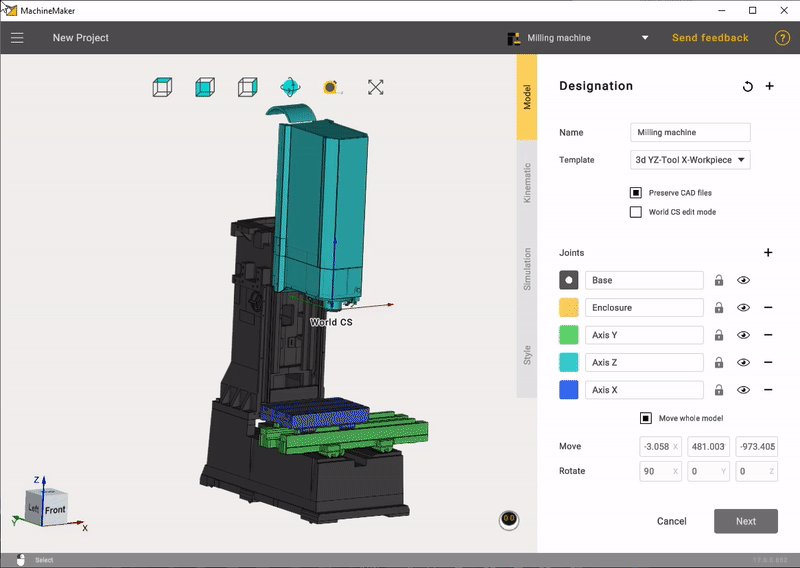
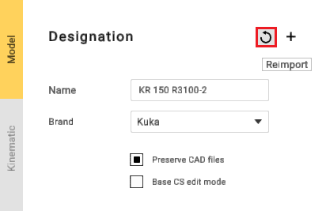
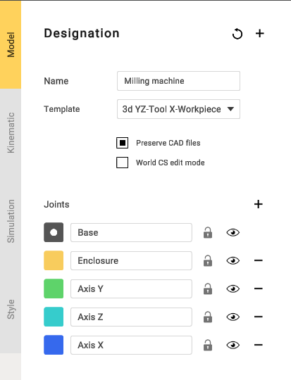
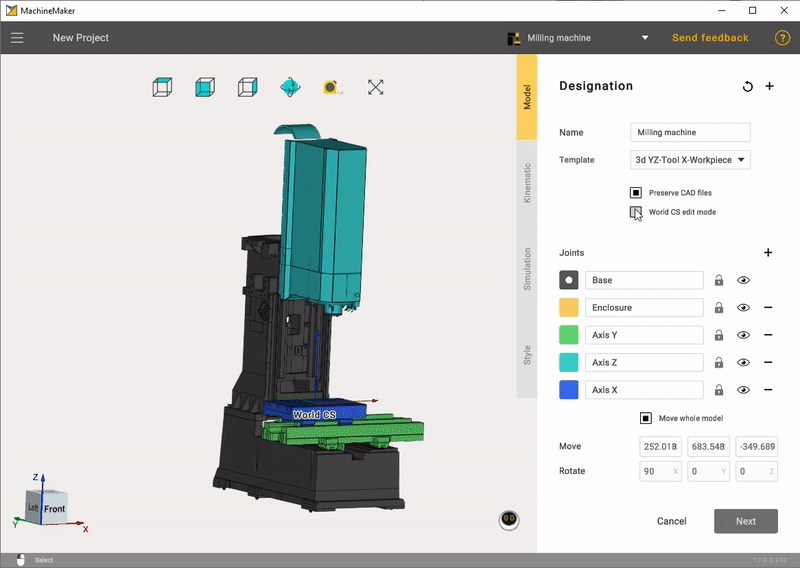
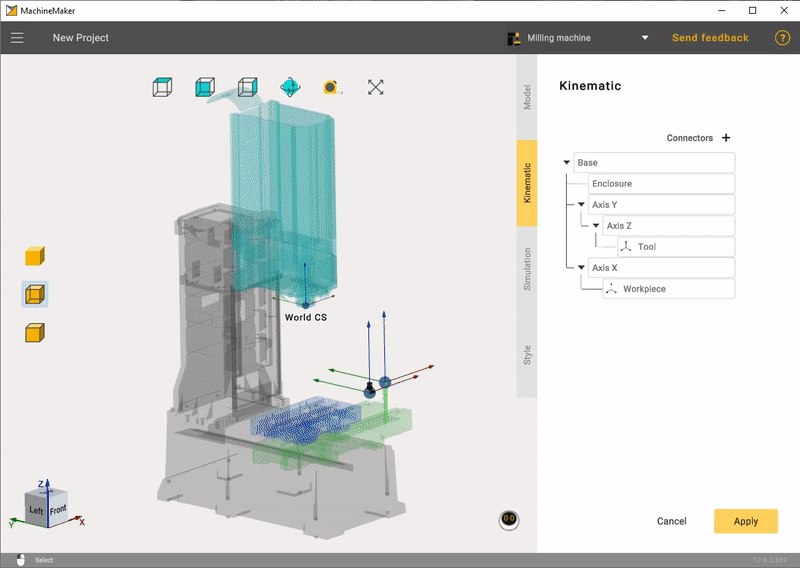

---
title: "Grouping elements into nodes"
---

<link rel="stylesheet" href="assets/manual.css">

<h1 id="src-129940248">Grouping elements into nodes</h1>

<h1 class="heading">Grouping elements</h1>

Equipment elements need to be grouped into nodes. Mark 3D model elements with specific colors to group them.

You can choose a template that suits your machine.

Select a node color from the right panel and mark desired elements on the 3D model. Each element marked with the same color will be added to the same group.

Use <i class=""><strong class="">Tab, </strong></i><strong class=""> 
↑,     

↓     
</strong> 
keys to switch current color.    

 
It is not necessary to mark each element. You can keep unnecessary elements unmarked to exclude them from mechanism. MachineMaker also saves source CAD file, so it is possible to change elements groups anytime.    

Use right mouse button to unmark 3D model element. Note that you can unmark only currently selected node elements. You can also use the keyboard shortcut <strong class="">"Ctrl + z"</strong> to roll back changes.

It is possible to delete unnecessary elements from the 3D model using <strong class=""><i class="">Del</i> </strong>key. Use <i class=""><strong class="">Ctrl+Z</strong></i><strong class=""> </strong>to undo element deletion.

MachineMaker stores all imported 3D models in the <i class=""><strong class="">CAD Files</strong></i> folder. You can always reimport the 3D model using <i class=""><strong class="">Reimport </strong></i>button. Turn off<i class=""> <strong class="">Copy imported CAD files</strong></i> checkbox to disable saving original CAD models.

<strong class="">Add file</strong> - function for adding additional files.

 
If MachineMaker can't group elements     

correctly     

- see how to     
<a class="external-link" href="https://kb.sprutcam.com/display/MMUMAU15/Prepare+and+import+3D+objects">fix your CAD models</a> 
.    

 
Mechanism name and type    

It is necessary to enter Mechanism name. MachineMaker uses 3D model filename as default name.

<h1 class="heading">World CS position</h1>

 
It is necessary to specify Machine CS position. Turn on <strong class=""><i class="">Machine CS editing mode</i></strong>, then hold <i class=""><strong class="">Left Ctrl</strong></i><strong class=""> </strong>key and drag you Machine CS into the correct position.  

<h1 class="heading">Tool and Workpiece position </h1>

 
Open the <strong class="">Kinematic</strong> tab. Hold down the <strong class="">Left Ctrl</strong> key and drag the <strong class="">Tool</strong> and <strong class="">Workpiece</strong> to the desired position.    

 

  

 
MachineMaker will use the Mechanism name as the Project name by default.    

