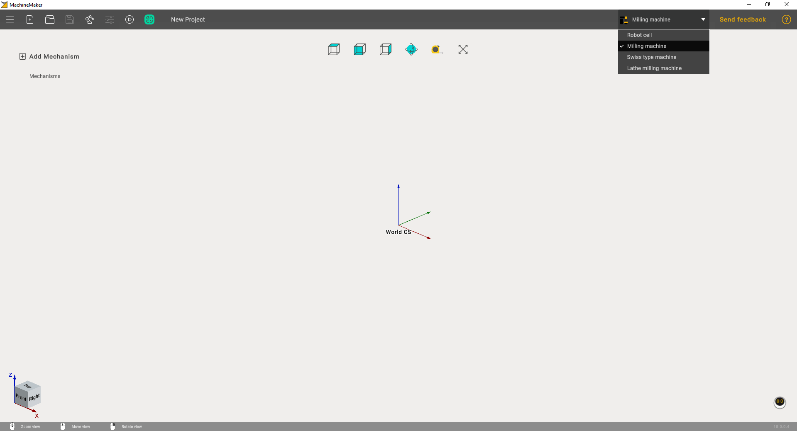

---
title: "MachineMaker — Machines"
---

<link rel="stylesheet" href="assets/manual.css">

<h1 id="src-128546571">MachineMaker — Machines</h1>

MachineMaker is a standalone application which allows you to create robot cells and CNC machines for CAM system.  You can launch MachineMaker directly from the CAM system utilities menu.

Next, it is necessary to select the correct application context using <i class=""><strong class="">Application Mode</strong></i><strong class=""> Selector.  </strong>

## Contents

- [Introduction to MachineMaker](introduction-to-machinemaker.md)
- [Interface](interface.md)
- [Main window](main-window.md)
- [3D navigation](3d-navigation.md)
- [Toolbar](toolbar.md)
- [Application Settings](application-settings.md)
- [Getting Started](getting-started.md)
- [Creating a project](creating-a-project.md)
- [Adding a mechanism](adding-a-mechanism.md)
- [Prepare and import 3D objects](prepare-and-import-3d-objects.md)
- [Grouping elements into nodes](grouping-elements-into-nodes.md)
- [Building a kinematic scheme](building-a-kinematic-scheme.md)
- [Chuck connector](chuck-connector.md)
- [Tool block](tool-block.md)
- [Assemblies](assemblies.md)
- [Assembly options](assembly-options.md)
- [Additional options](additional-options.md)
- [Coloring](coloring.md)
- [Mechanism Simulation and Validation](mechanism-simulation-and-validation.md)
- [Machine equipment configuration](machine-equipment-configuration.md)
- [Multi Tool Head](multi-tool-head.md)
- [Examples: Machines](examples-machines.md)
- [3-Axes Milling Machine](3-axes-milling-machine.md)
- [5-Axes Milling Machine](5-axes-milling-machine.md)
- [Trevisan Machine](trevisan-machine.md)
- [Swiss type machine](swiss-type-machine.md)
- [Examples: Lathe milling machine](examples-lathe-milling-machine.md)
- [Lathe milling machine](lathe-milling-machine.md)
- [Lathe milling machine with a dual-row turret](lathe-milling-machine-with-a-dual-row-turret.md)
- [Simplifier](simplifier.md)

