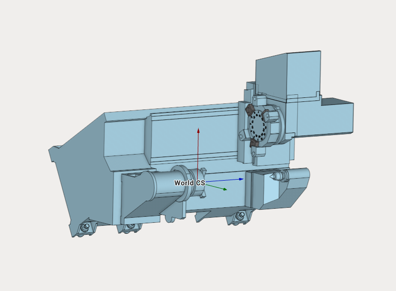

---
title: "Lathe milling machine with a dual-row turret"
---

<link rel="stylesheet" href="assets/manual.css">

<h1 id="src-142643760">Lathe milling machine with a dual-row turret</h1>

Download Project here: <strong class=""><a href="https://github.com/EncySoftware/public-docs/releases/download/machinemaker-examples-2026-09-22/Lathe_milling_machine-b093694fe9.zip">Lathe milling machine.zip</a></strong>

You can see the tutorial video at the <a class="external-link" href="https://www.youtube.com/watch?v=5pfjNPZR50A&amp;list=PLnaHZJpWJMKPN2hSDvR1DnxmAuFH4tP42&amp;index=17&amp;ab_channel=ENCYSoftware">link</a>.

