---
title: "Machine equipment configuration"
---

<link rel="stylesheet" href="assets/manual.css">

<h1 id="src-129940438">Machine equipment configuration</h1>

At the very beginning, before adding the machine equipment, we should prepare our machine and add the attachment points for our machine equipment.

To add connection points, click the plus button in the kinematics tab when editing your machine and select the desired connection.

<a class="doc-image-link" href="images/download/attachments/129940438/image2024-2-1_12-24-32.png" rel="noopener" target="_blank" title="Open full-size image">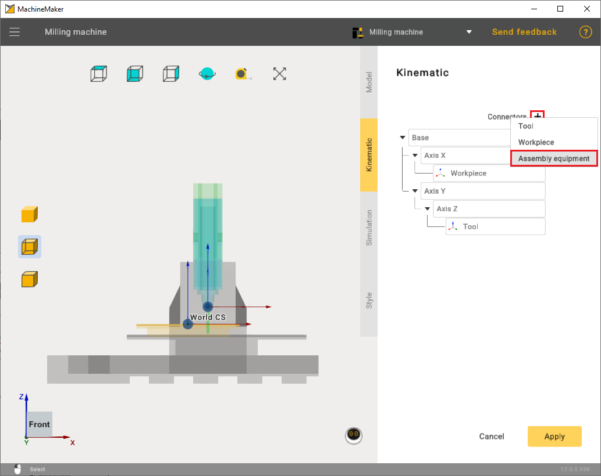</a>

After that, in the kinematics tree, you need to attach the points to the desired axis and position them on the machine.

<a class="doc-image-link" href="images/download/attachments/129940438/image2024-2-1_12-27-55.png" rel="noopener" target="_blank" title="Open full-size image">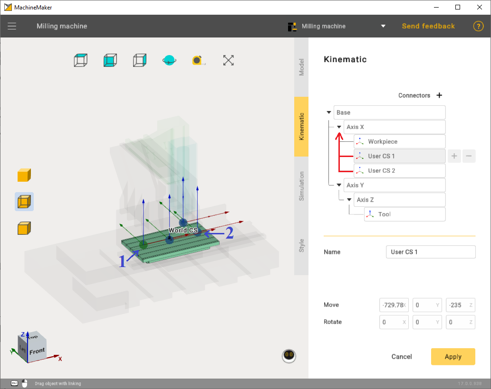</a>

You can download examples of machine and machine equipment here:

<ol class=""><li class="">
<a href="https://github.com/EncySoftware/public-docs/releases/download/machinemaker-examples-2026-09-22/Machine_equipment_1-6623c43908.rar">Machine equipment 1.rar</a>

</li><li class="">
<a href="https://github.com/EncySoftware/public-docs/releases/download/machinemaker-examples-2026-09-22/Machine_equipment_2-e22c4bff05.rar">Machine equipment 2.rar</a>

</li><li class="">
<a href="https://github.com/EncySoftware/public-docs/releases/download/machinemaker-examples-2026-09-22/Milling_machine-62966e00df.rar">Milling machine.rar</a>

</li></ol>
Machine equipment has 2 types of axles: 1) Rotary type; 2) Linear type.

In this chapter we will briefly look at the settings of these two types

To add machine equipment use the <strong class="">"Add Mechanism"</strong> button.

<a class="doc-image-link" href="images/download/attachments/129940438/image2024-8-13_11-42-28.png" rel="noopener" target="_blank" title="Open full-size image">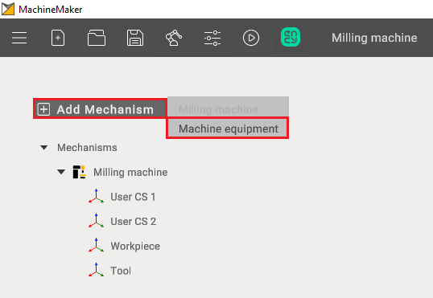</a>

After importing machine equipment, select the appropriate template. Also mark the machine equipment elements with the correct color.

<a class="doc-image-link" href="images/download/attachments/129940438/image2024-2-1_12-18-28.png" rel="noopener" target="_blank" title="Open full-size image">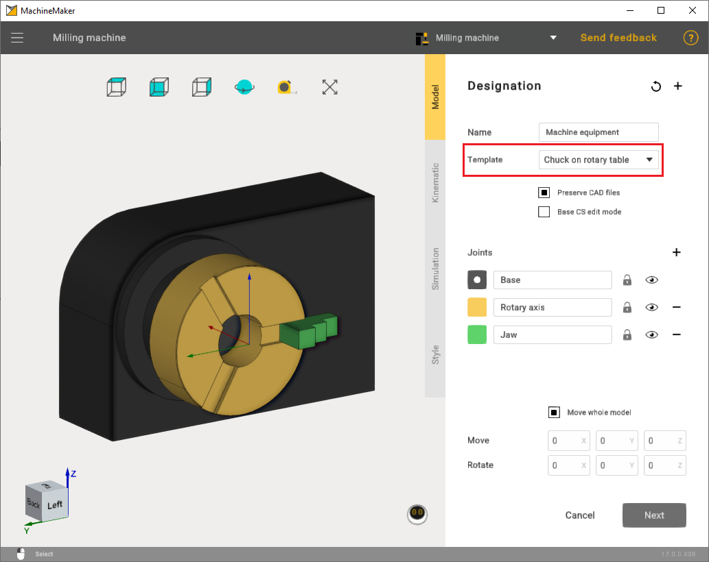</a>

Additionally, if necessary, correctly set the point through the Base CS edit mode to ensure that the machine equipment is properly secured on the machine in the future.

<a class="doc-image-link" href="images/download/attachments/129940438/image2024-2-1_12-38-12.png" rel="noopener" target="_blank" title="Open full-size image">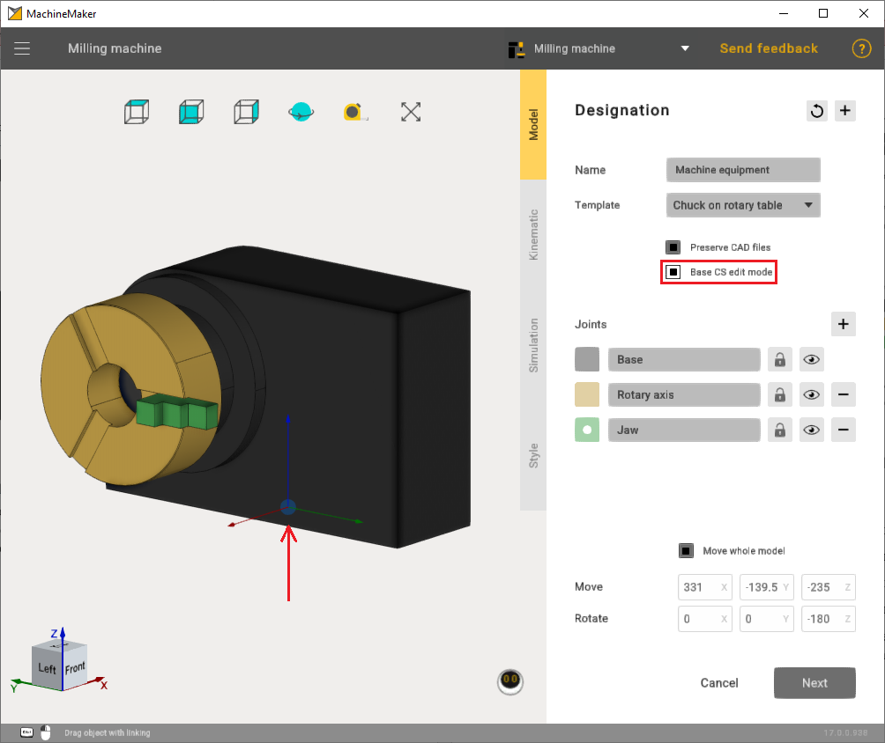</a>

In the <strong class="">Kinematic</strong> settings, it is important to correctly set the rotary axis.

<a class="doc-image-link" href="images/download/attachments/129940438/Machine_equipment1.webp" rel="noopener" target="_blank" title="Open full-size image">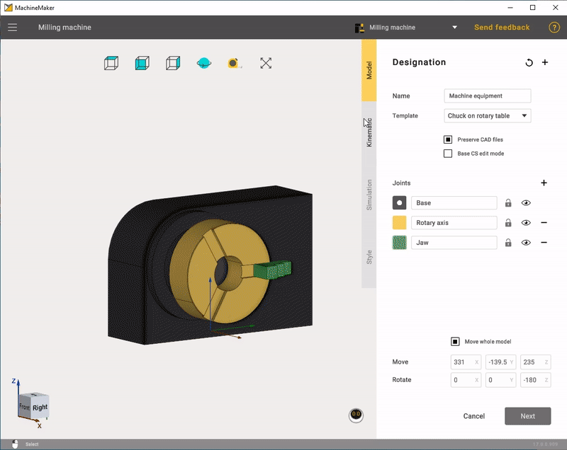</a>

It's also crucial to provide the correct coordinates for the jaws.

<a class="doc-image-link" href="images/download/attachments/129940438/Machine_equipment2.webp" rel="noopener" target="_blank" title="Open full-size image">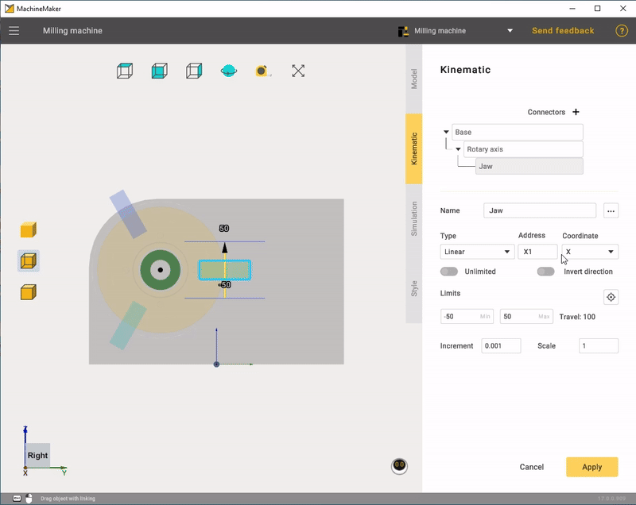</a>

In the <strong class="">Style</strong> mode, you can adjust colors to match the machine or choose a custom color.

<a class="doc-image-link" href="images/download/attachments/129940438/Machine_equipment3.webp" rel="noopener" target="_blank" title="Open full-size image">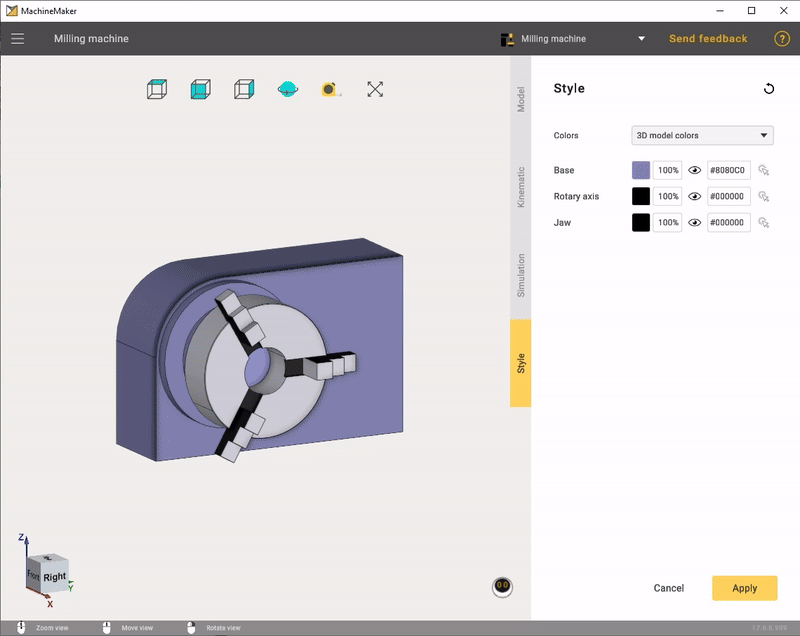</a>

After all settings have been applied, you will need to position the machine equipment on the previously set point.

<a class="doc-image-link" href="images/download/attachments/129940438/image2024-8-13_11-43-39.png" rel="noopener" target="_blank" title="Open full-size image">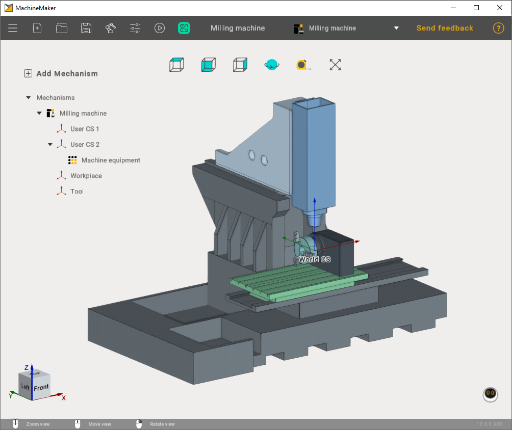</a>

In the second case, let's consider an example of machine equipment with a linear axis. The settings are straightforward. You need to select the appropriate template and configure the motion coordinates of the linear axis.

<a class="doc-image-link" href="images/download/attachments/129940438/image2024-2-1_12-55-22.png" rel="noopener" target="_blank" title="Open full-size image">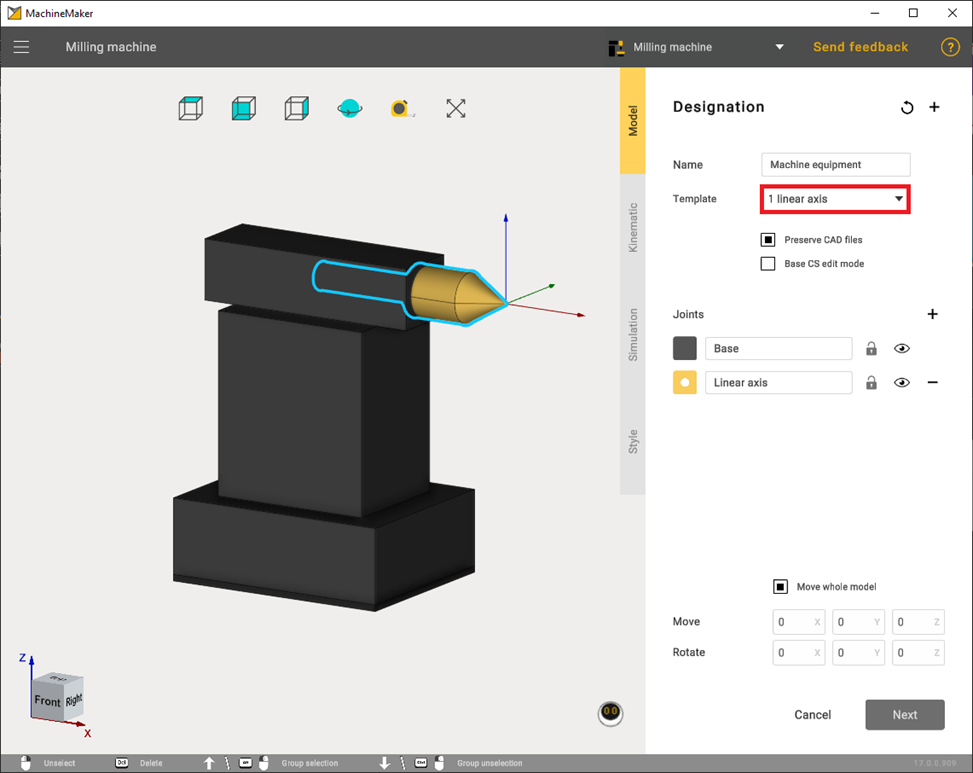</a>

Also, if necessary, it is advisable to correctly set the point through the Base CS edit mode so that the machine equipment is securely attached to the machine in the future.

<a class="doc-image-link" href="images/download/attachments/129940438/Machine_equipment4.webp" rel="noopener" target="_blank" title="Open full-size image">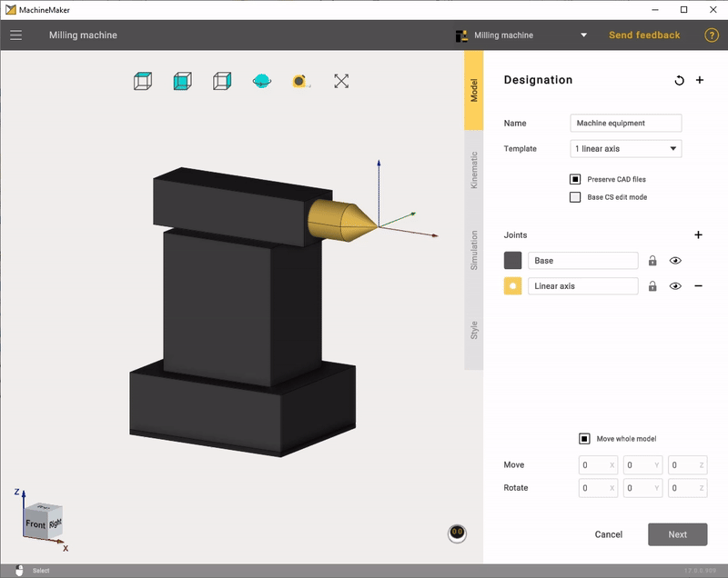</a>

The setting of the linear type is the same as that of the rotary type. You must also set the jaw movement limits.

<a class="doc-image-link" href="images/download/attachments/129940438/image2024-2-1_13-1-40.png" rel="noopener" target="_blank" title="Open full-size image">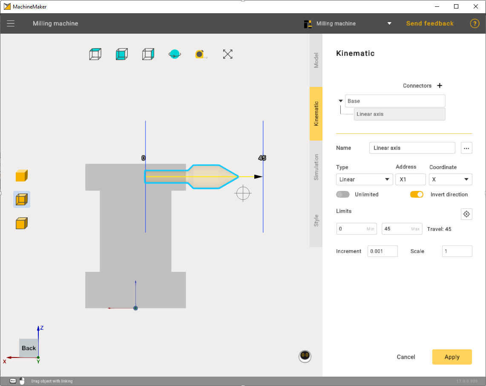</a>

In simulation mode, check that everything is working correctly.

<a class="doc-image-link" href="images/download/attachments/129940438/MachineEquipment5.webp" rel="noopener" target="_blank" title="Open full-size image">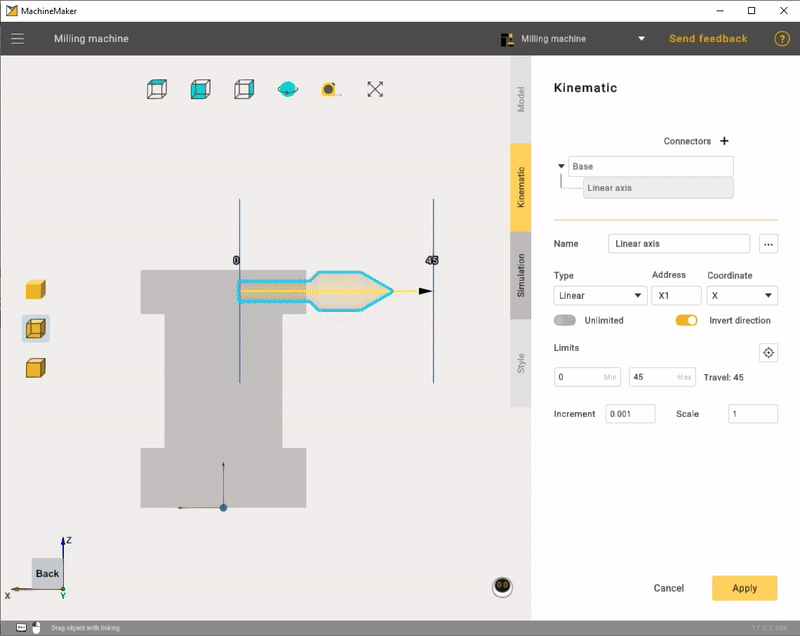</a>

In the end it was possible to assemble a machine with two machine equipment.

