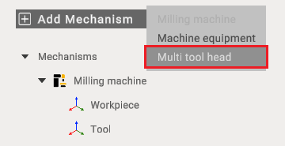
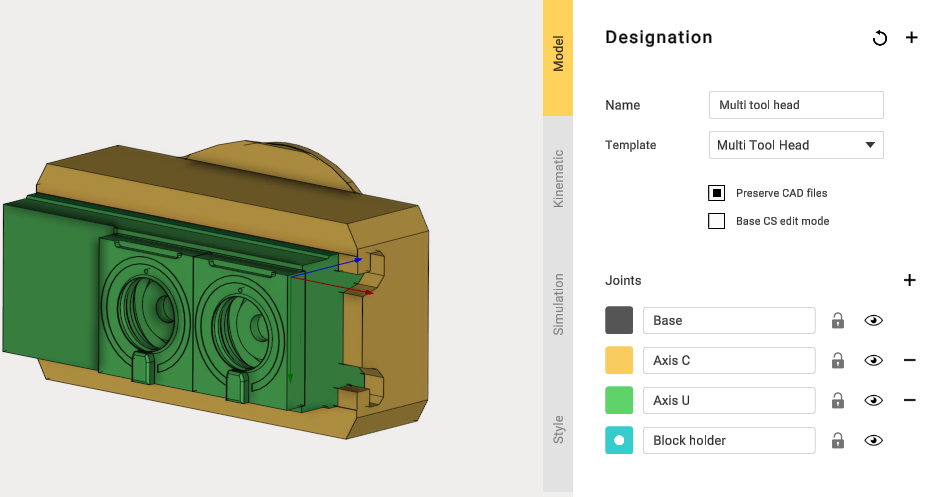
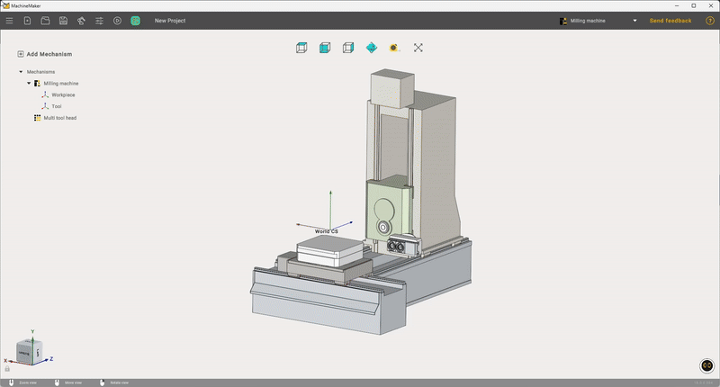
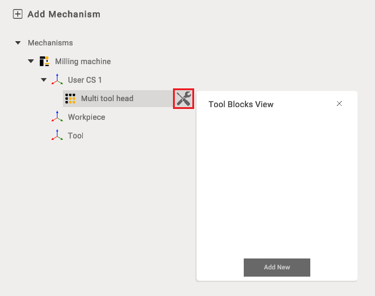
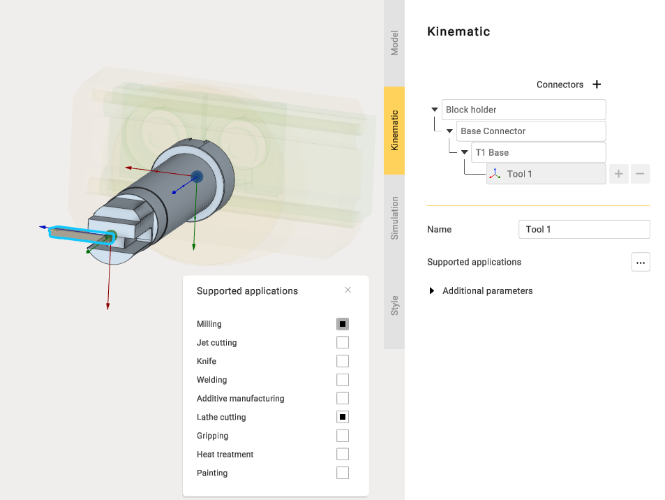
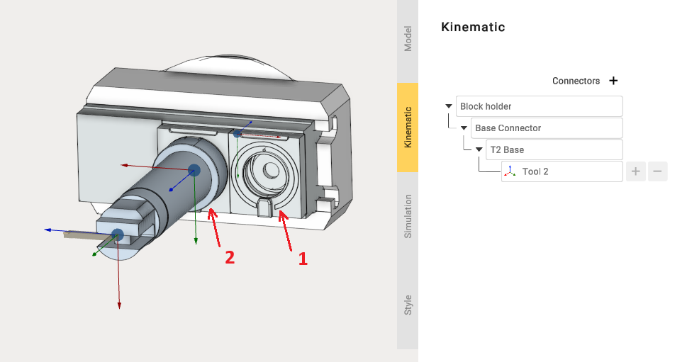
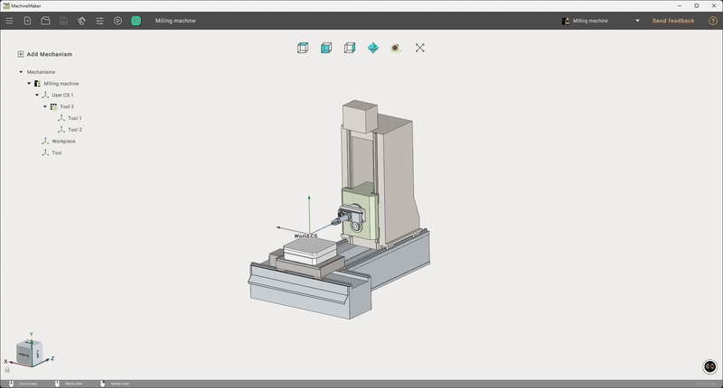

---
title: "Multi Tool Head"
---

<link rel="stylesheet" href="assets/manual.css">

<h1 id="src-142646393">Multi Tool Head</h1>

The Multi Tool Head is made to hold any number of tool blocks, which can be easily configured and adjusted. You can build fully custom Multi Tool Head.

To add it you need to create a project with a milling machine.

Attach a mounting point to the rear of the<strong class=""> Multi Tool Head</strong> and identify its moving components.

Next, create a mounting point on the milling machine and slightly customize<strong class=""> Workpiece</strong> settings.

After mounting the Multi-Tool Head on the milling machine, open the Tool Blocks View window and use it to add the new tool for installation

When adding a tool, you may select any type listed under Supported Applications. In this case, Lathe Cutting will be used.

When adding multiple tools, ensure proper placement of each tool. To reposition a tool, adjust the location of its <strong class="">Base Connector.</strong>

After exporting the project, you can test the machine equipped with the <strong class="">Multi Tool Head.</strong>

You can see how to build a machine with this Multi Tool Head at the <a class="external-link" href="https://www.youtube.com/watch?v=EIswSr_5KuM&amp;ab_channel=ENCYSoftware">link</a>.

