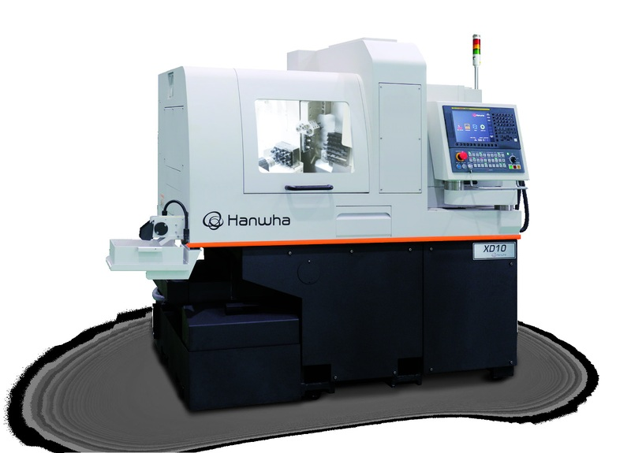
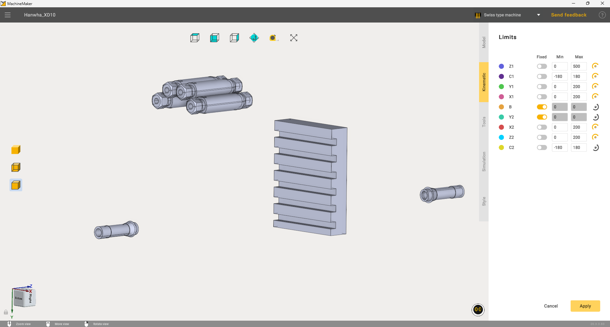
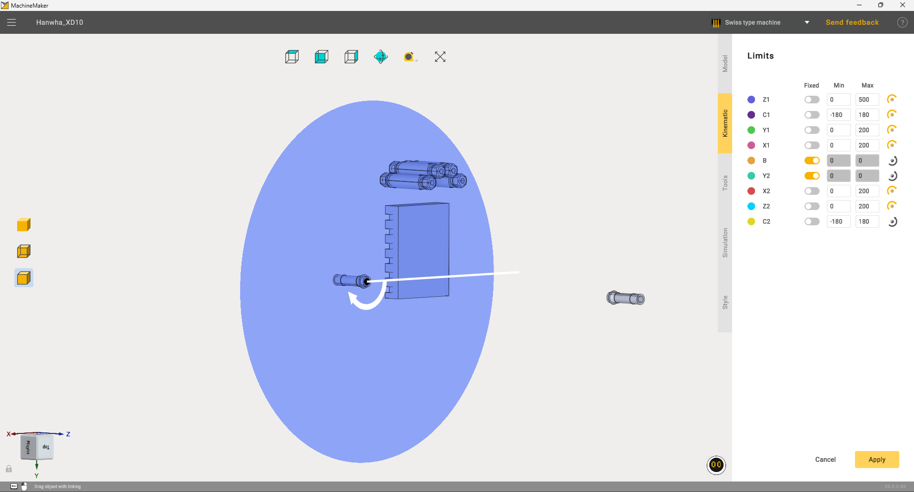
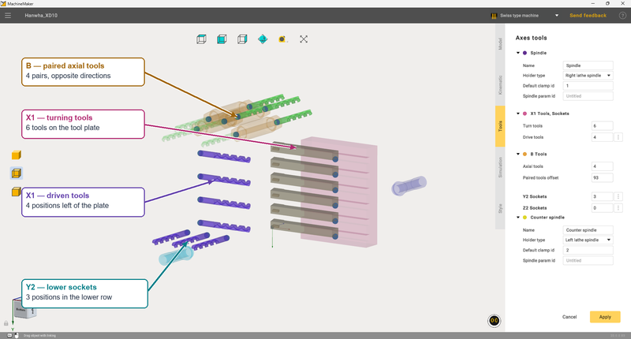
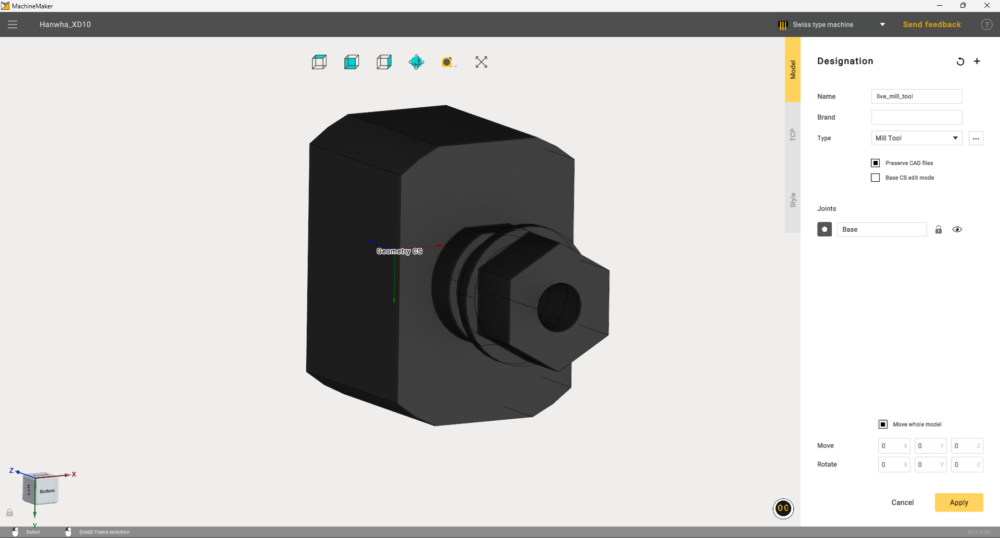
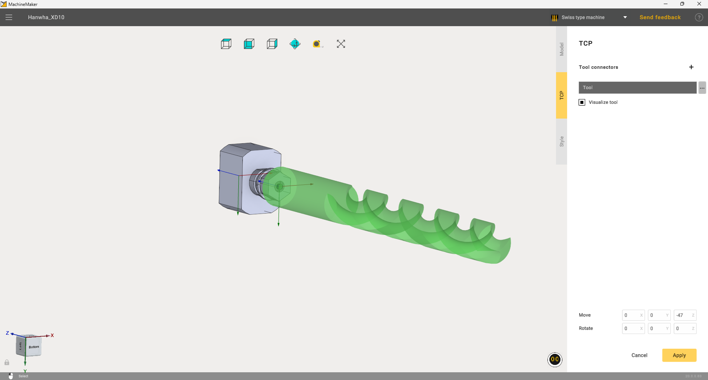
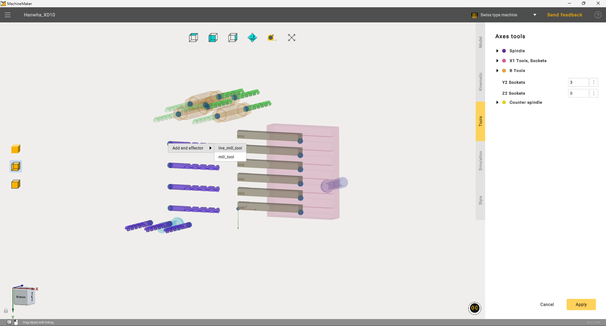
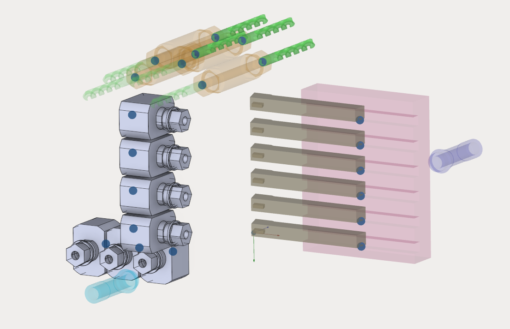

---
title: "Swiss type machine"
---

<link rel="stylesheet" href="assets/manual.css">

<h1 id="src-2026092101">Swiss type machine</h1>

This chapter explains how to build a Swiss-type machine in MachineMaker using the <strong>Hanwha XD10</strong> as an example. You will import the machine model, assign geometry to its nodes, configure the kinematics and tool positions, add tools with holders, and check the movement of the machine components in simulation.

<figure><figcaption>Hanwha XD10, the machine used in this example. Image from the XD_10.pdf documentation.</figcaption></figure>

You will need the <code>Hanwha_XD10.SLDASM</code> assembly and the <code>live_mill_tool.SLDPRT</code> and <code>mill_tool.SLDPRT</code> holder models. The values below apply to this training configuration in MachineMaker. For another machine, use its kinematic layout and technical documentation to determine the settings.

<strong>Example files.</strong> <a href="https://github.com/EncySoftware/public-docs/releases/download/machinemaker-examples-2026-09-22/3D_models_Hanwha_XD10-442fcff663.zip">Download Hanwha XD10 3D models (ZIP, 1.13 MB)</a> — the <code>Hanwha_XD10.SLDASM</code> assembly, machine parts and holder models used in this tutorial.

<a href="https://github.com/EncySoftware/public-docs/releases/download/machinemaker-examples-2026-09-22/MachineSchema-b0d2a4c49e.zip">Download the Hanwha XD10 machine configuration (ZIP, 0.56 MB)</a> — the <code>MachineSchema</code> folder containing the machine configuration, CAD files and node geometry.

Before importing the 3D models, extract the entire archive into one folder and keep the file names unchanged. Open <code>Hanwha_XD10.SLDASM</code> from that folder so that the assembly can find its referenced parts.

<h2 id="step-1">1. Creating a project and importing the model</h2>
<ol start="1">
<li>Open MachineMaker and create a new project.</li>
<li>Select <strong>Swiss type machine</strong> in the Application Mode Selector on the top toolbar.</li>
<li>Click <strong>Add Mechanism</strong> and select the <code>Hanwha_XD10.SLDASM</code> assembly. Wait for the import to finish.</li>
<li>On the <strong>Model</strong> tab, enter the name <code>Hanwha_XD10</code> and select the <strong>Type A (X2 along Y)</strong> template.</li>
<li>Enable <strong>Preserve CAD files</strong> to keep the source geometry available for subsequent editing.</li>
<li>Check the assembly orientation relative to the coordinate system. For the source assembly in the video example, with <strong>Move whole model</strong> enabled, the translation values are X = 0, Y = 0, Z = 0, and the rotation values are X = 0°, Y = −90°, Z = 90°. If the model is already oriented correctly, no further rotation is required.</li>
</ol>
<h2 id="step-2">2. Assigning parts on the Model tab</h2>

In the <strong>Designation</strong> panel, select a node and then select the corresponding parts in the viewport. Assign the parts the color of that node. Parts with the same color belong to the same group.

Assign the tool plate to <strong>X1</strong> and the four upper cylindrical tool housings to <strong>B</strong>. Assign the spindle components to the appropriate nodes of the selected template, using its diagram as a guide. The screenshots use the following colors for X1 and B:

<table><thead><tr><th>Node</th><th>Geometry</th><th>Color</th></tr></thead><tbody>
<tr><td>X1</td><td>Tool plate with six slots</td><td>Pink</td></tr>
<tr><td>B</td><td>Four cylindrical housings of the upper tool group</td><td>Orange</td></tr>
</tbody></table>

Check that every part belongs to the correct group. Do not include holders that will be added separately in the fixed machine geometry. Once the parts are assigned, open the <strong>Kinematic</strong> tab.

<h2 id="step-3">3. Setting axis limits on the Kinematic tab</h2>

In the <strong>Limits</strong> panel, enter the values shown in the screenshot. The <strong>Min</strong> and <strong>Max</strong> fields define the travel limits of linear axes and the rotation limits of rotary axes in degrees. Enable <strong>Fixed</strong> for <strong>B</strong> and <strong>Y2</strong> to lock their movement.

<figure><figcaption>Axis limits for the training configuration. Axes B and Y2 are fixed.</figcaption></figure>

Select each axis in turn and check its movement direction in the viewport. Planes indicate the travel limits of linear axes; a circular indicator shows the rotation of rotary axes.

<h2 id="step-4">4. Positioning the C2 axis</h2>

Select <strong>C2</strong> and align its rotation axis with the centerline of the cylindrical counter-spindle component, as shown below. The center of the indicator must coincide with the center of the hole in the end face. Check the rotation direction using the arrow; if necessary, reverse it with the direction icon to the right of the C2 row.

<figure><figcaption>Positioning C2: the rotation center coincides with the center of the hole, and the axis runs along the counter spindle.</figcaption></figure>

This image illustrates the position of C2. Use the screenshot in the previous step for the numerical limits of all axes.

<h2 id="step-5">5. Positioning tools and sockets</h2>

Open the <strong>Tools</strong> tab. In the <strong>Axes tools</strong> panel, expand the relevant groups and set the number of positions:

<table><thead><tr><th>Group</th><th>Setting</th><th>Value</th></tr></thead><tbody>
<tr><td>X1 tools and sockets</td><td>Turn tools</td><td>6</td></tr>
<tr><td>X1 tools and sockets</td><td>Drive tools</td><td>4</td></tr>
<tr><td>B tools</td><td>Axial tools</td><td>4</td></tr>
<tr><td>B tools</td><td>Paired tools offset</td><td>93</td></tr>
<tr><td>Y2 sockets</td><td>Count</td><td>3</td></tr>
<tr><td>Z2 sockets</td><td>Count</td><td>0</td></tr>
</tbody></table>

Position the tools and sockets as shown in the image. Select each position in the viewport and adjust its location and orientation using the <strong>Move</strong> and <strong>Rotate</strong> fields and geometry snapping.

<figure><figcaption>Tool group layout: X1 turning tools, X1 driven-tool positions, B paired axial tools, and the lower Y2 sockets.</figcaption></figure>

<strong>X1 turning tools.</strong> Place six turning tools in the slots of the tool plate on the right. The tool shanks must be parallel, with one in each slot.

<strong>X1 driven-tool positions.</strong> The four purple tool symbols form a vertical row just to the left of the turning tools. Holders will be attached to these positions later.

<strong>B paired tools.</strong> The upper group contains four axial positions. Align them with the holes in the cylindrical housings. The paired tools point in opposite directions; set the distance between them using <strong>Paired tools offset = 93</strong>.

<strong>Y2 sockets.</strong> The three lower positions form a separate row. Position them relative to the lower spindle component, as shown in the image.

For the spindle groups, use the settings shown in the screenshot:

<table><thead><tr><th>Setting</th><th>Main spindle</th><th>Counter spindle</th></tr></thead><tbody>
<tr><td>Name</td><td>Spindle</td><td>Counter spindle</td></tr>
<tr><td>Holder type</td><td>Right lathe spindle</td><td>Left lathe spindle</td></tr>
<tr><td>Default clamp ID</td><td>1</td><td>2</td></tr>
</tbody></table>

Check the group positions from several viewing angles and click <strong>Apply</strong>.

<h2 id="step-6">6. Adding the first tool with a holder</h2>
<ol start="7">
<li>In the main window, click <strong>Add Mechanism</strong> and add <code>live_mill_tool.SLDPRT</code> as a tool.</li>
<li>On the <strong>Model</strong> tab, enter the name <strong>live_mill_tool</strong> and select the <strong>Mill Tool</strong> type. Assign the holder geometry to the <strong>Base</strong> node. Keep <strong>Preserve CAD files</strong> enabled.</li>
<li>Check the orientation of the model and its coordinate system. In the screenshot, all model translation and rotation values are zero.</li>
</ol>
<figure><figcaption>Adding the first tool: select the milling tool type and assign the holder geometry to Base.</figcaption></figure>
<ol start="10">
<li>Open the <strong>TCP</strong> tab and select the <strong>Tool</strong> connector.</li>
<li>Place the connector at the center of the holder's clamping hole. For this model, set translation to <strong>X = 0, Y = 0, Z = −47</strong> and rotation to <strong>X = 0°, Y = 0°, Z = 0°</strong>.</li>
<li>Enable <strong>Visualize tool</strong>. The tool symbol must extend from the hole along the clamping axis, as shown in the image.</li>
<li>Click <strong>Apply</strong>. The new tool is now available for attachment to the machine sockets.</li>
</ol>
<figure><figcaption>First tool TCP: translation Z = −47, zero rotation about all axes, and tool visibility enabled.</figcaption></figure>
<h2 id="step-7">7. Adding the second tool</h2>

Similarly, use <strong>Add Mechanism</strong> to import <code>mill_tool.SLDPRT</code>. Enter the name <strong>mill_tool</strong>, select the <strong>Mill Tool</strong> type and assign the geometry to the <strong>Base</strong> node.

On the <strong>TCP</strong> tab, position the connector at the center of the hole. The second model in the source video uses translation <strong>X = 0, Y = 0, Z = −34</strong> and zero rotation about all axes. Enable tool visibility, check the tool direction and click <strong>Apply</strong>.

<h2 id="step-8">8. Attaching tools to the machine sockets</h2>
<ol start="14">
<li>Open the settings of the <code>Hanwha_XD10</code> mechanism and select the <strong>Tools</strong> tab.</li>
<li><strong>Right-click</strong> the required tool position or its attachment point.</li>
<li>In the context menu, select <strong>Add end effector</strong>, then <strong>live_mill_tool</strong> or <strong>mill_tool</strong>.</li>
</ol>
<figure><figcaption>Attaching a tool to a socket using Add end effector in the context menu.</figcaption></figure>
<ol start="17">
<li>Repeat for the other positions. Fill the four positions in the vertical group and the three lower sockets with suitable tools and holders.</li>
<li>Check the seating and orientation of every holder. Once all positions are filled, the configuration should look like the image below. Click <strong>Apply</strong>.</li>
</ol>
<figure><figcaption>Completed socket setup: four holders in the vertical group and three holders in the lower row.</figcaption></figure>
<h2 id="step-9">9. Checking the simulation and saving the project</h2>

Switch to MachineMaker simulation mode and check the movement of all machine components. Change the positions of the available axes in turn: <strong>Z1, Y1, X1, X2, Z2</strong>, then check the rotation of <strong>C1</strong> and <strong>C2</strong>.

Make sure that the components move in the correct directions and stay within the configured limits, and that the holders and tools move with their assigned nodes. The counter spindle must rotate about the configured C2 axis. Axes <strong>B</strong> and <strong>Y2</strong> must remain stationary in this configuration.

If any movement is incorrect, return to the part assignments, axis settings or tool positions and correct the relevant parameter. Repeat the check after making changes.

Exit simulation mode and <strong>save the machine project</strong> using the save command on the top toolbar. The Hanwha XD10 configuration is ready for further use in the CAM system.

