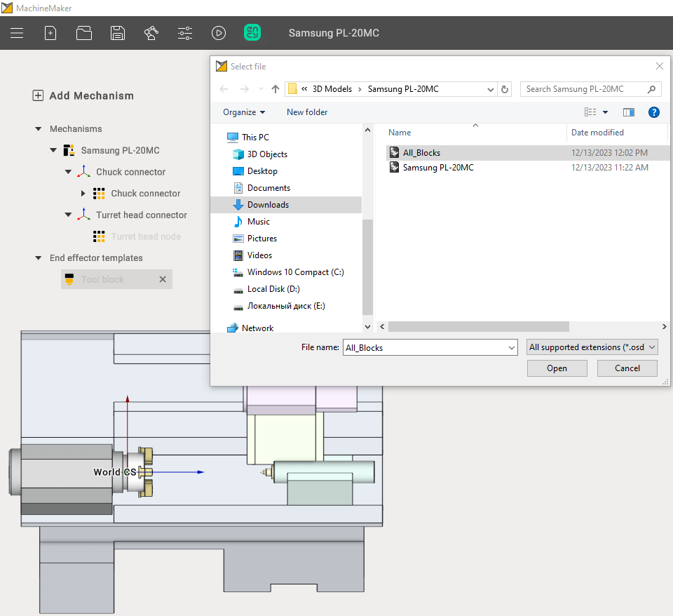
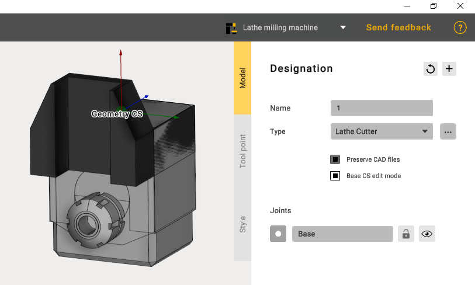
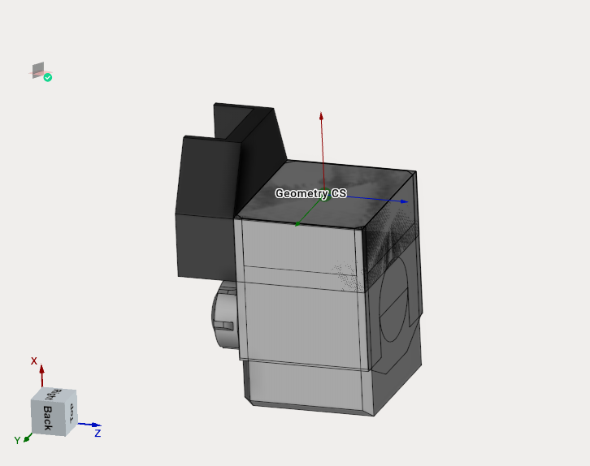
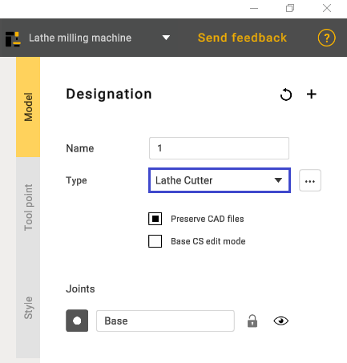
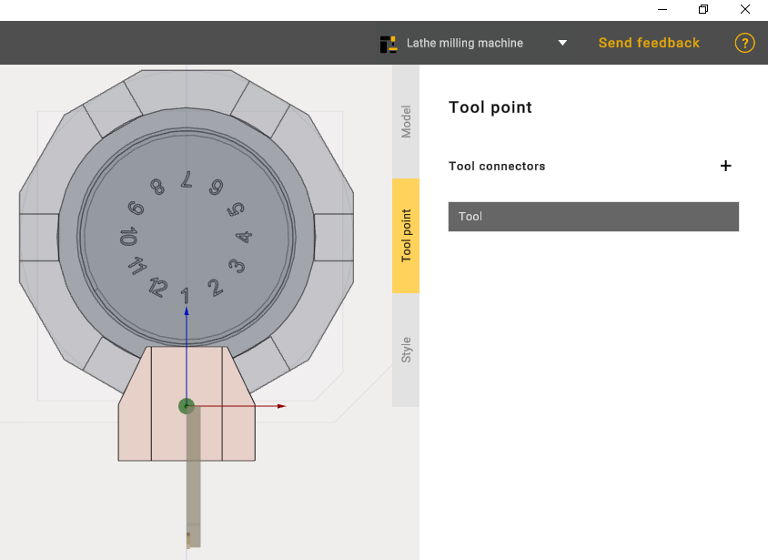
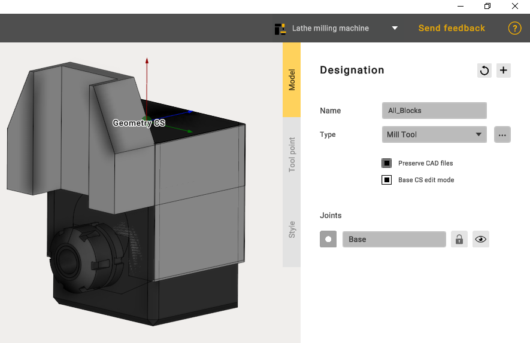
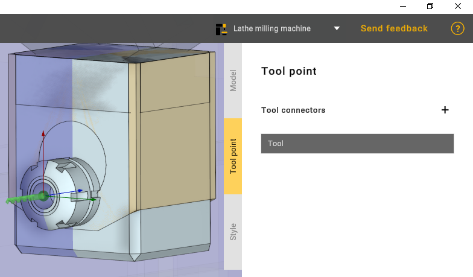

---
title: "Tool block"
---

<link rel="stylesheet" href="assets/manual.css">

<h1 id="src-129940383">Tool block</h1>

The next step is to add two Tool blocks.

The first to be added is the turning tool. For this purpose it is necessary to paint the upper area of the added model.

It is important that the <strong class="">Geometry CS</strong> match the common coordinate system.

Select the desired tool type

On the Tool point tab, position the tool as shown in the picture:

Add a second Tool block and paint the lower part of the model. Select the type of Mill tool.

On the Tool point tab, position the tool as shown in the picture:

Then click apply and this is the end of adding two tool blocks.

