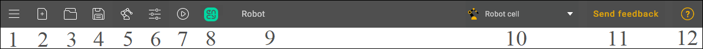
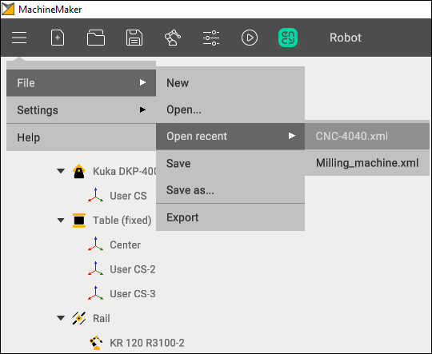
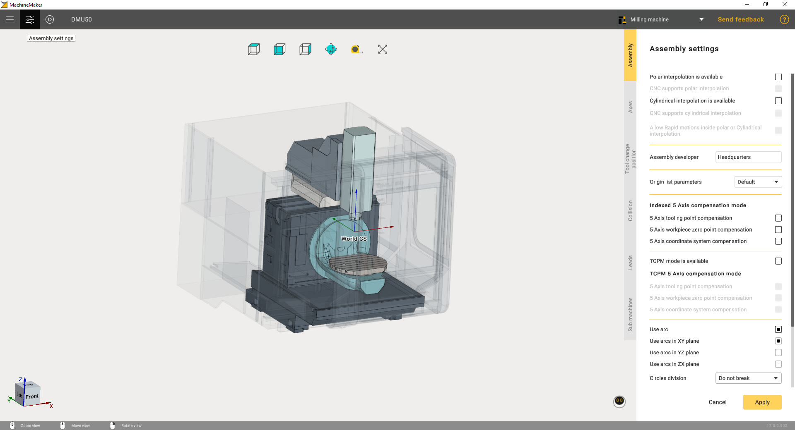
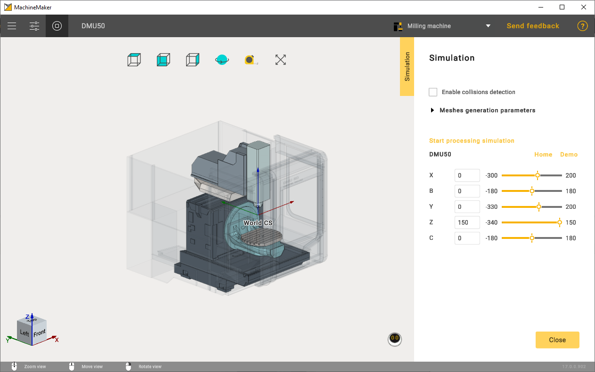
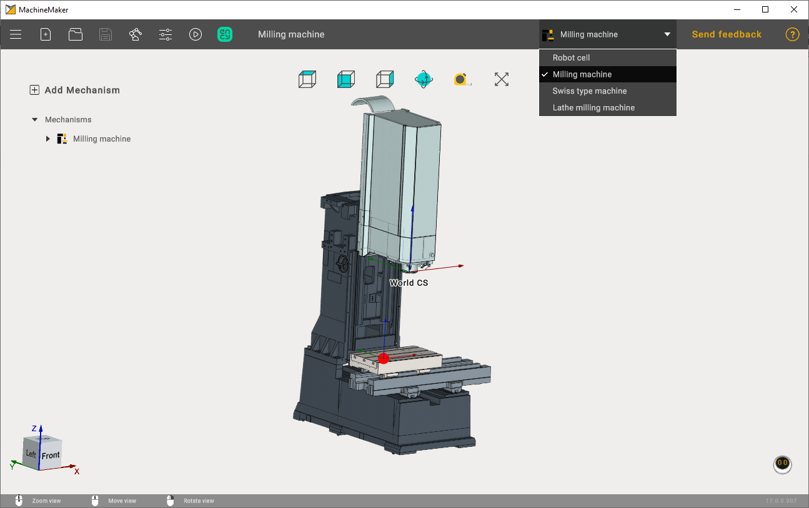
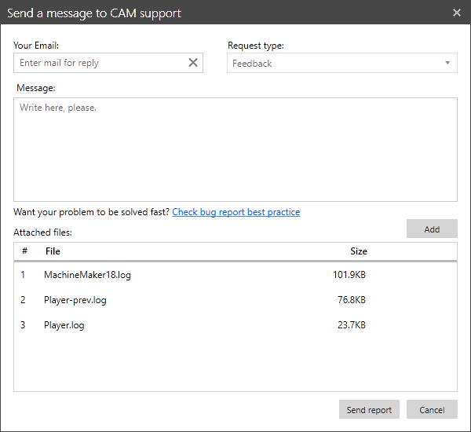

---
title: "Toolbar"
---

<link rel="stylesheet" href="assets/manual.css">

<h1 id="src-128546624">Toolbar</h1>

Application toolbar is located in the top panel of the main window.

<h1 class="heading">Main menu (1)</h1>

 
<i class=""><strong class="">Main Menu (1)</strong> </i> 
contains the following items:    
  

<i class=""><strong class="">File</strong></i> opens a submenu for project operations:

<ul class=""><li class="">
<i class=""><strong class="">New</strong></i><strong class=""> </strong>- create a new project. It is also possible to use <i class=""><strong class="">New (1)</strong></i><strong class=""> </strong>button in the toolbar.

</li><li class="">
<i class=""><strong class="">Open</strong></i><strong class=""> </strong>- open an existing project. It is also possible to use <i class=""><strong class="">Open (3)</strong></i><strong class=""> </strong>button in toolbar.

</li><li class="">
<i class=""><strong class="">Open recent</strong></i><strong class=""> </strong>- show latest projects. Keep mouse over <i class=""><strong class="">Open (3)</strong></i><strong class=""> </strong>button to show recent projects.

</li><li class="">
<i class=""><strong class="">Save</strong></i><strong class=""> </strong>- save current project. MachineMaker will ask for project destination folder when saving the file for the first time. It is also possible to use <i class=""><strong class="">Save (4)</strong></i><strong class=""> </strong>button located in the toolbar.

</li><li class="">
<i class=""><strong class="">Save as</strong></i><strong class=""> </strong>- save current project to another folder

</li><li class="">
<i class=""><strong class="">Export</strong></i><strong class=""> </strong>- open CAM system with the current Machine. It is also possible to use <i class="">CAM system </i>button located in the toolbar

 
It is necessary to add a robot to the assembly to save the project    

</li></ul> 

<h1 class="heading">Mechanisms Library (5)</h1>

 
Opens a library of mechanisms. The library is categorized into different categories. For robots, milling machines and lathe-milling machines    

<h1 class="heading">Assembly settings (6)</h1>

Use <i class=""><strong class="">Assembly settings (6)</strong></i><strong class=""> </strong>button to openassembly settings panel.

<h1 class="heading">Simulation (7)</h1>

Use <i class=""><strong class="">Simulation (7)</strong></i><strong class=""> </strong>button to validate all mechanisms kinematics.

<h1 class="heading">Project name (9)</h1>

Use double click on project name to change it. Entered project name will be used by CAM system. It is also possible to change project name in settings panel.

<h1 class="heading">Context switcher (10)</h1>

Select the context depending on your tasks.

<h1 class="heading">Feedback and help</h1>

Use <strong class=""><i class="">Feedback (11)</i> </strong>button to provide your feedback or ask for assistance.

MachineMaker will automatically attach log files and current project to your request, It is possible to remove any attachment and attach any new file to your request.

Use <strong class=""><i class="">Help (12)</i> </strong>button to open this help and tutorial.

