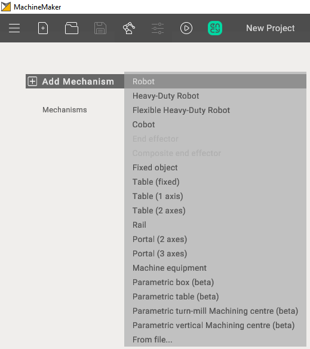
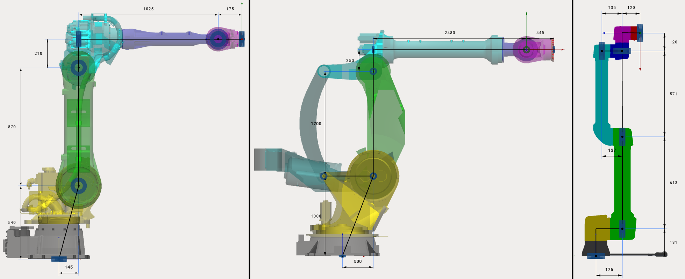

---
title: "Adding a mechanism"
---

<link rel="stylesheet" href="assets/manual.css">

<h1 id="src-129930542">Adding a mechanism</h1>

First of all it is necessary to add the desired mechanism to your project using <i class=""><strong class="">Add Mechanism </strong></i>button

<strong class=""> 

  
</strong>

<h1 class="heading">Supported mechanism types</h1>
<ul class=""><li class="">
 
<strong class="">Robot </strong>- common industrial 6-axes robotic arm.    

</li><li class="">
 
<strong class="">Heavy-Duty Robot </strong>- high payload robot with additional joints.    

</li><li class="">
 
<strong class="">Cobot </strong>- collaborative 6-axes robotic arm.    

</li><li class="">
 
<strong class="">End effector</strong> -     
device at the extremity of the robotic arm, designed to interact with the environment. Spindles, Laser Heads, Wire Cutters and etc. Robot can contain any number of end effectors. End effector can be added only after the robot is selected.    

</li><li class="">
<strong class=""> 
Composite End effector     
</strong> 
-    

 complex devices, contain movable parts. For example gripper with fingers.    

</li><li class="">
 
<strong class="">Fixed object</strong> - any fixed object (controller, enclosure, etc).    

</li><li class="">
 
<strong class="">Table (fixed)</strong> - static table    

</li><li class="">
 
<strong class="">Table (1 axis)</strong> - rotary table (positioner) with     
1     
axis    

</li><li class="">
 
<strong class=""><strong class="">Table (</strong>2 axes) </strong>- rotary table (positioner) with     
2     
axes    

</li><li class="">
 
<strong class="">Rail</strong> - rail or any another linear axis. Usually allows you to move the robot along the X axis.    

</li><li class="">
 
<strong class="">Portal (2 axes)</strong> - mechanism with 2 linear axes. Usually allows you to move the robot along X-Y axes.    

</li><li class="">
 
<strong class="">Portal (3 axes)</strong> -     
portal,     

mechanism with     

3 linear axes. Usually allows you to move the robot along X-Y-Z axes.    

</li><li class="">
 
<strong class="">Machine equipment - </strong>Universal equipment with the possibility of configuration.    

</li><li class="">
<strong class=""> 
Parametric box -     
</strong> 
Cube, with the possibility of changing its length, width, height.    

</li><li class="">
<strong class=""> 
Parametric table -     
</strong> 
Table, with the possibility of changing its length, width, height, thickness and height of legs.    

</li><li class="">
<strong class=""> 
Parametric turn-mill Machining centre -     
</strong> 
Parametric machine (Turn).    

</li><li class="">
<strong class=""> 
Parametric vertical Machining centre -     
</strong> 
Parametric machine (Mill).    

</li><li class="">
 
<strong class="">From file </strong>- allows you to add a mechanism exported to    
 .mmm file. Check "Mechanism library" section for more information about .mmm files    

</li></ul>
<ul class=""></ul>
Robots, Heavy-Duty Robots and Cobots have different kinematic schemes:

