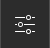
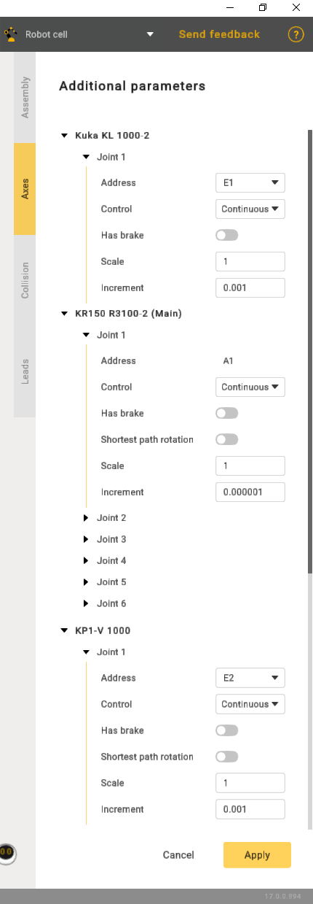
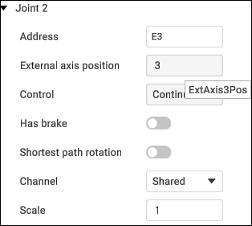

---
title: "Additional options"
---

<link rel="stylesheet" href="assets/manual.css">

<h1 id="src-129936331">Additional options</h1>

Robot controller can use external axes and it is necessary to assign correct positions (indices) for these axes in the assembly. Default CAM-system postprocessors use index-based axes identifiers (<strong class="">ExtAxis1Pos</strong> for the first axis, <strong class="">ExtAxis2Pos</strong> etc). Some custom postprocessors can use axis address instead of indices (<strong class="">E1, E2, E3, J4</strong> etc).

Click 
     button to open the Assembly parameters panel. Then go to the <i class=""><strong class="">Axes</strong></i> tab.

<ul class=""><li class="">
Address - axis designation.

</li><li class="">
Control:

</li></ul><ol class=""><li class="">
Countinuous.

</li><li class="">
Indexed - indicates that rotation will be carried out incrementally.

</li><li class="">
Manual - implies that the operation is entirely manual.

</li></ol><ul class=""><li class="">
Shortest path rotation - refers to the rotation around an axis or point using the most direct path between the initial and final positions in three-dimensional space.

</li><li class="">
Scale is a setting with four positions. Each position corresponds to a specific angular increment. Position 1 equals 90 degrees, Position 2 equals 180 degrees, and so on.

</li></ul>
Define <strong class="">Address </strong>and <strong class="">External axis position (index) </strong>here. MachineMaker will show axis identifier (like ExtAxis3Pos) in tooltip. You can use it in the postprocessor.

Axis address and axis index must be unique in the assembly context. If you try to set use a value that has been already taken, MachineMaker will propose to replace the existing one.

It is not possible to change the robot axis address and index. You can change external addresses only.

It is also possible to define additional axes parameters here: <strong class="">Control type (Continues, Indexed, Manual)</strong>, <strong class="">Brakes </strong>and <strong class="">Shortest path rotation mode.</strong>

