---
title: "Assemblies"
---

<link rel="stylesheet" href="assets/manual.css">

<h1 id="src-129931045">Assemblies</h1>

<h1 class="heading">Connectors</h1>

Each mechanism or object has at least one connector. It is possible to connect two mechanisms using their connectors.

A robot always has 2 connectors: first one at the base coordinate system (3) and the second one at the flange (4).

A table has at least 2 connectors: at the base (1) and at the table top (2).

End effector has one connector at the base (5).

It is possible to place the robot on the table by linking the robot connector (3) to the table connector (2). It is also possible to place an end effector on the robot flange by linking the end effector connector to the robot flange connector.

<a class="doc-image-link" href="images/download/attachments/129931045/image2021-5-6_15-38-13.png" rel="noopener" target="_blank" title="Open full-size image">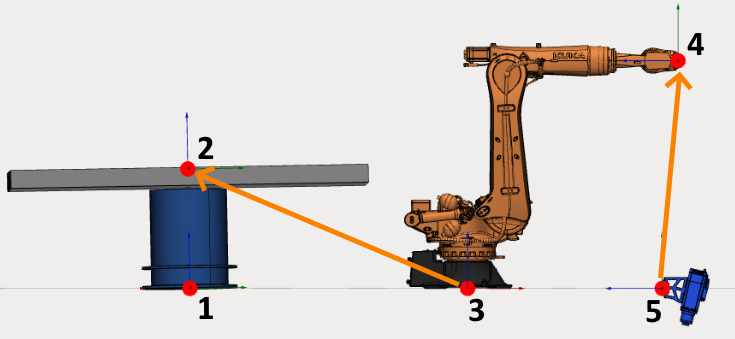</a>

A table can hold several mechanisms. If this is the case, it must have several connectors.

<a class="doc-image-link" href="images/download/attachments/129931045/image2021-5-6_15-42-51.png" rel="noopener" target="_blank" title="Open full-size image">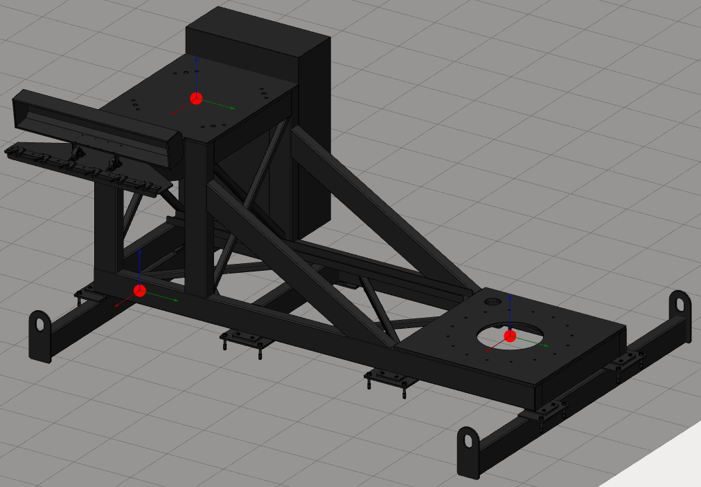</a>
All empty connectors will be used as workpiece connectors in CAM system.

<a class="doc-image-link" href="images/download/attachments/129931045/image2021-5-6_15-57-35.png" rel="noopener" target="_blank" title="Open full-size image">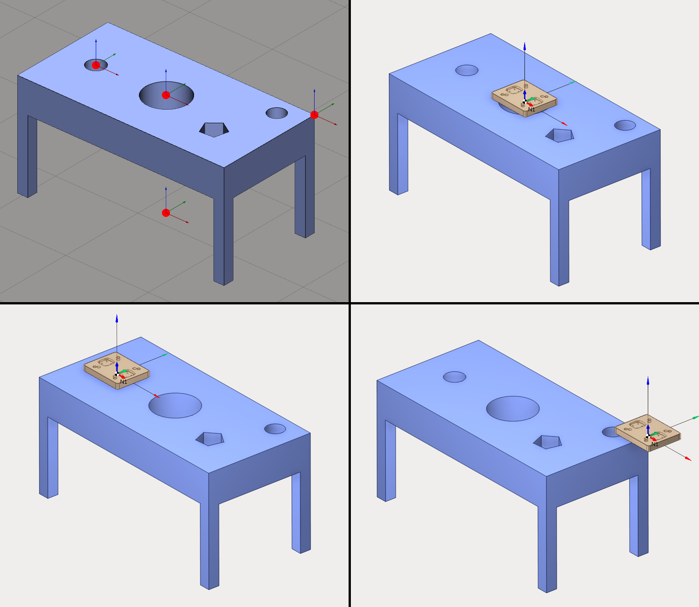</a>

<h1 class="heading">Manage table connectors</h1>

It is possible to add several connectors. Create a new table or edit an existing one and open the <a class="external-link" href="https://kb.sprutcam.com/display/MMUMAU15/Build+kinematic+schema">kinematics panel</a>. You can check <i class=""><strong class="">User coordinate systems</strong></i><strong class=""> </strong>panel to manage connectors.

<a class="doc-image-link" href="images/download/attachments/129931045/image2024-2-9_16-26-44.png" rel="noopener" target="_blank" title="Open full-size image">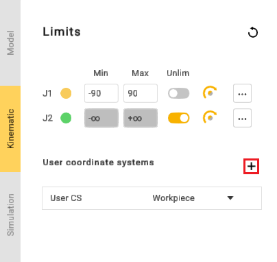</a>

Use 
 button to add a new connector.

<a class="doc-image-link" href="images/download/attachments/129931045/image2024-2-9_16-28-49.png" rel="noopener" target="_blank" title="Open full-size image">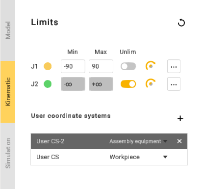</a>

Click on a connector to select it. It is also possible to select a connector in 3D View. Double-click on the connector name to modify it. Use <i class=""><strong class="">Enter</strong></i><strong class=""> </strong>key to validate the new name and <i class=""><strong class="">Esc</strong></i><strong class=""> </strong>key to cancel.

<a class="doc-image-link" href="images/download/attachments/129931045/manage_table_connectors_3.png" rel="noopener" target="_blank" title="Open full-size image">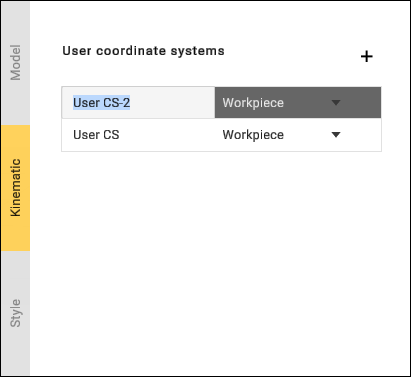</a>

Use 
 button to delete the connector.

 
A table must have at least one connector (user CS), so it is impossible to delete the last one.    

It is possible to change connector position using <a href="building-a-kinematic-scheme.md">transformation panel, dimensions or drag&amp;drop</a>.

<h1 class="heading">Connect mechanisms to assembly</h1>

Hold down <i class=""><strong class="">Left Ctrl</strong></i><strong class=""> </strong>key in Assembly view to show all connectors. Empty connectors will be shown as red dots and busy connectors will be shown as green dots.

<a class="doc-image-link" href="images/download/attachments/129931045/image2023-10-27_14-37-9.png" rel="noopener" target="_blank" title="Open full-size image">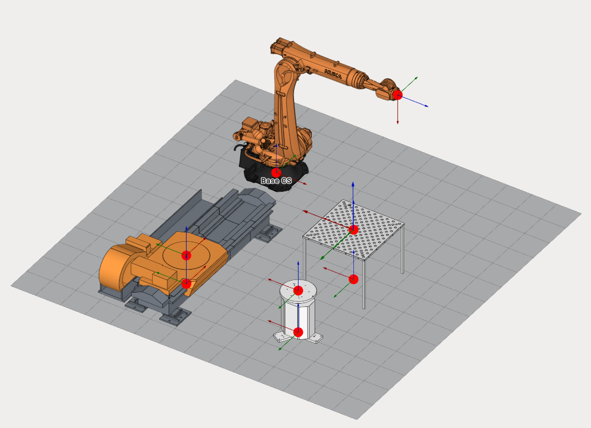</a>

Click on a busy connector (green dot) to break the connection between mechanisms.

Hold down <i class=""><strong class="">Left <i class=""><strong class="">Crtl</strong></i><strong class=""> </strong></strong></i>key, drag any mechanism and drop onto to another one. MachineMaker will show a sticky arrow between linking connectors.

<a class="doc-image-link" href="images/download/attachments/129931045/linkunlink21323.webp" rel="noopener" target="_blank" title="Open full-size image">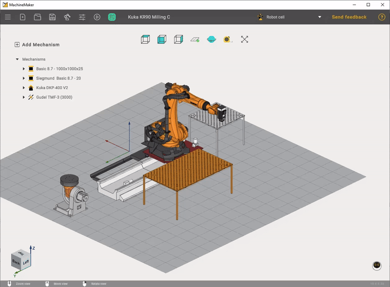</a>

 
Use     
<i class=""><strong class="">Left Alt</strong></i><strong class=""> </strong> 
key to use drag and drop function without snapping mechanisms to each other.    

<h1 class="heading">Using assembly tree</h1>

Assembly tree shows all mechanisms and connectors.

<a class="doc-image-link" href="images/download/attachments/129931045/image2023-10-27_14-46-20.png" rel="noopener" target="_blank" title="Open full-size image">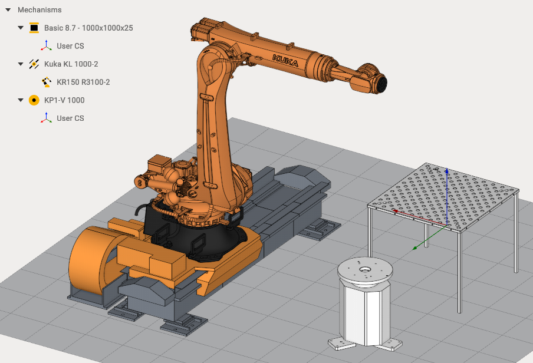</a>

It is possible to use Drag&amp;Drop in the assembly tree. Drag Kuka Robot and drop it to the <i class=""><strong class="">Mechanisms</strong></i><strong class=""> </strong>node to unlink it from the Rail.

<a class="doc-image-link" href="images/download/attachments/129931045/unlink4erezderevo.webp" rel="noopener" target="_blank" title="Open full-size image">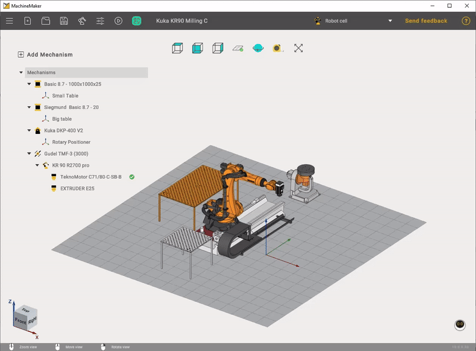</a>

Drag Kuka Robot and drop it to the Rail node to connect mechanisms again.

<a class="doc-image-link" href="images/download/attachments/129931045/narail.webp" rel="noopener" target="_blank" title="Open full-size image">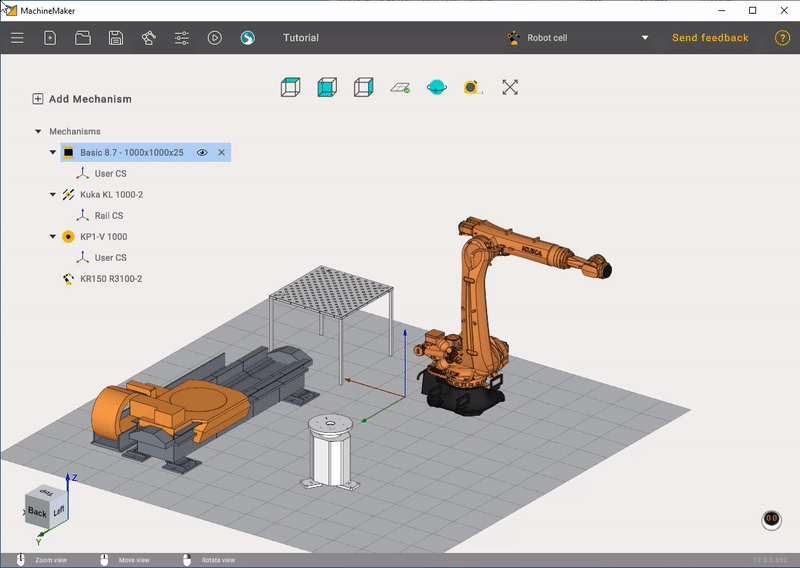</a>

Use 
 button to switch mechanism visibility.

<a class="doc-image-link" href="images/download/attachments/129931045/visibilityli.webp" rel="noopener" target="_blank" title="Open full-size image">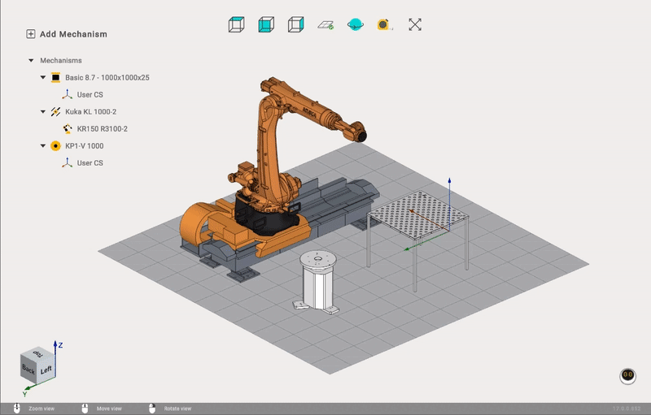</a>

Use 
 button to delete a mechanism.

 
Be careful when deleting mechanisms. All connected mechanisms also will be deleted. Unlink all child mechanisms if you want to delete only one mechanism.    

It is possible to add several end effectors and select the active end effector using 
 button.

