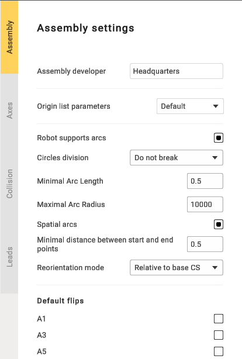

---
title: "Assembly options"
---

<link rel="stylesheet" href="assets/manual.css">

<h1 id="src-129935832">Assembly options</h1>

Click 
     button to open Assembly parameters panel.

<ul class=""><li class="">
<strong class="">Snap base to rotary positioner</strong>: When enabled, this option attaches the coordinate system to the rotary positioner, moving with it. When disabled, the coordinate system on the positioner remains stationary.

</li><li class="">
<strong class="">Snap base to linear axis:</strong> Functions similarly to "Snap Base to Rotary Positioner," but is used with linear axes.

</li><li class="">
<strong class="">Fix WCS on axis:</strong> This option is used to select the axis of the coordinate system. For example, if you have multiple mechanisms and need to choose a specific one.

</li><li class="">
<strong class="">Assembly developer:</strong> Company name.

</li><li class="">
<strong class="">Robot supports arcs:</strong> Necessary to output arcs in the control program.

</li><li class="">
<strong class="">Circles division:</strong> Used to divide arcs into halves or quarters.

</li><li class="">
<strong class="">Minimal Arc Length:</strong> Prevents the output of arcs shorter than a specified length; a segment will be displayed instead.

</li><li class="">
<strong class="">Maximal Arc Radius:</strong> Prevents the output of arcs with a radius larger than specified; segments will be displayed.

</li><li class="">
<strong class="">Spatial arcs:</strong> Arbitrary spatial arcs. A function necessary for robots to work.

</li><li class="">
<strong class="">Minimal distance between btart and end points:</strong> A restriction that allows the display of segments with a small distance between points.

</li><li class="">
<strong class="">Reorientation mode:</strong> The method of calculating the midpoint. The functionality may vary depending on the manufacturer.

</li><li class="">
<strong class="">Default flips:</strong> Needed to set the position of the robot.

</li></ul>

