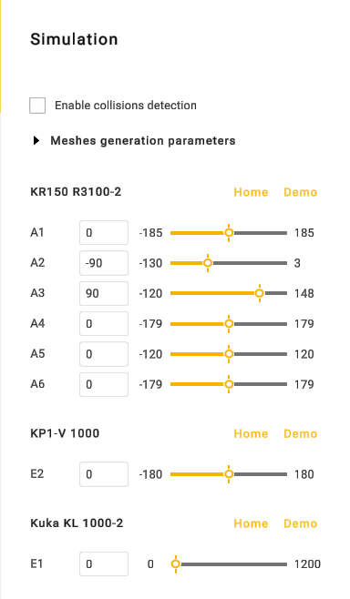
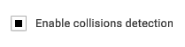
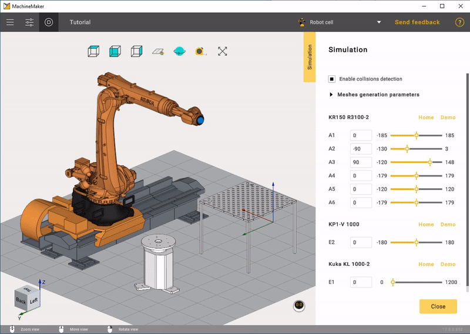

---
title: "Assembly Simulation and Validation"
---

<link rel="stylesheet" href="assets/manual.css">

<h1 id="src-131904463">Assembly Simulation and Validation</h1>

We recommend validating the complete assembly by simulating mechanisms movements. Click 
button to open Assembly simulation panel.

In this tab there is "Enable collisions detection".

This panel is similar to the the panel described here: <a href="mechanism-simulation-and-validation.md">Mechanism movements in simulation</a>, but allows you to simulate all mechanisms in assembly.

