---
title: "Building a kinematic scheme"
---

<link rel="stylesheet" href="assets/manual.css">

<h1 id="src-131903495">Building a kinematic scheme</h1>

Click <i class=""><strong class="">Kinematic</strong></i><strong class=""> </strong>tab to open kinematic parameters panel.

<h1 class="heading">Kinematics</h1>

MachineMaker shows the current mechanism's 3D model and kinematic scheme. It is necessary to build correct kinematic linkage by specifying connector's positions.

<a class="doc-image-link" href="images/download/attachments/131903495/image2022-4-4_11-33-14.png" rel="noopener" target="_blank" title="Open full-size image">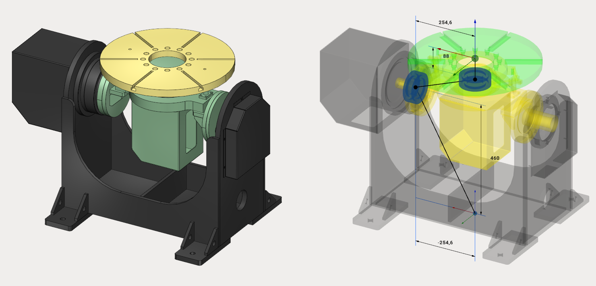</a>

<a class="doc-image-link" href="images/download/attachments/131903495/image2022-4-4_11-40-48.png" rel="noopener" target="_blank" title="Open full-size image">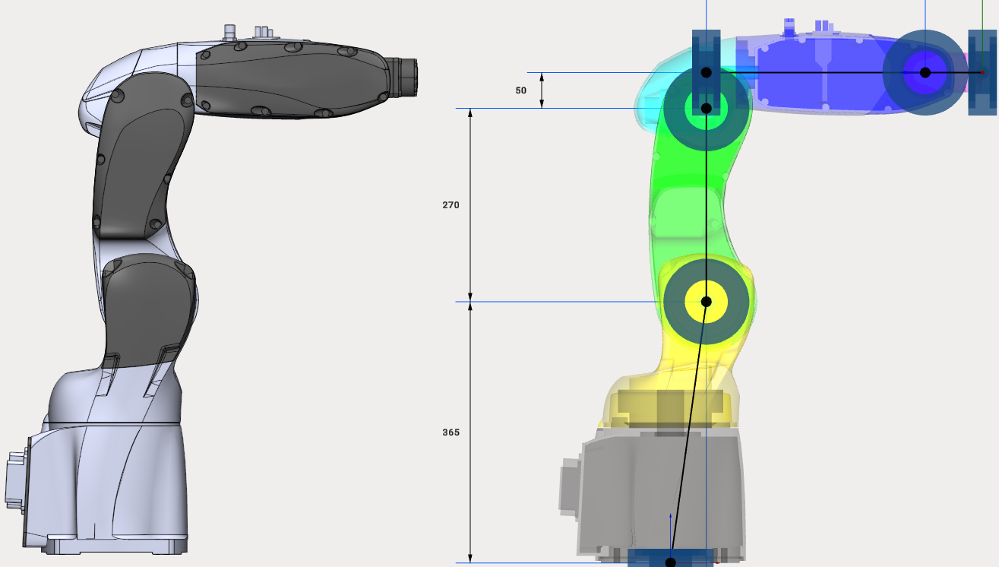</a>

There are three ways to specify connector position:

<ul class=""><li class="">
Dimensions

</li><li class="">
Transformation panel

</li><li class="">
Drag&amp;Drop and snap points

</li></ul> 

<h2 class="heading">Dimensions</h2>

Click to dimension and enter new value.

<a class="doc-image-link" href="images/download/attachments/131903495/dimens1on.webp" rel="noopener" target="_blank" title="Open full-size image">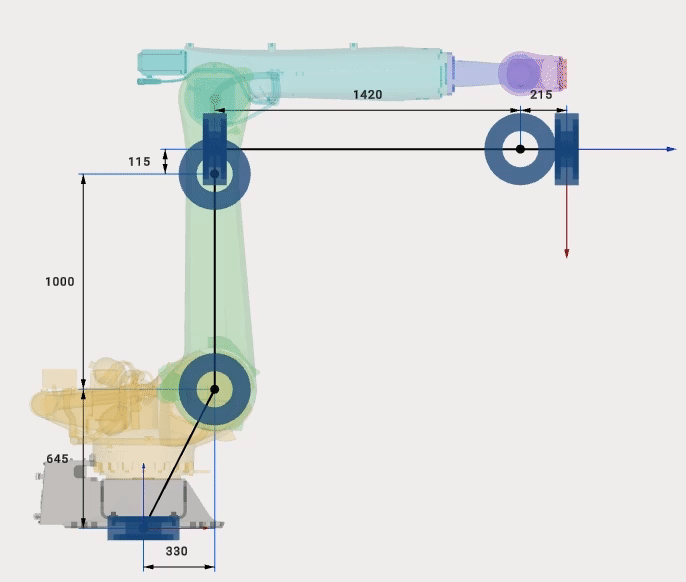</a>

<h2 class="heading">Transformation panel</h2>

It is also possible to set position of any connector manually.Select connector (blue bearing for rotary joints and blue dot for "assemblies") and enter move and rotate values to the     

<i class=""><strong class="">Transformation Panel</strong></i> 

at the right bottom corner.

<a class="doc-image-link" href="images/download/attachments/131903495/razmery2.2.webp" rel="noopener" target="_blank" title="Open full-size image">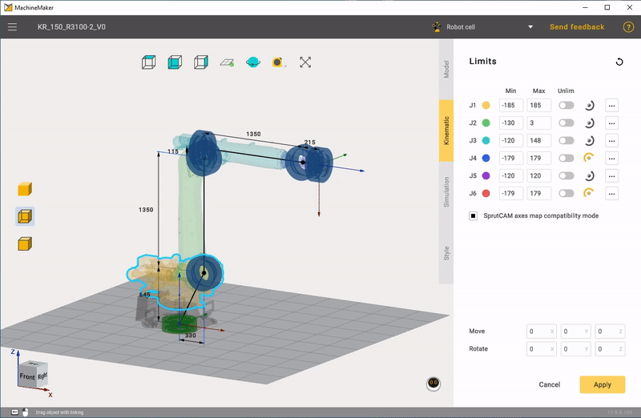</a>

 
Use     
<i class=""><strong class="">Mouse Wheel Scroll</strong></i> 
 to    
<strong class=""> </strong> 
change values on any inputbox or combobox. Hold     
<i class=""><strong class="">Shift</strong></i><strong class=""> </strong> 
or     
<i class=""><strong class="">Ctrl</strong></i><strong class=""> </strong> 
keys while scrolling values to change values faster or slower.    

<h2 class="heading">Drag&amp;Drop and snap points</h2>

Hold <i class=""><strong class="">Left Ctrl</strong></i><strong class=""> </strong>key to enter Drag&amp;Drop mode. Drag any connector (blue bearing for rotary joints and blue dot for "assemblies"). MachineMaker will show small red snap points nearby. Release mouse button to drop object.

<a class="doc-image-link" href="images/download/attachments/131903495/ezgif-2-352d7f99dff1.webp" rel="noopener" target="_blank" title="Open full-size image">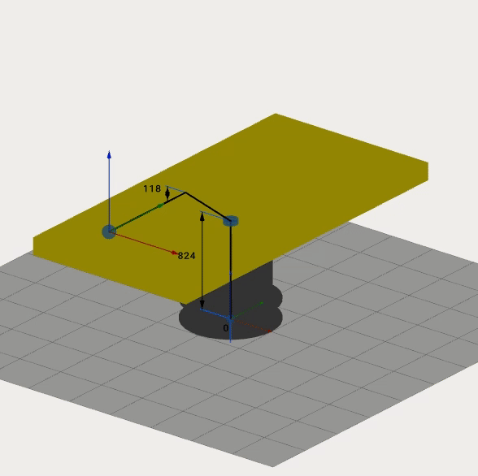</a>

<h1 class="heading">Limits</h1>

It is possible to enter limits for each node. You can find this information in DataSheets.

<a class="doc-image-link" href="images/download/attachments/131903495/image2023-10-25_14-58-15.png" rel="noopener" target="_blank" title="Open full-size image">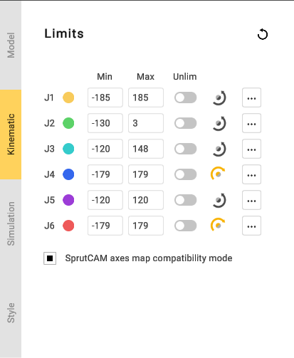</a>

MachineMaker shows joint's minimum and maximum values.

<a class="doc-image-link" href="images/download/attachments/131903495/image2021-5-4_23-15-27.png" rel="noopener" target="_blank" title="Open full-size image">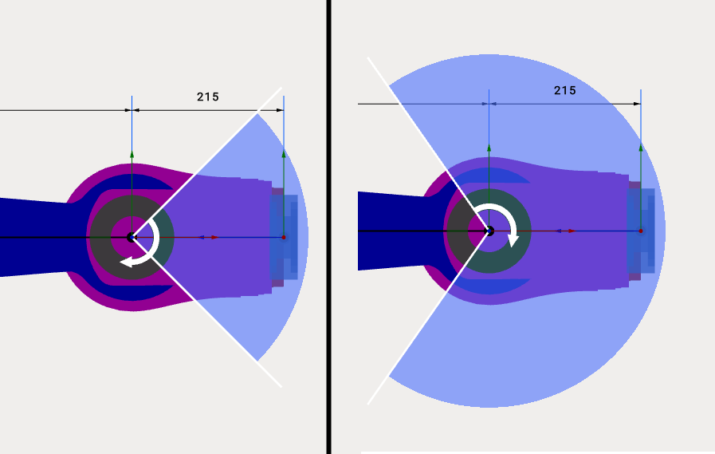</a>

Use 
 or 
 buttons to change rotation or movement direction.

Use <i class=""><strong class="">Unlim</strong></i><strong class=""> </strong>switcher to allow unlimited rotation for positioners.

<h1 class="heading">Model Position</h1>

Use <i class=""><strong class="">Model Position</strong></i><strong class=""> </strong>to set joint values for current position of imported 3D model. These fields allows you to use CAD files of mechanisms, saved in non-zero positions.

For example here is the zero position of Kuka robots:

<a class="doc-image-link" href="images/download/attachments/131903495/image2021-5-4_23-35-25.png" rel="noopener" target="_blank" title="Open full-size image">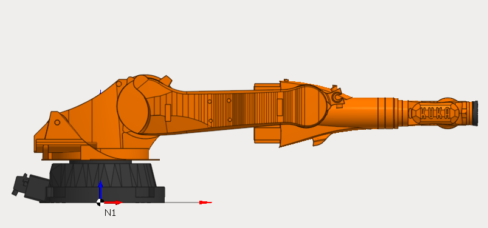</a>

But <a class="external-link" href="https://www.kuka.com/en-de/services/downloads">Kuka download center</a> provides only 3D models for non-zero robot position:

<a class="doc-image-link" href="images/download/attachments/131903495/image2021-5-4_23-37-37.png" rel="noopener" target="_blank" title="Open full-size image">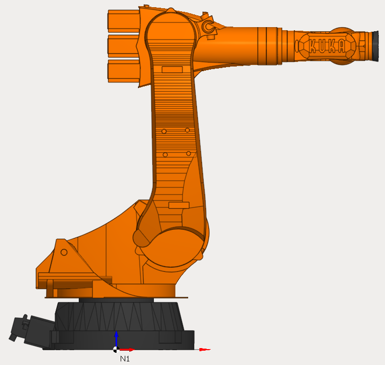</a>

So we can just specify <i class=""><strong class="">Model Position</strong></i><strong class=""> </strong>values and use 3D models provided by Kuka. It is not necessary to change them on CAD system.

<a class="doc-image-link" href="images/download/attachments/131903495/image2023-10-25_15-1-43.png" rel="noopener" target="_blank" title="Open full-size image">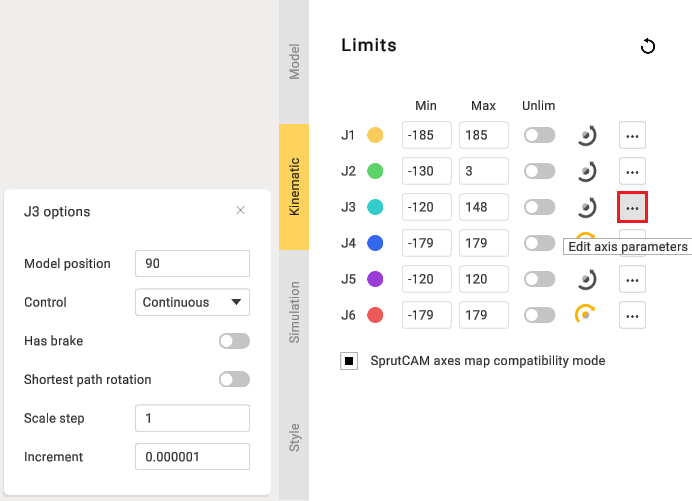</a>

<i class=""><strong class="">Model Position</strong></i> function is also useful for mechanisms with linear axes. For example, when editing rail limits.

<a class="doc-image-link" href="images/download/attachments/131903495/image2024-2-9_15-52-0.png" rel="noopener" target="_blank" title="Open full-size image">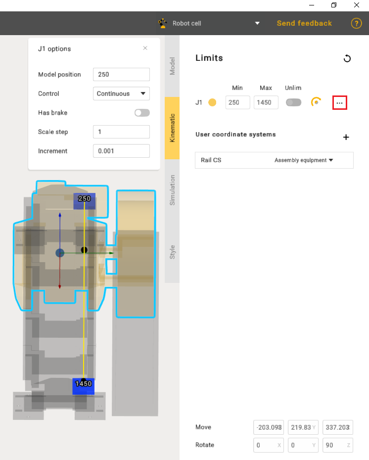</a>

