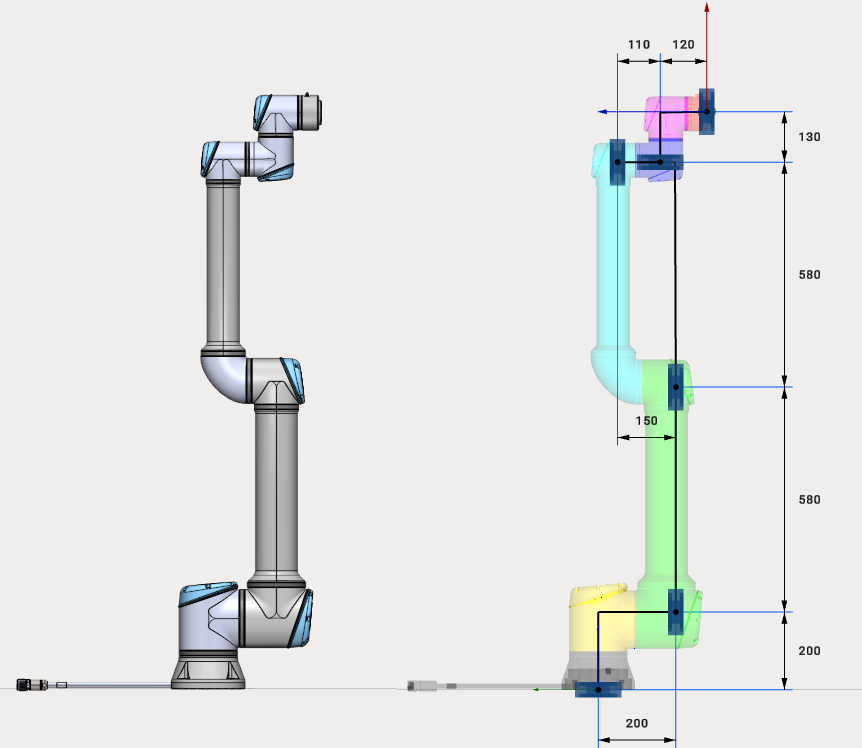

---
title: "Cobot"
---

<link rel="stylesheet" href="assets/manual.css">

<h1 id="src-131903666">Cobot</h1>

Cobots (Collaborative robots) have a different template of kinematic schemes. As a rule, at zero position this kind of robots is vertically aligned.

Current version of MachineMaker supports 6-axes Universal and AUBO collaborative robots.

