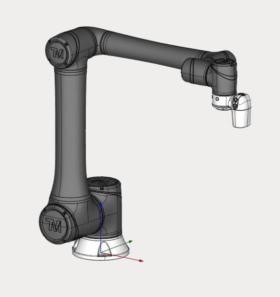

---
title: "Cobot"
---

<link rel="stylesheet" href="assets/manual.css">

<h1 id="src-129933035">Cobot</h1>

Download Project here: <strong class=""><a href="https://github.com/EncySoftware/public-docs/releases/download/machinemaker-examples-2026-09-22/Cobot-52fe7f5be9.zip">Cobot.zip</a></strong>

<strong class=""><strong class="">
 </strong></strong><strong class=""> </strong>

You can see the tutorial video at the <a class="external-link" href="https://www.youtube.com/watch?v=L-k6n-61InU&amp;list=PLnaHZJpWJMKPN2hSDvR1DnxmAuFH4tP42&amp;index=1">link</a>

