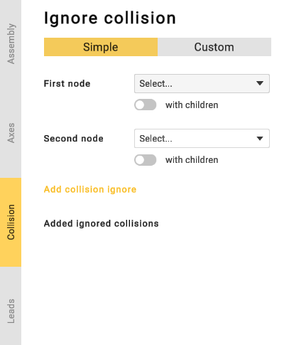
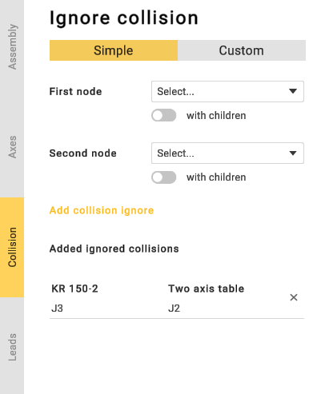
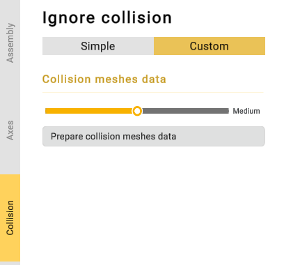
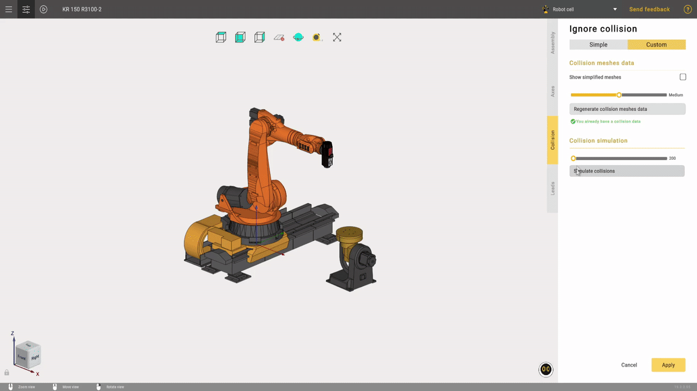
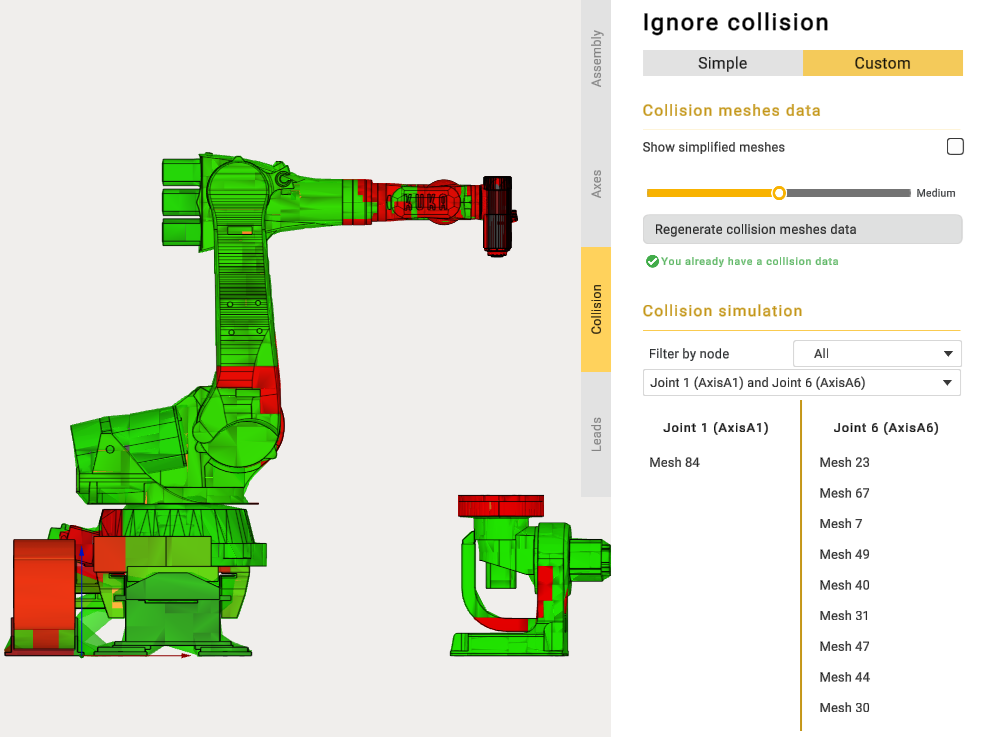

---
title: "Collision"
---

<link rel="stylesheet" href="assets/manual.css">

<h1 id="src-129936493">Collision</h1>

If you are using inaccurate 3D models, CAM system can detect false-positive collisions between nodes. You can add these nodes to the ignore-list to prevent CAM system from detecting false-positive collisions.

Click 
button to open the parameters panel. Then go to the <i class=""><strong class="">Collisions</strong></i> tab.

Select first and second nodes and click <strong class="">Add collisions</strong> button. Use <i class=""><strong class="">with children</strong></i><strong class=""> </strong>toggle to add node's children to the ignore-list. Use 
 button to delete a previously added collision from the ignore list.

In the custom collision tab, you can manually compute collisions using user-defined parameters. This section allows you to specify the mesh resolution for each mechanism node used by the collision-detection algorithm.

If you click <strong class="">“Prepare collision meshes data”</strong>, the application will calculate the number of mechanism positions required for collision detection.

After calculating the number of mechanism positions, you will be able to sort them by nodes and visually inspect collisions on the mechanisms.

CAM system always ignores collisions between sibling nodes. So it is not necessary to add them to the ignore list.

