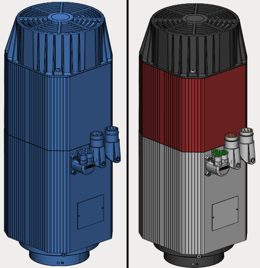
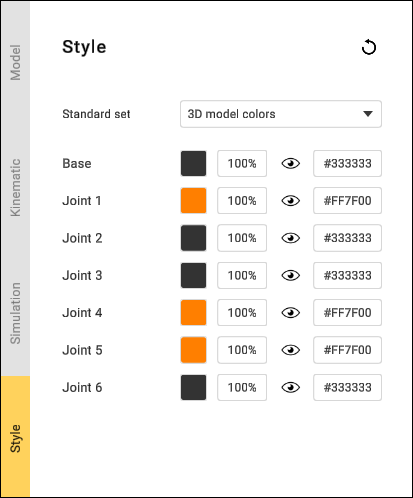
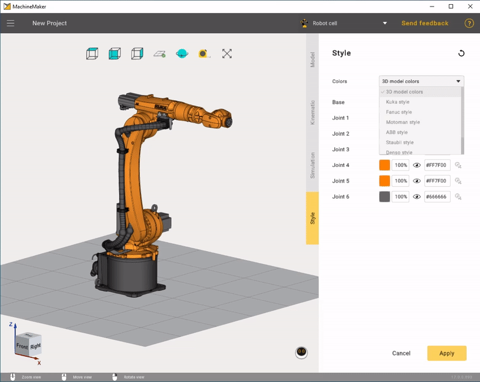
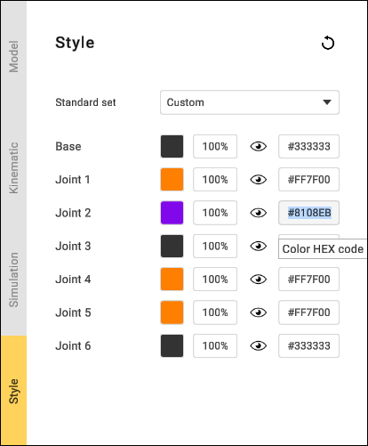
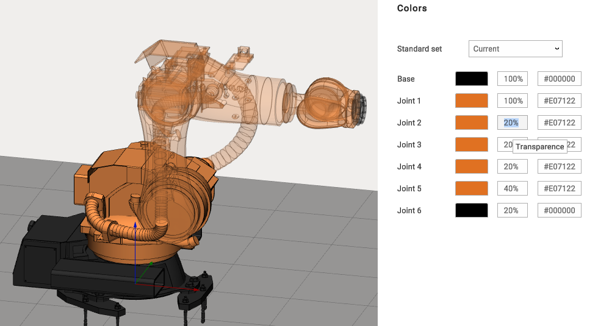

---
title: "Coloring"
---

<link rel="stylesheet" href="assets/manual.css">

<h1 id="src-131903745">Coloring</h1>

By default, MachineMaker uses the 3D model's color. Using the 3D model's colors gives a detailed representation. It is also possible to define the node's (machine element) color manually.

Use the <i class=""><strong class="">Style</strong></i><strong class=""> </strong>tab to open the Color parameters. You can select a predefined color set or specify node colors manually.

 
Use     
<i class=""><strong class="">Mouse wheel scroll</strong></i> 
 with the mouse cursor on the combobox to switch between styles    

Select the <i class=""><strong class="">3D Models colors </strong></i>style to reset the colors of all the nodes to the 3D model's values. Select <strong class=""><i class="">Current</i> </strong>style to reset the colors of all the nodes to the saved values.

 Click on the color hex code input field on the right to open the color selector. It is possible to copy and paste hex codes manually.

It is also possible to change the node's transparence.

