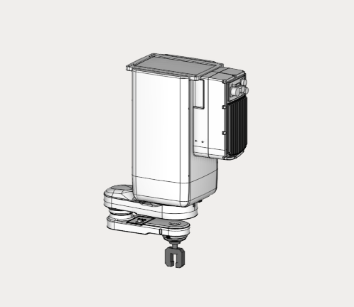

---
title: "Column-type robot"
---

<link rel="stylesheet" href="assets/manual.css">

<h1 id="src-157870578">Column-type robot</h1>

Download project here: <strong class=""><a href="https://github.com/EncySoftware/public-docs/releases/download/machinemaker-examples-2026-09-22/EZ03V-4525_J4-492d81900f.zip">EZ03V-4525_J4.zip</a></strong>

You can see the tutorial video at the <a class="external-link" href="https://www.youtube.com/watch?v=iGrTD3ob8sU">link</a>.

