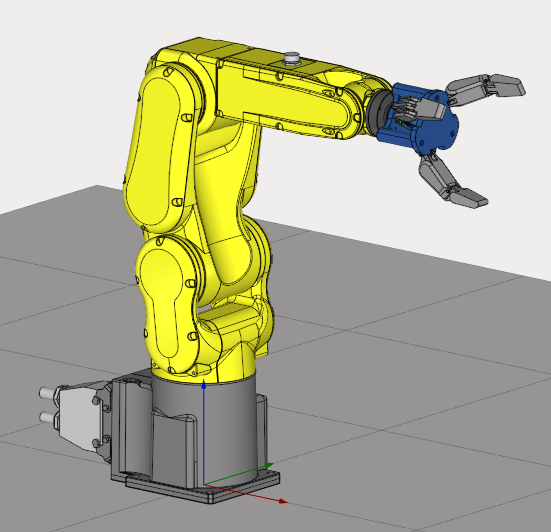
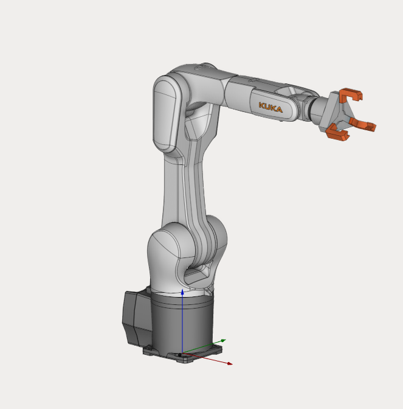

---
title: "Composite End Effector"
---

<link rel="stylesheet" href="assets/manual.css">

<h1 id="src-129935339">Composite End Effector</h1>

Download Project here: <strong class=""><a href="https://github.com/EncySoftware/public-docs/releases/download/machinemaker-examples-2026-09-22/CompositeEndEffector-b5830ce681.zip">CompositeEndEffector.zip</a></strong><strong class=""> / <a href="https://github.com/EncySoftware/public-docs/releases/download/machinemaker-examples-2026-09-22/CompositeEndEffectorLinear-341a345875.zip">CompositeEndEffectorLinear.zip</a></strong>

Composite End Effectors have two types:<ol class=""><li class="">
Rotary

</li><li class="">
Linear

</li></ol>

In the case of "Rotary" a special configuration is used for flexible limbs of the mechanism. For "Linear" only linear axes are used along which the gripper jaws will move.

<strong class="">
</strong>

To learn more about these features, we recommend watching our tutorials on <strong class=""><a class="external-link" href="https://www.youtube.com/watch?v=zHQKJ3JOpGE&amp;list=PLnaHZJpWJMKPN2hSDvR1DnxmAuFH4tP42&amp;index=7">rotary</a></strong> and <strong class=""><a class="external-link" href="https://www.youtube.com/watch?v=sVA2ds63cKg&amp;list=PLnaHZJpWJMKPN2hSDvR1DnxmAuFH4tP42&amp;index=8">linear</a></strong> Composite End Effectors.

