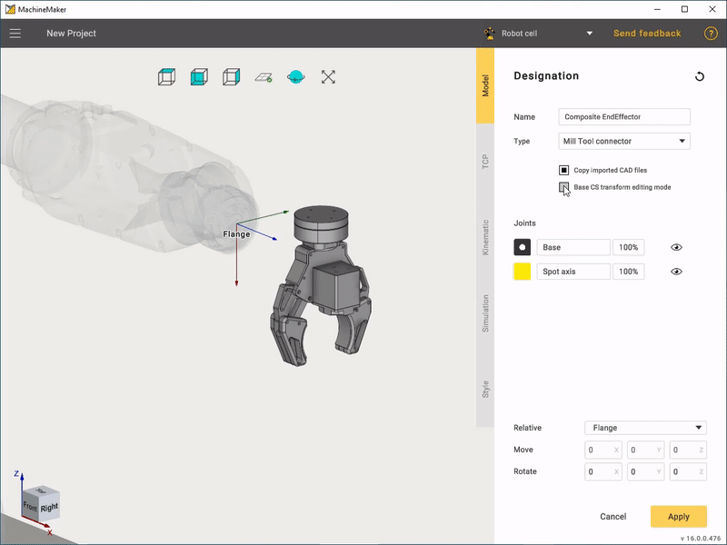
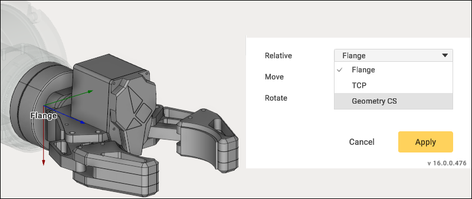
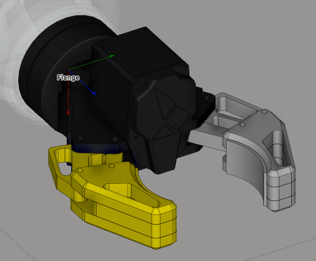
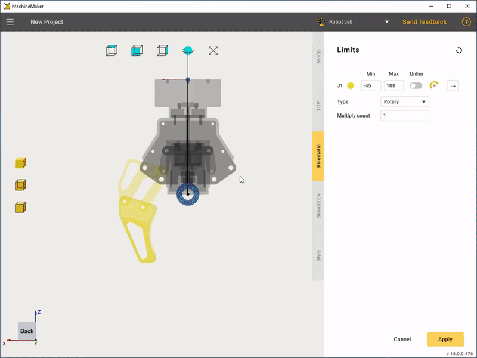
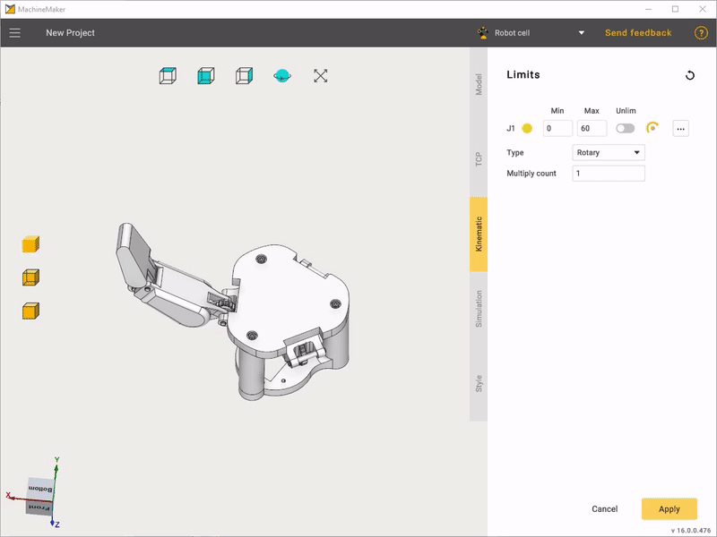
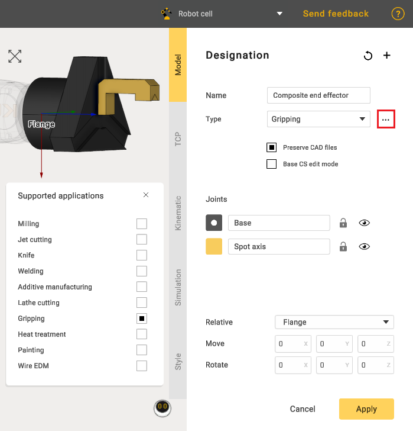
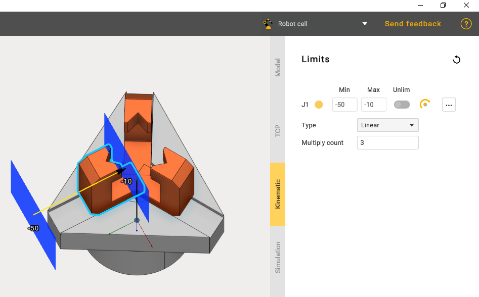
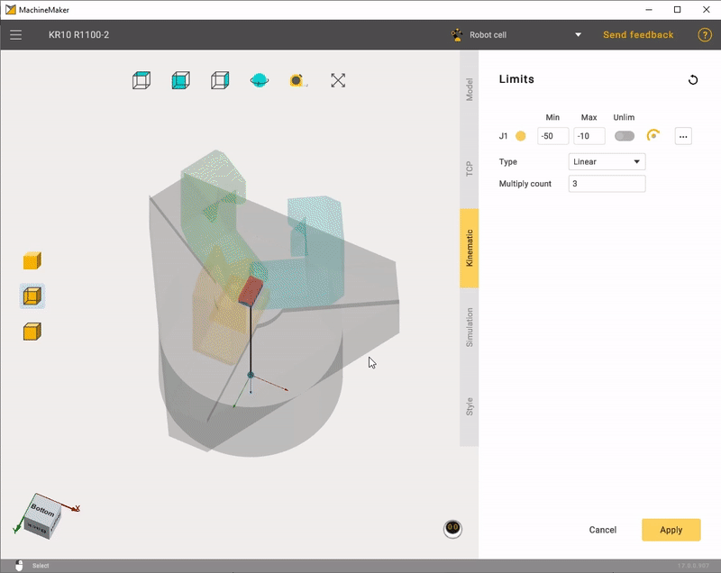

---
title: "Composite End effectors"
---

<link rel="stylesheet" href="assets/manual.css">

<h1 id="src-131903701">Composite End effectors</h1>

Composite end effectors usually contain movable parts such as fingers.

First of all, it is necessary to connect the end effector with the robot flange. The easiest way is to use <i class=""><strong class="">Base CS transform editing mode.</strong></i>

<i class=""><strong class="">Relative</strong></i><strong class=""> </strong>selector allows you to change coordinate system for the Transformation Panel. Use <i class=""><strong class="">Default</strong></i> for Geometry CS, <i class=""><strong class="">Base CS</strong></i><strong class=""> </strong>for the Robot Flange CS and <i class=""><strong class="">TCP</strong></i><strong class=""> </strong>for the tool center point.

Once this is done, you have to "Grouping elements into nodes".

At that stage we need to select only one movable joint. MachineMaker will automatically add all necessary joints later.

Next, go to the <i class=""><strong class="">Kinematic</strong></i><strong class=""> </strong>tab and define the connectors location. First of all it is necessary to select the connector type, it may be <i class=""><strong class="">Linear</strong></i><strong class=""> </strong>or <i class=""><strong class="">Rotary</strong></i>. Use Drag&amp;Drop and Transformation Panel to set the connector's position and orientation. Set minimal and maximal positions in the <i class=""><strong class="">Limits</strong></i><strong class=""> </strong>panel.<strong class=""></strong>

In order to create copies of movable joint use <i class=""><strong class="">Multiply count</strong></i><strong class=""> </strong>edit.

Finally set the TCP and Style similarly to a plain "End Effector"

In some cases, a composite end effector can be linear. Ensure that the "Gripping" type is selected.

In kinematics, choose the "Linear" type and set the necessary limits for the jaws. Also use the "Multiply count edit" function to create copies of the jaws.   

Similarly to "Rotary" the limits of jaws movements are edited.

