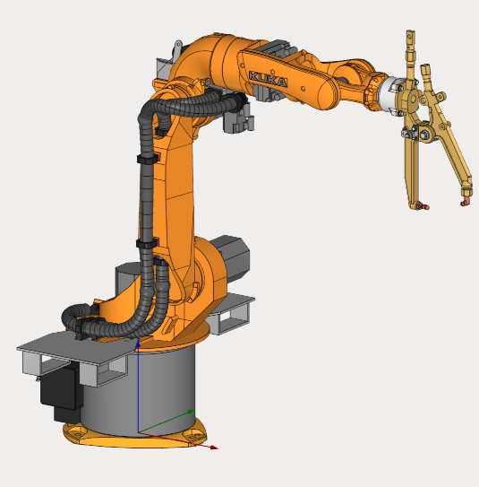

---
title: "Composite EndEffector: Spot Welding"
---

<link rel="stylesheet" href="assets/manual.css">

<h1 id="src-129937016">Composite EndEffector: Spot Welding</h1>

Download Project here:<strong class=""> <a href="https://github.com/EncySoftware/public-docs/releases/download/machinemaker-examples-2026-09-22/Spot_Welding-962e874262.zip">Spot_Welding.zip</a></strong>

You can see the tutorial video at the <a class="external-link" href="https://www.youtube.com/watch?v=u1T05RAbqvA&amp;list=PLnaHZJpWJMKPN2hSDvR1DnxmAuFH4tP42&amp;index=14">link</a>

