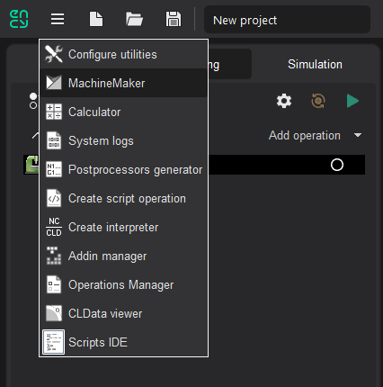
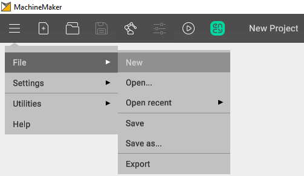

---
title: "Creating a project"
---

<link rel="stylesheet" href="assets/manual.css">

<h1 id="src-129930512">Creating a project</h1>

<h1 class="heading">Starting MachineMaker</h1>

MachineMaker can be started    
 directly from the CAM system utilities menu    

<h1 class="heading">Creating a project</h1>

MachineMaker automatically creates a new project at startup. It is possible to create a new project any time using <i class=""><strong class="">Menu - </strong><strong class="">File - New</strong></i>

