---
title: "End effectors and TCP calibration"
---

<link rel="stylesheet" href="assets/manual.css">

<h1 id="src-129930953">End effectors and TCP calibration</h1>

It is possible to equip the robot with a static or movable end effector. More information on movable end effectors can be found on <a href="composite-end-effectors.md">Composite End effectors</a> page.Add a new End Effector and select its 3D model file.

<a class="doc-image-link" href="images/download/attachments/129930953/image2024-8-13_11-35-10.png" rel="noopener" target="_blank" title="Open full-size image">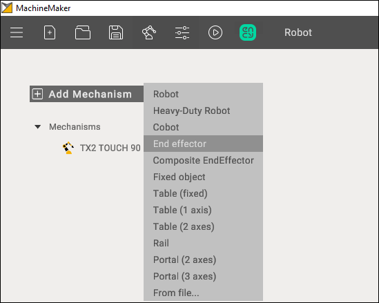</a>

<h1 class="heading">3D model</h1>

MachineMaker shows a transparent robot and an <a href="prepare-and-import-3d-objects.md">imported end effector CAD model</a>. All 3D model elements are marked as Base node by default. Use the right mouse button to <a href="grouping-elements-into-nodes.md">ungroup unnecessary elements</a>.

You have to define the name of the End Effector and select supported tool types. Next, place the 3D model on the robot flange. There are 2 ways to specify the correct position:

<ul class=""><li class="">
Use Transformation Panel in the right bottom corner

</li><li class="">
Turn on <i class=""><strong class="">Base CS Transformation mode,</strong></i> hold down the <i class=""><strong class="">Left Ctrl</strong></i><strong class=""> </strong>key and specify the robot's flange connection point using Drag&amp;Drop

</li></ul>
<a class="doc-image-link" href="images/download/attachments/129930953/endeff.webp" rel="noopener" target="_blank" title="Open full-size image">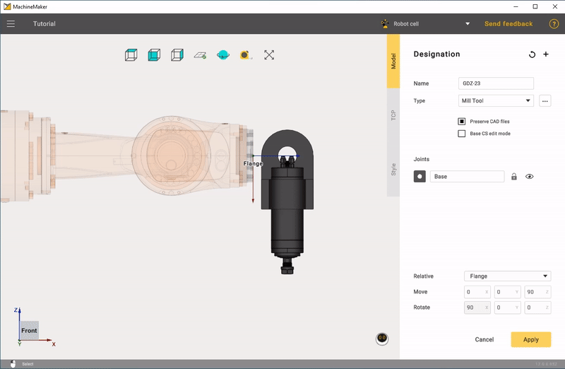</a>
<a class="doc-image-link" href="images/download/attachments/129930953/endeff2.webp" rel="noopener" target="_blank" title="Open full-size image">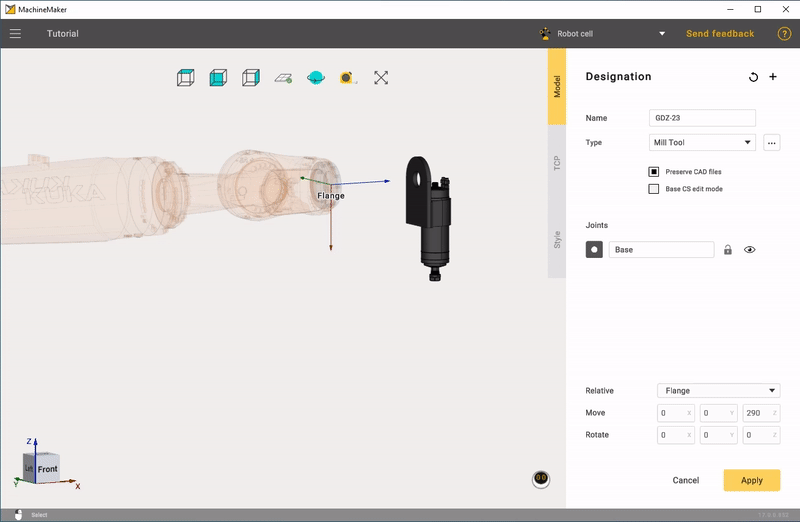</a>

<h1 class="heading">TCP calibration</h1>

Click TCP tab to open the tool center point panel. It is necessary to place the tool in the correct position.

<a class="doc-image-link" href="images/download/attachments/129930953/image2022-4-19_12-35-48.png" rel="noopener" target="_blank" title="Open full-size image">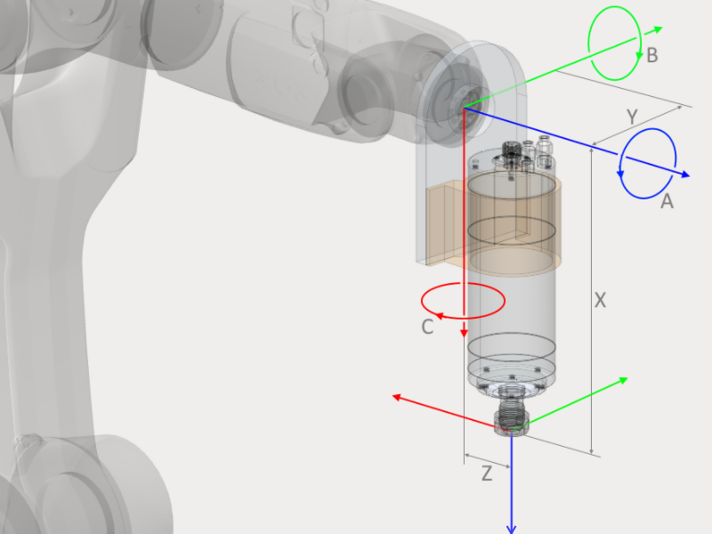</a>

You can use the Transformation Panel or hold down the <i class=""><strong class="">Left Ctrl </strong></i>key<i class=""><strong class=""> </strong></i>to enter Drag&amp;Drop mode. Use <i class=""><strong class="">Visualize tool</strong></i><strong class=""> </strong>checkbox to show the tool's visibility. Click <i class=""><strong class="">Reset</strong></i><strong class=""> </strong>to clear all fields.

<a class="doc-image-link" href="images/download/attachments/129930953/endeff3.webp" rel="noopener" target="_blank" title="Open full-size image">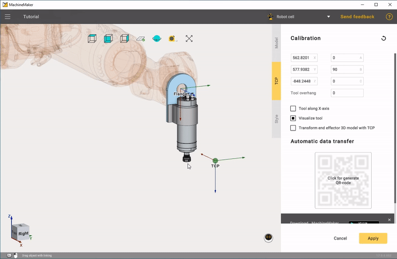</a>

Use <i class=""><strong class="">Transform End Effector 3D model with TCP</strong></i><strong class=""> </strong>to change the 3D model's position.

Subsequently, TCP calibration is performed on the actual robot to obtain real-world values. To avoid visual discrepancies with the real robot, it is advisable to move the TCP in conjunction with the 3D model of the end effector after obtaining actual calibration numbers."

<a class="doc-image-link" href="images/download/attachments/129930953/ikufgdjlfvsdk.webp" rel="noopener" target="_blank" title="Open full-size image">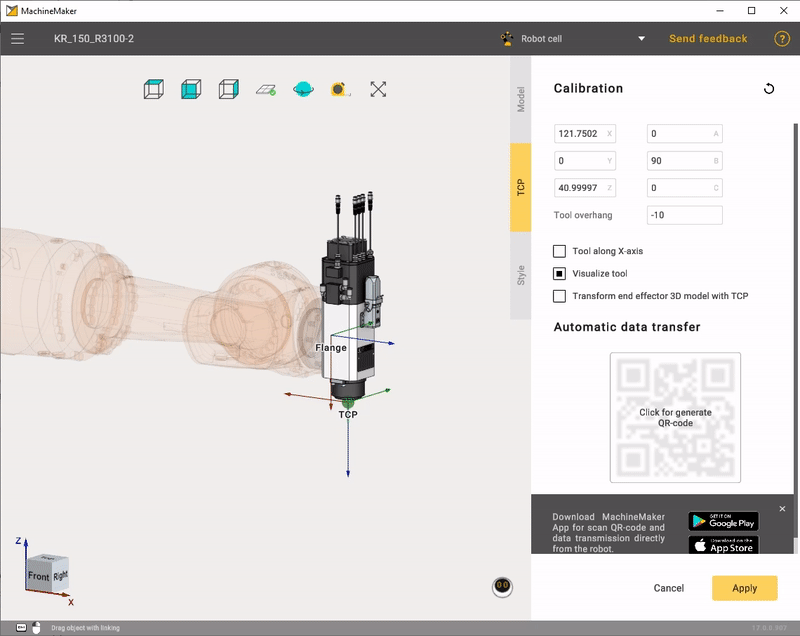</a>

It is also possible to set the tool overhang if you have tool-tip calibration values from the robot and want to enter these values in the XYZ ABC fields.

<a class="doc-image-link" href="images/download/attachments/129930953/image2021-6-25_14-46-35.png" rel="noopener" target="_blank" title="Open full-size image">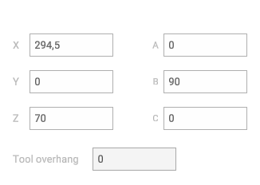</a>

 
You can set the tool overhang to zero and calibrate the tool base point. Or you can specify the tool overhang and calibrate the tool-tip. In    

 CAM system and MachineMaker    

 both options are available.    

<h1 class="heading">Using calibration app</h1>

MachineMaker calibration app allows you to make the most accurate TCP calibration using the 2-point calibration method.

<a class="doc-image-link" href="images/download/attachments/129930953/image2022-4-19_12-42-8.png" rel="noopener" target="_blank" title="Open full-size image">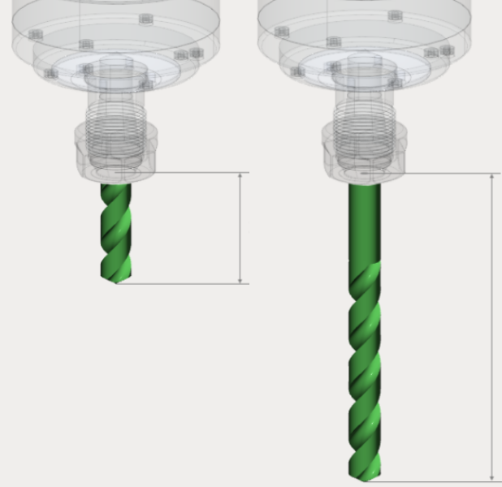</a>

<a class="doc-image-link" href="images/download/attachments/129930953/image2022-4-19_12-43-14.png" rel="noopener" target="_blank" title="Open full-size image">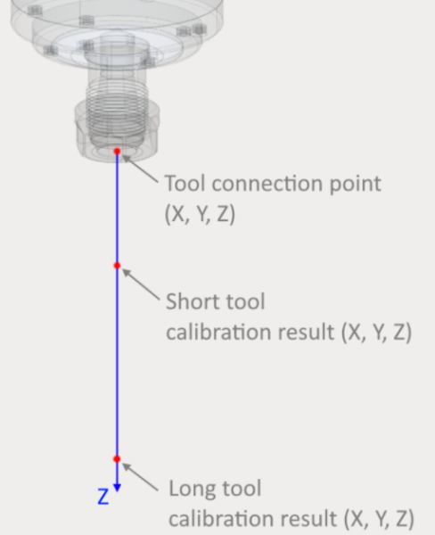</a>

First of all it is necessary to calibrate both long and short tools using your robot's standard 4-points calibration method.

<a class="doc-image-link" href="images/download/attachments/129930953/4.webp" rel="noopener" target="_blank" title="Open full-size image">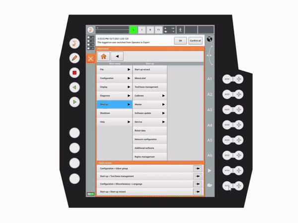</a>

Next, download the latest version of our mobile app using the link in MachineMaker.

Launch the mobile app and fill in calibration values from the robot.

<a class="doc-image-link" href="images/download/attachments/129930953/5.webp" rel="noopener" target="_blank" title="Open full-size image">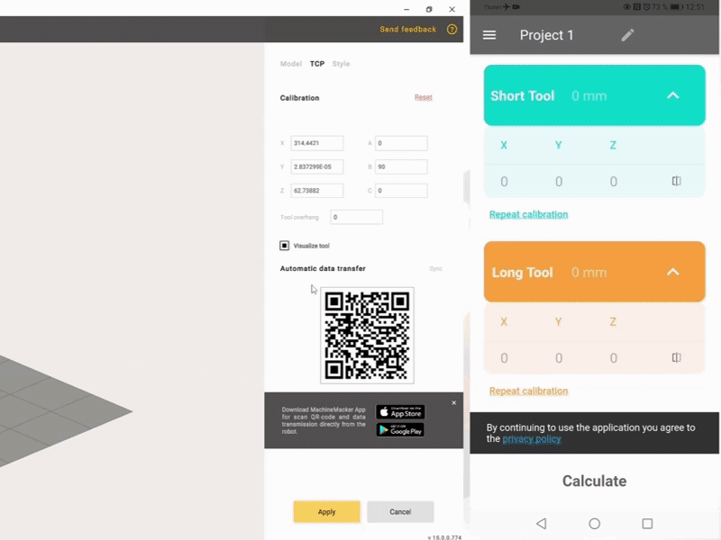</a>

Finally, click <i class=""><strong class="">Send</strong></i><strong class=""> </strong>button and scan the QR code from the MachineMaker. Calculated values will be transferred to your MachineMaker TCP calibration input fields automatically. It is also possible to enter the calculated calibration values manually.

<a class="doc-image-link" href="images/download/attachments/129930953/9.webp" rel="noopener" target="_blank" title="Open full-size image">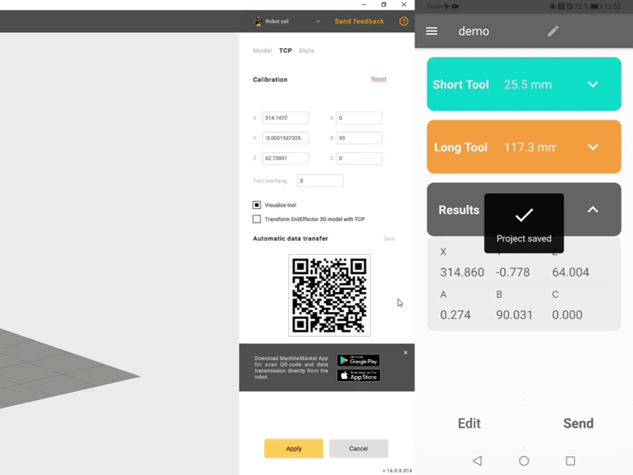</a>

<h1 class="heading">Quaternions, Radians and Euler Angles</h1>

Some robots (such as ABB) use quaternions or Radians instead of euler angles. For this kind of robots MachineMaker will show quaternions fields. You can switch to Euler angles if you prefer to use Euler angles.

<a class="doc-image-link" href="images/download/attachments/129930953/image2021-6-25_15-12-4.png" rel="noopener" target="_blank" title="Open full-size image">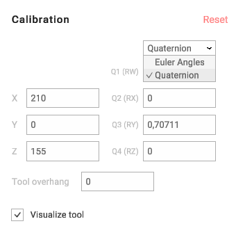</a>

 
MachineMaker will save TCP values in the acceptable format for the robot anyway. So, even if you use Euler angles and set tool position in A B C values, MachineMaker will convert it to quaternions automatically.    

